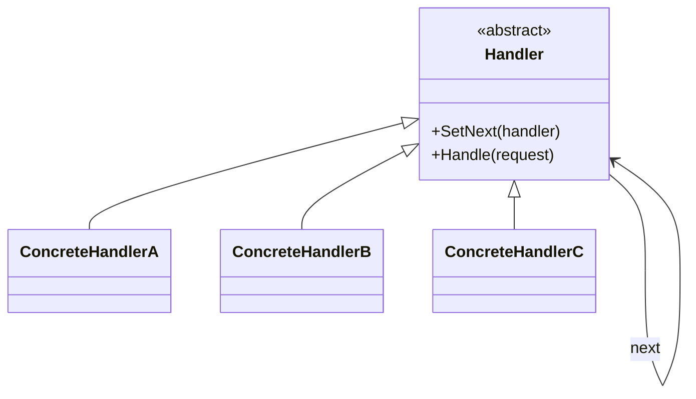
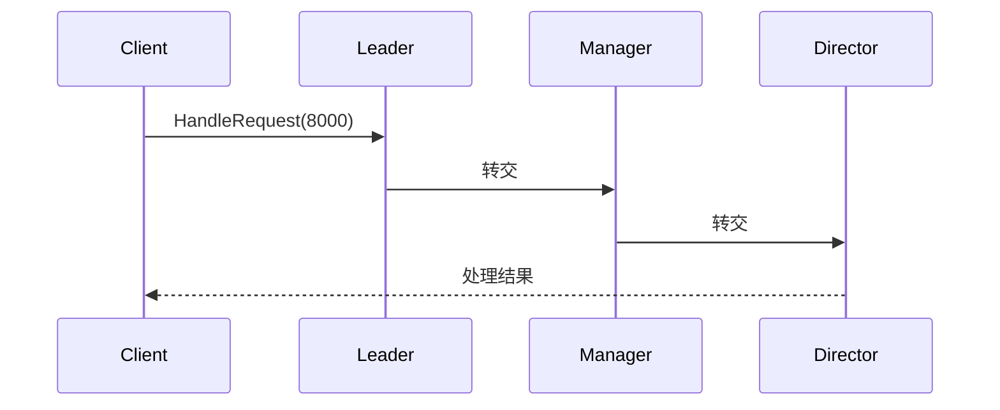
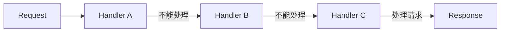

# Chain of Responsibility (ChainOfResponsibilityDemo)

说明：
- 该项目演示设计模式：**Chain of Responsibility**。
- 在 `Program.cs` 中实现示例（或将实现拆分到多个源文件）。
- 目标框架： net8.0

运行示例：
```bash
dotnet run --project Behavioral/ChainOfResponsibilityDemo/ChainOfResponsibilityDemo.csproj
```

------

# **📦 责任链模式（Chain of Responsibility Pattern）**

## **一、模式定义**

> **责任链模式**是一种行为型设计模式，它将请求沿着处理链传递，直到有一个对象处理它为止，从而避免请求发送者与接收者之间的耦合。


------


## **二、核心思想**


- 将多个处理对象连接成一条链
- 请求在链上传递，直到被处理
- 每个处理者决定：
    - 自己处理
    - 还是交给下一个处理者


------


## **三、关键概念**


### **1️⃣ Handler（抽象处理者）**

定义处理请求的接口，并包含下一个处理者引用


### **2️⃣ ConcreteHandler（具体处理者）**

实现具体处理逻辑，并决定是否传递请求


### **3️⃣ Client（客户端）**

发起请求，不关心具体由谁处理


------


## **四、模式结构**


### **角色说明**

| **角色**        | **说明**   |
| --------------- | ---------- |
| Handler         | 抽象处理者 |
| ConcreteHandler | 具体处理者 |
| Client          | 客户端     |
|                 |            |

------


## **五、类图（Mermaid）**



------


## **六、C# 经典示例（审批流程）**


### **1️⃣ 抽象处理者**

```c#
public abstract class Approver
{
    protected Approver _next;

    public void SetNext(Approver next)
    {
        _next = next;
    }

    public abstract void HandleRequest(int amount);
}
```


### **2️⃣ 具体处理者**

```c#
public class TeamLeader : Approver
{
    public override void HandleRequest(int amount)
    {
        if (amount <= 1000)
        {
            Console.WriteLine("组长审批通过");
        }
        else
        {
            _next?.HandleRequest(amount);
        }
    }
}

public class Manager : Approver
{
    public override void HandleRequest(int amount)
    {
        if (amount <= 5000)
        {
            Console.WriteLine("经理审批通过");
        }
        else
        {
            _next?.HandleRequest(amount);
        }
    }
}

public class Director : Approver
{
    public override void HandleRequest(int amount)
    {
        if (amount <= 10000)
        {
            Console.WriteLine("总监审批通过");
        }
        else
        {
            Console.WriteLine("金额过大，拒绝审批");
        }
    }
}
```


### **3️⃣ 客户端调用**

```c#
class Program
{
    static void Main()
    {
        var leader = new TeamLeader();
        var manager = new Manager();
        var director = new Director();

        leader.SetNext(manager);
        manager.SetNext(director);

        leader.HandleRequest(8000);
    }
}
```


------


## **七、时序图（访问流程）**




------


## **八、实际业务案例（中间件 / 过滤器）**


### **场景**

Web 请求处理流程：

- 身份认证
- 权限校验
- 日志记录
- 参数校验

👉 本质就是责任链


### **示例**

```c#
public abstract class Middleware
{
    protected Middleware _next;

    public Middleware SetNext(Middleware next)
    {
        _next = next;
        return next;
    }

    public virtual bool Handle(string request)
    {
        if (_next != null)
            return _next.Handle(request);

        return true;
    }
}

public class AuthMiddleware : Middleware
{
    public override bool Handle(string request)
    {
        Console.WriteLine("认证通过");
        return base.Handle(request);
    }
}

public class LogMiddleware : Middleware
{
    public override bool Handle(string request)
    {
        Console.WriteLine("记录日志");
        return base.Handle(request);
    }
}
```


### **调用**

```c#
class Program
{
    static void Main()
    {
        var auth = new AuthMiddleware();
        var log = new LogMiddleware();

        auth.SetNext(log);

        auth.Handle("请求");
    }
}
```


------


## **九、优点**

✅ 解耦请求发送者与接收者

✅ 支持动态组合处理链

✅ 符合单一职责原则

✅ 易于扩展新的处理者


------


## **十、缺点**

❌ 请求可能无人处理

❌ 调试困难（链条较长）

❌ 性能可能下降（多次传递）


------


## **十一、适用场景**

- 审批流程（请假 / 报销）
- Web 中间件（ASP.NET Core Pipeline）
- 过滤器链（Servlet Filter）
- 日志处理链
- 权限校验链


------


## **十二、与装饰器模式对比**

| **对比项**   | **责任链模式** | **装饰器模式** |
| ------------ | -------------- | -------------- |
| 目的         | 处理请求       | 增强功能       |
| 是否一定执行 | 不一定         | 一定执行       |
| 结构         | 链式传递       | 包裹结构       |
|              |                |                |

------


## **十三、责任链流程图**



------


## **十四、总结**

> **责任链模式 = “请求在链上传递，直到被处理”**

责任链模式通过将多个处理对象串联成链，使请求在链上流转，从而实现请求发送者与接收者的解耦。

它非常适用于**流程型处理场景（审批、过滤、拦截）**，在实际开发中广泛应用于 Web 框架和中间件体系。


------