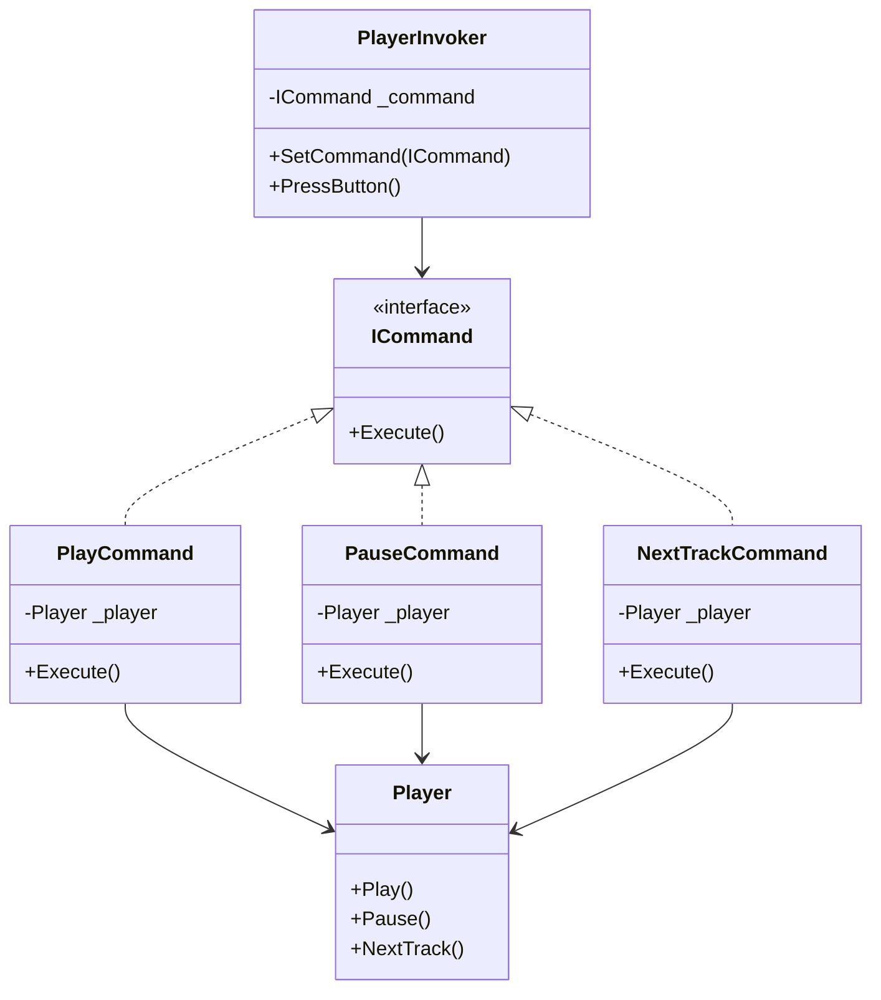
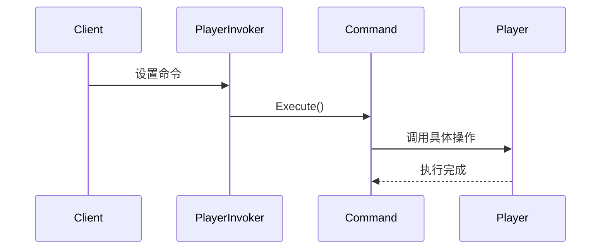
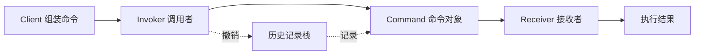

# Command (CommandDemo)

说明：
- 该项目演示设计模式：**Command**。
- 在 `Program.cs` 中实现示例（或将实现拆分到多个源文件）。
- 目标框架： net8.0

运行示例：
```bash
dotnet run --project Behavioral/CommandDemo/CommandDemo.csproj
```

------

# **📦 命令模式（Command Pattern）**

## **一、模式定义**

> **命令模式**是一种行为型设计模式，它将一个请求封装为一个对象，从而使你可以用不同的请求对客户进行参数化，对请求排队或记录请求日志，并支持可撤销操作。


------


## **二、核心思想**


- 将“请求”封装成一个对象（Command）
- 将调用者（Invoker）与执行者（Receiver）解耦
- 调用者不关心具体执行逻辑
- 支持请求队列、日志、宏命令等扩展能力
- Execute() 是核心方法


------


## **三、关键概念**


### **1️⃣ 请求调用者（Invoker）**


负责触发命令，但不知道命令内部如何执行：

- 触发命令执行
- 不关心具体业务逻辑


### **2️⃣ 命令对象（Command）**


将请求封装成对象：

- 实现命令接口
- 持有 Receiver
- 调用 Receiver 完成具体操作


### **3️⃣ 接收者（Receiver）**


真正执行具体业务逻辑的对象：

- 真正执行业务逻辑的对象


------


## **四、模式结构**


### **角色说明**

| **角色**        | **说明**         |
| --------------- | ---------------- |
| Command         | 抽象命令         |
| ConcreteCommand | 具体命令         |
| Receiver        | 接收者           |
| Invoker         | 调用者           |
| Client          | 客户端，负责组装 |

------


## **五、类图（Mermaid）**



------


## 六、C# 经典示例（播放器控制）


### **1️⃣ 接收者**

```c#
public class Player
{
    public void Play()
    {
        Console.WriteLine("播放器：开始播放");
    }

    public void Pause()
    {
        Console.WriteLine("播放器：暂停播放");
    }

    public void NextTrack()
    {
        Console.WriteLine("播放器：切换下一首");
    }
}
```


### **2️⃣ 抽象命令**

```c#
public interface ICommand
{
    void Execute();
}
```


### **3️⃣ 具体命令**

```c#
public class PlayCommand : ICommand
{
    private readonly Player _player;

    public PlayCommand(Player player)
    {
        _player = player;
    }

    public void Execute()
    {
        _player.Play();
    }
}

public class PauseCommand : ICommand
{
    private readonly Player _player;

    public PauseCommand(Player player)
    {
        _player = player;
    }

    public void Execute()
    {
        _player.Pause();
    }
}

public class NextTrackCommand : ICommand
{
    private readonly Player _player;

    public NextTrackCommand(Player player)
    {
        _player = player;
    }

    public void Execute()
    {
        _player.NextTrack();
    }
}
```


### **4️⃣ 调用者**

```c#
public class PlayerInvoker
{
    private ICommand _command;

    public void SetCommand(ICommand command)
    {
        _command = command;
    }

    public void PressButton()
    {
        _command?.Execute();
    }
}
```


### **5️⃣ 客户端组装**

```c#
class Program
{
    static void Main()
    {
        var player = new Player();
				var playCommand = new PlayCommand(player);
				var pauseCommand = new PauseCommand(player);
				var nextTrackCommand = new NextTrackCommand(player);
      
				var invoker = new PlayerInvoker();
			
      	invoker.SetCommand(playCommand);
				invoker.PressButton();
				
      	invoker.SetCommand(nextTrackCommand);
				invoker.PressButton();
				
      	invoker.SetCommand(pauseCommand);
				invoker.PressButton();
    }
}
```


------


## **七、时序图（执行流程）**




------


## **八、实际业务案例（订单操作审计与撤销）**


### **场景**

在订单系统中，常见操作包括：

- 创建订单
- 取消订单
- 发货
- 回滚操作

如果直接在按钮点击、接口层里写死逻辑，会导致：

- 调用方和业务处理强耦合
- 不方便记录操作日志
- 不方便做撤销/重试/排队执行

此时可以将每个订单操作封装为一个命令对象。

### **示例**

```c#
public interface IOrderCommand
{
    void Execute();
    void Undo();
}

public class OrderService
{
    public void Create(string orderNo)
    {
        Console.WriteLine($"创建订单：{orderNo}");
    }

    public void Cancel(string orderNo)
    {
        Console.WriteLine($"取消订单：{orderNo}");
    }
}

public class CreateOrderCommand : IOrderCommand
{
    private readonly OrderService _orderService;
    private readonly string _orderNo;

    public CreateOrderCommand(OrderService orderService, string orderNo)
    {
        _orderService = orderService;
        _orderNo = orderNo;
    }

    public void Execute()
    {
        _orderService.Create(_orderNo);
    }

    public void Undo()
    {
        _orderService.Cancel(_orderNo);
    }
}

public class CommandInvoker
{
    private readonly Stack<IOrderCommand> _history = new Stack<IOrderCommand>();

    public void ExecuteCommand(IOrderCommand command)
    {
        command.Execute();
        _history.Push(command);
    }

    public void UndoLast()
    {
        if (_history.Count == 0) return;
        var command = _history.Pop();
        command.Undo();
    }
}
```


### **价值**

- 可以统一记录命令执行日志
- 可以支持失败重试和延迟执行
- 可以支持撤销最近一次操作
- 很适合高频业务中的操作解耦与审计跟踪


------


## **九、优点**

✅ 请求发送者与接收者解耦

✅ 易于扩展新命令，符合开闭原则

✅ 支持撤销、重做、排队、日志记录

✅ 适合将操作标准化、对象化


------


## **十、缺点**

❌ 命令类会增多，系统结构更复杂

❌ 简单场景下可能显得设计过度

❌ 撤销逻辑复杂时，实现成本较高


------


## **十一、适用场景**

- 按钮点击触发业务动作
- 菜单命令、快捷键命令
- 任务队列、作业调度
- 撤销/重做功能
- 操作日志与审计系统
- 消息驱动、事件驱动中的指令封装


------


## **十二、与策略模式对比**

| **对比项**   | **命令模式**         | **策略模式**       |
| ------------ | -------------------- | ------------------ |
| 核心目的     | 封装请求             | 封装算法           |
| 关注点       | 执行一个动作         | 选择一种行为策略   |
| 是否支持撤销 | 常见且适合           | 通常不关注         |
| 典型角色     | Invoker / Receiver   | Context / Strategy |
| 调用方式     | Invoker 触发         | Context 调用       |
| 是否支持队列 | 支持                 | 不强调             |
| 使用场景     | 操作请求、队列、日志 | 规则切换、算法替换 |


------


## **十三、命令流转关系图**




------


## **十四、总结**


> **命令模式 = 把“操作请求”封装成对象**
>
> 命令模式是一种行为型设计模式，它将请求封装为命令对象，使调用者与执行者解耦。
>
> 它特别适合需要撤销、重做、队列、日志、调度的场景，例如按钮操作、订单流程、任务调度等。
>
> 优点是扩展性强、解耦彻底，缺点是命令类数量可能增加。


------