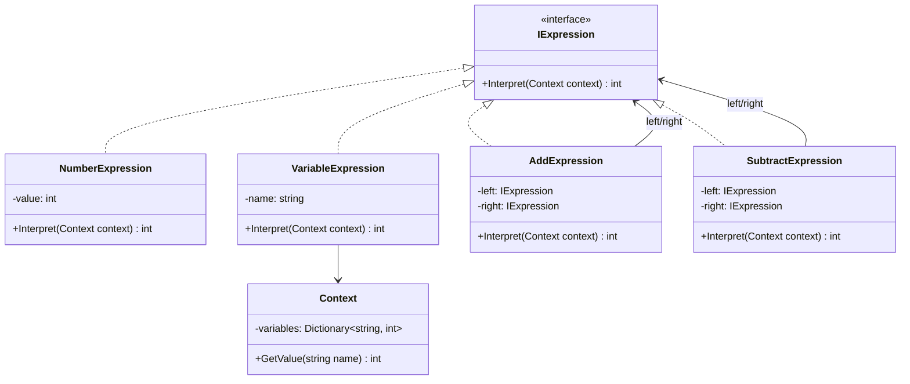
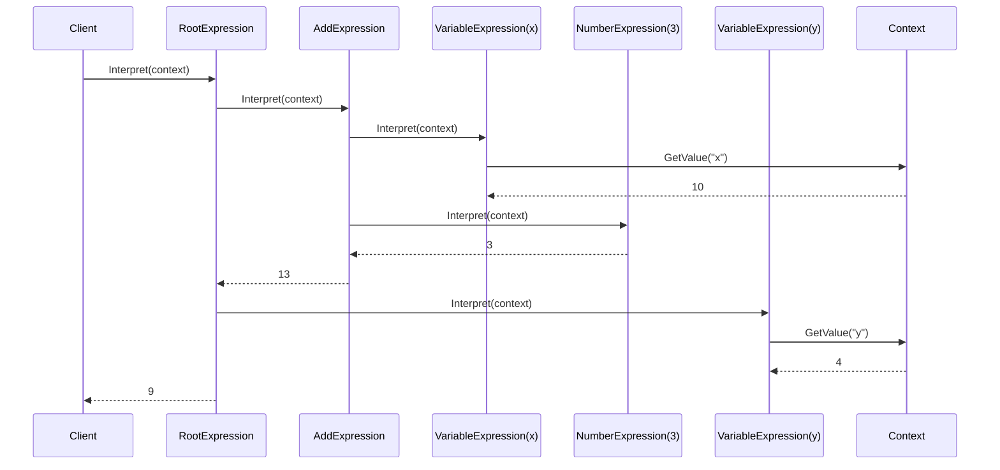
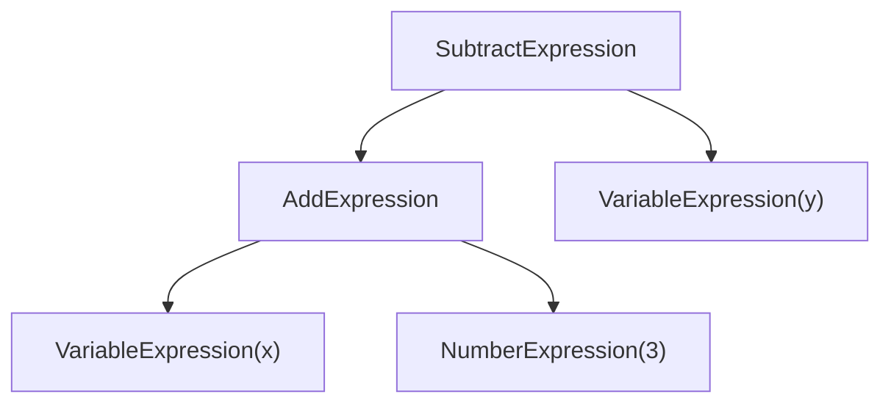

# Interpreter (InterpreterDemo)

说明：
- 该项目演示设计模式：**Interpreter**。
- 在 `Program.cs` 中实现示例（或将实现拆分到多个源文件）。
- 目标框架： net8.0

运行示例：
```bash
dotnet run --project Behavioral/InterpreterDemo/InterpreterDemo.csproj
```

------

# **📦 解释器模式（Interpreter Pattern）**

## **一、模式定义**

> **解释器模式**是一种行为型设计模式，它定义一个语言的语法表示，并提供一个解释器来解释该语言中的句子。

------

## **二、核心思想**

- 将一个复杂表达式拆分为多个语法规则节点
- 每个节点负责解释自己所表示的语义
- 通过组合不同表达式对象，构建一棵语法树（Abstract Syntax Tree, AST）
- 客户端只需要传入上下文，即可得到表达式的解释结果

------

## **三、关键概念**

### **1️⃣ 终结符表达式（Terminal Expression）**

语法中最基础、不可再拆分的表达式，例如：

- 数字
- 变量
- 固定关键字

### **2️⃣ 非终结符表达式（Nonterminal Expression）**

由多个终结符或其他非终结符组合而成，例如：

- 加法表达式
- 减法表达式
- 与、或、非表达式

### **3️⃣ 上下文（Context）**

解释过程中所需的外部信息，例如：

- 变量值映射
- 当前环境配置
- 业务规则参数

------

## **四、模式结构**

### **角色说明**

| **角色**              | **说明**       |
| --------------------- | -------------- |
| AbstractExpression    | 抽象表达式     |
| TerminalExpression    | 终结符表达式   |
| NonterminalExpression | 非终结符表达式 |
| Context               | 上下文环境     |
| Client                | 客户端         |

------

## **五、类图（Mermaid）**



------

## **六、C# 经典示例（四则表达式解释）**

### **1️⃣ 抽象表达式**

```c#
public interface IExpression
{
    int Interpret(Context context);
}
```

### **2️⃣ 上下文**

```c#
public class Context
{
    private readonly Dictionary<string, int> _variables = new();

    public void SetValue(string name, int value)
    {
        _variables[name] = value;
    }

    public int GetValue(string name)
    {
        if (!_variables.ContainsKey(name))
            throw new ArgumentException($"变量 {name} 不存在");

        return _variables[name];
    }
}
```

### **3️⃣ 终结符表达式：数字**

```c#
public class NumberExpression : IExpression
{
    private readonly int _value;

    public NumberExpression(int value)
    {
        _value = value;
    }

    public int Interpret(Context context)
    {
        return _value;
    }
}
```

### **4️⃣ 终结符表达式：变量**

```c#
public class VariableExpression : IExpression
{
    private readonly string _name;

    public VariableExpression(string name)
    {
        _name = name;
    }

    public int Interpret(Context context)
    {
        return context.GetValue(_name);
    }
}
```

### **5️⃣ 非终结符表达式：加法**

```c#
public class AddExpression : IExpression
{
    private readonly IExpression _left;
    private readonly IExpression _right;

    public AddExpression(IExpression left, IExpression right)
    {
        _left = left;
        _right = right;
    }

    public int Interpret(Context context)
    {
        return _left.Interpret(context) + _right.Interpret(context);
    }
}
```

### **6️⃣ 非终结符表达式：减法**

```c#
public class SubtractExpression : IExpression
{
    private readonly IExpression _left;
    private readonly IExpression _right;

    public SubtractExpression(IExpression left, IExpression right)
    {
        _left = left;
        _right = right;
    }

    public int Interpret(Context context)
    {
        return _left.Interpret(context) - _right.Interpret(context);
    }
}
```

### **7️⃣ 调用**

```c#
class Program
{
    static void Main()
    {
        var context = new Context();
        context.SetValue("x", 10);
        context.SetValue("y", 4);

        // 表达式：x + 3 - y
        IExpression expression =
            new SubtractExpression(
                new AddExpression(
                    new VariableExpression("x"),
                    new NumberExpression(3)
                ),
                new VariableExpression("y")
            );

        int result = expression.Interpret(context);
        Console.WriteLine(result); // 9
    }
}
```

------

## **七、时序图（解释流程）**



------

## **八、实际业务案例（规则表达式）**

### **场景**

在业务系统中，经常需要解释“规则表达式”，例如：

- `用户等级 >= 3 AND 订单金额 >= 1000`
- `地区 = 华东 AND 渠道 = 直营网点`
- `库存 > 0 AND 未下架`

这类规则如果写成大量 `if-else`，会出现：

- 逻辑分支复杂
- 扩展新规则困难
- 条件组合难维护

这时可以使用解释器模式，把每个规则节点都建模成表达式对象。

### **示例**

```c#
public interface IRuleExpression
{
    bool Interpret(RuleContext context);
}

public class RuleContext
{
    public int UserLevel { get; set; }
    public decimal OrderAmount { get; set; }
}

public class UserLevelExpression : IRuleExpression
{
    private readonly int _minLevel;

    public UserLevelExpression(int minLevel)
    {
        _minLevel = minLevel;
    }

    public bool Interpret(RuleContext context)
    {
        return context.UserLevel >= _minLevel;
    }
}

public class OrderAmountExpression : IRuleExpression
{
    private readonly decimal _minAmount;

    public OrderAmountExpression(decimal minAmount)
    {
        _minAmount = minAmount;
    }

    public bool Interpret(RuleContext context)
    {
        return context.OrderAmount >= _minAmount;
    }
}

public class AndExpression : IRuleExpression
{
    private readonly IRuleExpression _left;
    private readonly IRuleExpression _right;

    public AndExpression(IRuleExpression left, IRuleExpression right)
    {
        _left = left;
        _right = right;
    }

    public bool Interpret(RuleContext context)
    {
        return _left.Interpret(context) && _right.Interpret(context);
    }
}
```

### **调用示例**

```c#
var context = new RuleContext
{
    UserLevel = 4,
    OrderAmount = 1500
};

IRuleExpression rule =
    new AndExpression(
        new UserLevelExpression(3),
        new OrderAmountExpression(1000)
    );

bool passed = rule.Interpret(context);
Console.WriteLine(passed); // True
```

> 这个案例中，规则不再散落在业务代码中，而是被组织成可组合、可复用、可扩展的表达式对象。

------

## **九、优点**

✅ 易于扩展新的语法规则

✅ 将复杂规则拆分成独立对象，职责清晰

✅ 支持组合表达式，便于构建语法树

✅ 更适合规则引擎、查询语句、表达式解析等场景

------

## **十、缺点**

❌ 类数量容易膨胀，语法复杂时维护成本高

❌ 不适合特别复杂的完整语言解析

❌ 对客户端构建语法树有一定要求

------

## **十一、适用场景**

- 表达式计算器
- 规则引擎
- SQL / 查询条件解释
- 权限表达式判断
- 过滤器语法解析
- 配置脚本解释执行

------

## **十二、与组合模式对比**

| **对比项** | **解释器模式**       | **组合模式**           |
| ---------- | -------------------- | ---------------------- |
| 核心目标   | 解释语法和语义       | 组织树形结构           |
| 关注点     | 表达式求值           | 部分-整体结构          |
| 典型对象   | 终结符、非终结符     | 叶子、容器             |
| 使用场景   | 规则解析、表达式执行 | 菜单、组织架构、文件树 |

------

## **十三、表达式树关系图**



------

## **十四、总结**

> **解释器模式 = 把“规则”或“语句”拆成一个个表达式对象，再逐层解释执行**
>
> 解释器模式特别适合“语法规则相对固定，但组合方式多变”的场景。
>
> 它的核心价值不在于提升性能，而在于把复杂规则结构化、对象化。
>
> 当系统中存在大量可组合条件、公式、规则表达式时，解释器模式会比堆砌 `if-else` 更清晰、更容易扩展。

------