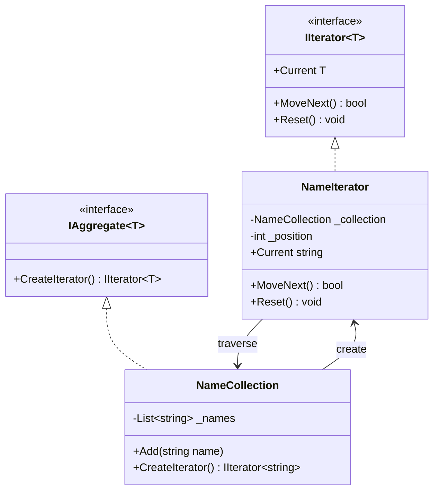
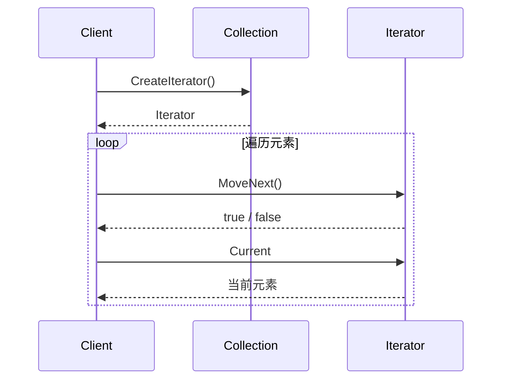
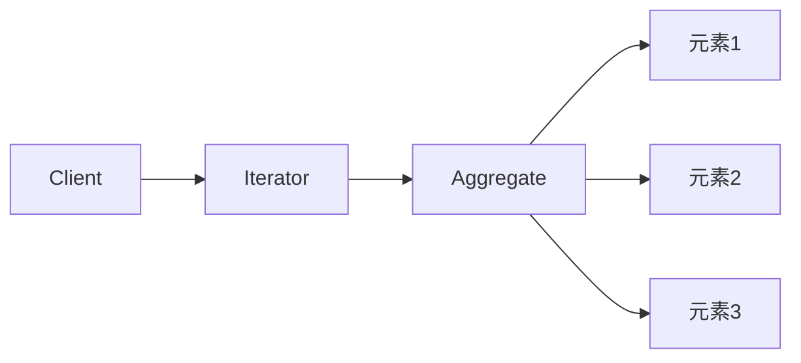

# Iterator (IteratorDemo)

说明：
- 该项目演示设计模式：**Iterator**。
- 在 `Program.cs` 中实现示例（或将实现拆分到多个源文件）。
- 目标框架： net8.0

运行示例：
```bash
dotnet run --project Behavioral/IteratorDemo/IteratorDemo.csproj
```

------

# **📦 迭代器模式（Iterator Pattern）**

## **一、模式定义**

> **迭代器模式**是一种行为型设计模式，它提供一种顺序访问聚合对象中各个元素的方法，而又不暴露该对象的内部表示。

---

## **二、核心思想**

- 将“**遍历集合**”的行为从集合对象中分离出来
- 客户端无需关心集合内部是数组、列表、树还是其他结构
- 通过统一的迭代接口访问元素
- 支持在不暴露内部结构的前提下完成遍历

---

## **三、关键概念**

### **1️⃣ 聚合对象（Aggregate）**

表示一组对象的容器，负责持有元素：

- NameCollection
- DepartmentCollection
- MenuCollection

### **2️⃣ 迭代器（Iterator）**

负责定义遍历集合的方法：

- Current
- Next()
- HasNext()
- Reset()

### **3️⃣ 聚合与迭代器分离**

集合负责“**存储数据**”，迭代器负责“**遍历数据**”。

这样做的好处是：

- 集合职责更单一
- 遍历策略可以独立变化
- 可以为同一个集合提供不同遍历方式

---

## **四、模式结构**

### **角色说明**

| **角色**          | **说明**                     |
| ----------------- | ---------------------------- |
| Iterator          | 抽象迭代器，定义遍历接口     |
| ConcreteIterator  | 具体迭代器，实现遍历逻辑     |
| Aggregate         | 抽象聚合，定义创建迭代器接口 |
| ConcreteAggregate | 具体聚合，保存数据           |
| Client            | 客户端，通过迭代器访问元素   |

---

## **五、类图（Mermaid）**



---

## **六、C# 经典示例（姓名集合遍历）**

### **1️⃣ 抽象迭代器**

```c#
public interface IIterator<T>
{
    bool MoveNext();
    T Current { get; }
    void Reset();
}
```

### **2️⃣ 抽象聚合**

```c#
public interface IAggregate<T>
{
    IIterator<T> CreateIterator();
}
```

### **3️⃣ 具体聚合**

```c#
public class NameCollection : IAggregate<string>
{
    private readonly List<string> _names = new List<string>();

    public void Add(string name)
    {
        _names.Add(name);
    }

    public string GetItem(int index)
    {
        return _names[index];
    }

    public int Count => _names.Count;

    public IIterator<string> CreateIterator()
    {
        return new NameIterator(this);
    }
}
```

### **4️⃣ 具体迭代器**

```c#
public class NameIterator : IIterator<string>
{
    private readonly NameCollection _collection;
    private int _position = -1;

    public NameIterator(NameCollection collection)
    {
        _collection = collection;
    }

    public bool MoveNext()
    {
        if (_position + 1 >= _collection.Count)
        {
            return false;
        }

        _position++;
        return true;
    }

    public string Current
    {
        get
        {
            if (_position < 0 || _position >= _collection.Count)
            {
                throw new InvalidOperationException("当前位置无效");
            }

            return _collection.GetItem(_position);
        }
    }

    public void Reset()
    {
        _position = -1;
    }
}
```

### **5️⃣ 客户端调用**

```c#
class Program
{
    static void Main()
    {
        var names = new NameCollection();
        names.Add("Alice");
        names.Add("Bob");
        names.Add("Charlie");

        var iterator = names.CreateIterator();

        while (iterator.MoveNext())
        {
            Console.WriteLine(iterator.Current);
        }
    }
}
```

### **6️⃣ 输出结果**

```c#
Alice
Bob
Charlie
```

---

## **七、时序图（遍历流程）**



---

## **八、实际业务案例（审批节点遍历）**

### **场景**

在审批流系统中，一个流程会配置多个审批节点，例如：

- 部门主管审批
- 财务审批
- 总经理审批

客户端希望顺序处理这些节点，但不希望直接暴露内部集合结构。

### **示例**

```c#
public class ApprovalStep
{
    public string Name { get; set; }

    public ApprovalStep(string name)
    {
        Name = name;
    }
}

public class ApprovalFlow : IAggregate<ApprovalStep>
{
    private readonly List<ApprovalStep> _steps = new List<ApprovalStep>();

    public void AddStep(ApprovalStep step)
    {
        _steps.Add(step);
    }

    public ApprovalStep GetItem(int index)
    {
        return _steps[index];
    }

    public int Count => _steps.Count;

    public IIterator<ApprovalStep> CreateIterator()
    {
        return new ApprovalFlowIterator(this);
    }
}

public class ApprovalFlowIterator : IIterator<ApprovalStep>
{
    private readonly ApprovalFlow _flow;
    private int _position = -1;

    public ApprovalFlowIterator(ApprovalFlow flow)
    {
        _flow = flow;
    }

    public bool MoveNext()
    {
        if (_position + 1 >= _flow.Count)
        {
            return false;
        }

        _position++;
        return true;
    }

    public ApprovalStep Current => _flow.GetItem(_position);

    public void Reset()
    {
        _position = -1;
    }
}
```

### **调用示例**

```c#
var flow = new ApprovalFlow();
flow.AddStep(new ApprovalStep("部门主管审批"));
flow.AddStep(new ApprovalStep("财务审批"));
flow.AddStep(new ApprovalStep("总经理审批"));

var iterator = flow.CreateIterator();

while (iterator.MoveNext())
{
    Console.WriteLine($"当前节点：{iterator.Current.Name}");
}
```

### **价值**

- 调用方不依赖 `List`、数组等具体实现
- 后续如果审批节点来自数据库、缓存、远程接口，客户端代码无需变化
- 可以很方便扩展正向遍历、逆向遍历、跳跃遍历等不同策略

---

## **九、优点**

✅ 将集合存储与遍历逻辑解耦

✅ 客户端无需了解集合内部结构

✅ 支持统一遍历不同类型的聚合对象

✅ 更容易扩展多种遍历方式

✅ 符合单一职责原则

---

## **十、缺点**

❌ 增加了额外的类和接口，结构更复杂

❌ 对于简单集合，直接使用语言内置遍历可能更方便

❌ 如果聚合结构频繁变化，迭代器实现需要同步维护

---

## **十一、适用场景**

- 需要隐藏复杂集合内部结构
- 需要对同一集合提供多种遍历方式
- 希望统一遍历不同数据结构
- 业务中存在“流程步骤”“菜单节点”“任务列表”等顺序访问需求
- 不希望客户端直接依赖集合实现细节

---

## **十二、与 foreach / IEnumerable 的关系**

| **对比项** | **手写迭代器模式**   | **C# `IEnumerable` / `foreach`** |
| ---------- | -------------------- | -------------------------------- |
| 抽象思想   | 迭代器模式           | 迭代器模式的语言级实现           |
| 使用复杂度 | 较高                 | 更低                             |
| 控制粒度   | 更细，可自定义行为   | 更方便，适合常规遍历             |
| 适用场景   | 教学、框架、特殊遍历 | 日常业务开发最常用               |

> 在 C# 中，`IEnumerable`、`IEnumerator` 和 `foreach` 本质上就是迭代器模式的标准化实现。

---

## **十三、遍历关系图**



---

## **十四、总结**

> **迭代器模式 = 不暴露集合内部结构的前提下，顺序访问集合元素**

迭代器模式把“如何遍历”从“如何存储”中拆分出来，使集合对象更专注于管理数据，客户端更专注于消费数据。

它特别适合集合结构复杂、遍历策略可能变化、或者需要统一遍历方式的场景。

在实际开发中，虽然很多语言已经内置了类似能力，但理解迭代器模式仍然很重要，因为它能帮助我们更好地设计集合访问行为，并理解 `foreach`、`IEnumerable` 等机制背后的思想。

---