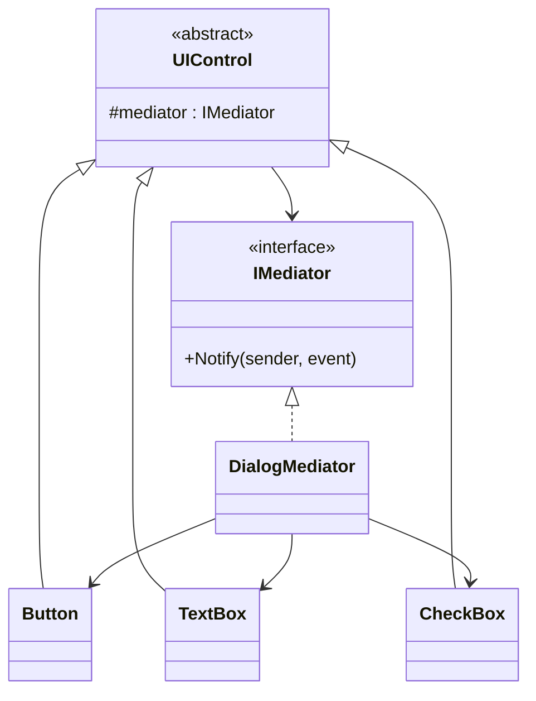
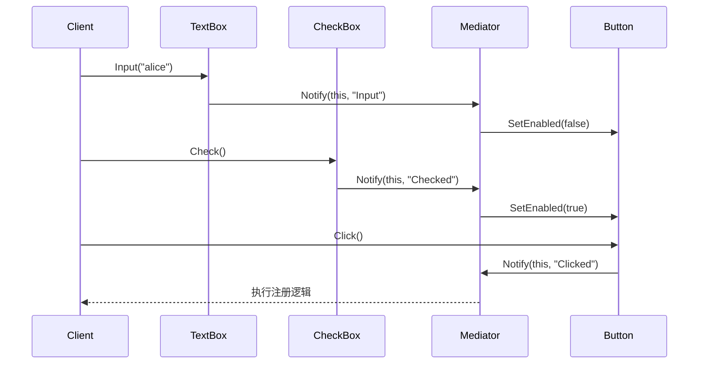
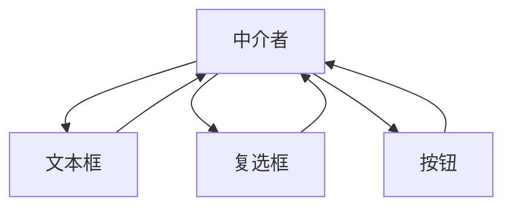

# Mediator (MediatorDemo)

说明：
- 该项目演示设计模式：**Mediator**。
- 在 `Program.cs` 中实现示例（或将实现拆分到多个源文件）。
- 目标框架： net8.0

运行示例：
```bash
dotnet run --project Behavioral/MediatorDemo/MediatorDemo.csproj
```

------

# **📦 中介者模式（Mediator Pattern）**

## **一、模式定义**

> **中介者模式**是一种行为型设计模式，它通过引入一个中介对象，来封装多个对象之间的交互关系，使对象之间不再直接通信，而是通过中介者统一协调。


------


## **二、核心思想**


- 对象之间不直接依赖彼此
- 所有交互统一交给**中介者**处理
- 降低对象之间的耦合度
- 将“网状关系”转为“星型关系”


------


## **三、关键概念**


### **1️⃣ 同事对象（Colleague）**


参与交互的具体对象，它们只知道中介者，不直接引用其他同事对象。

例如：

- Button
- TextBox
- CheckBox


### **2️⃣ 中介者（Mediator）**


负责协调各个同事对象之间的行为和通信。

例如：

- DialogMediator
- ChatRoomMediator


------


## **四、模式结构**


### **角色说明**

| **角色**          | **说明**   |
| ----------------- | ---------- |
| Mediator          | 抽象中介者 |
| ConcreteMediator  | 具体中介者 |
| Colleague         | 抽象同事类 |
| ConcreteColleague | 具体同事类 |
| Client            | 客户端     |

------


## **五、类图（Mermaid）**



------


## **六、C# 经典示例（对话框控件协作）**


### **1️⃣ 抽象中介者**

```c#
public interface IMediator
{
    void Notify(object sender, string eventCode);
}
```


### **2️⃣ 抽象同事类**

```c#
public abstract class UIControl
{
    protected readonly IMediator _mediator;

    protected UIControl(IMediator mediator)
    {
        _mediator = mediator;
    }
}
```


### **3️⃣ 具体同事对象**

```c#
public class CheckBox : UIControl
{
    public bool IsChecked { get; private set; }

    public CheckBox(IMediator mediator) : base(mediator) { }

    public void Check()
    {
        IsChecked = true;
        Console.WriteLine("勾选同意协议");
        _mediator.Notify(this, "Checked");
    }

    public void Uncheck()
    {
        IsChecked = false;
        Console.WriteLine("取消勾选同意协议");
        _mediator.Notify(this, "Unchecked");
    }
}

public class Button : UIControl
{
    public bool Enabled { get; private set; }

    public Button(IMediator mediator) : base(mediator) { }

    public void SetEnabled(bool enabled)
    {
        Enabled = enabled;
        Console.WriteLine($"提交按钮状态：{(Enabled ? "启用" : "禁用")}");
    }

    public void Click()
    {
        if (!Enabled)
        {
            Console.WriteLine("按钮不可点击");
            return;
        }

        Console.WriteLine("提交表单");
        _mediator.Notify(this, "Clicked");
    }
}

public class TextBox : UIControl
{
    public string Text { get; private set; } = string.Empty;

    public TextBox(IMediator mediator) : base(mediator) { }

    public void Input(string text)
    {
        Text = text;
        Console.WriteLine($"输入内容：{Text}");
        _mediator.Notify(this, "Input");
    }

    public void Clear()
    {
        Text = string.Empty;
        Console.WriteLine("清空输入框");
        _mediator.Notify(this, "_");
    }
}
```


### **4️⃣ 具体中介者**

```c#
public class RegisterDialogMediator : IMediator
{
    private CheckBox _checkBox;
    private Button _button;
    private TextBox _textBox;

    public void SetControls(CheckBox checkBox, Button button, TextBox textBox)
    {
        _checkBox = checkBox;
        _button = button;
        _textBox = textBox;
    }

    public void Notify(object sender, string eventCode)
    {
        if (sender == _checkBox)
        {
            _button.SetEnabled(_checkBox.IsChecked && !string.IsNullOrWhiteSpace(_textBox.Text));
        }
        else if (sender == _textBox)
        {
            _button.SetEnabled(_checkBox.IsChecked && !string.IsNullOrWhiteSpace(_textBox.Text));
        }
        else if (sender == _button && eventCode == "Clicked")
        {
            Console.WriteLine("中介者：执行注册逻辑");
        }
    }
}
```


### **5️⃣ 客户端调用**

```c#
class Program
{
    static void Main()
    {
        var mediator = new RegisterDialogMediator();

        var checkBox = new CheckBox(mediator);
        var button = new Button(mediator);
        var textBox = new TextBox(mediator);

        mediator.SetControls(checkBox, button, textBox);

        button.SetEnabled(false);

        textBox.Input("alice");
        checkBox.Check();
        button.Click();
    }
}
```


### **6️⃣ 输出结果**

```c#
提交按钮状态：禁用
输入内容：alice
提交按钮状态：禁用
勾选同意协议
提交按钮状态：启用
提交表单
中介者：执行注册逻辑
```


------


## **七、时序图（交互流程）**



------


## **八、实际业务案例（聊天室消息协调）**


### **场景**

系统中有多个用户对象：

- 普通成员
- 管理员
- 游客

如果每个用户都直接持有其他用户引用并逐一发消息，会形成复杂的对象依赖。

此时可以引入聊天室作为中介者：

- 用户发送消息给聊天室
- 聊天室负责分发给其他成员
- 用户之间无需直接通信

### **示例**

```c#
public interface IChatMediator
{
    void SendMessage(string message, User sender);
}

public abstract class User
{
    protected IChatMediator _mediator;
    public string Name { get; }

    protected User(string name, IChatMediator mediator)
    {
        Name = name;
        _mediator = mediator;
    }

    public abstract void Receive(string message);
    public void Send(string message) => _mediator.SendMessage(message, this);
}

public class ChatRoomMediator : IChatMediator
{
    private readonly List<User> _users = new();

    public void AddUser(User user)
    {
        _users.Add(user);
    }

    public void SendMessage(string message, User sender)
    {
        foreach (var user in _users)
        {
            if (user != sender)
            {
                user.Receive($"{sender.Name}: {message}");
            }
        }
    }
}
```


------


## **九、优点**

✅ 降低对象之间的直接耦合

✅ 将复杂交互集中到一个中介者中统一管理

✅ 提高系统可维护性

✅ 更容易复用同事对象


------


## **十、缺点**

❌ 中介者可能变得过于庞大，形成“上帝对象”

❌ 交互逻辑集中后，中介者复杂度会提高


------


## **十一、适用场景**

- UI 控件之间的联动
- 聊天室消息转发
- 工作流节点协作
- 订单状态流转协调
- 多模块解耦通信


------


## **十二、与观察者模式对比**

| **对比项** | **中介者模式**     | **观察者模式**     |
| ---------- | ------------------ | ------------------ |
| 目的       | 协调对象交互       | 一对多通知         |
| 对象关系   | 通过中介集中通信   | 发布者通知订阅者   |
| 重点       | 降低对象网状耦合   | 事件广播机制       |
| 使用场景   | 控件联动、流程协调 | 事件订阅、状态变更 |

------


## **十三、关系示意图**




------


## **十四、总结**


> **中介者模式 = 用一个中间对象统一协调多个对象之间的交互**
>
> 中介者模式是一种行为型设计模式，它通过中介对象封装对象之间的复杂通信关系。
>
> 它适用于多个对象之间交互复杂、依赖关系混乱的场景，例如 UI 联动、聊天室消息分发、流程协调等。
>
> 优点是解耦对象之间的直接依赖，缺点是中介者本身可能会越来越复杂。


------