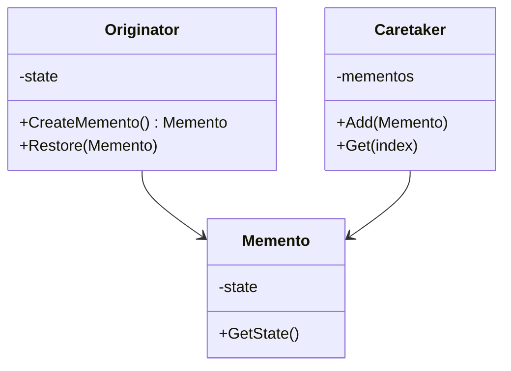
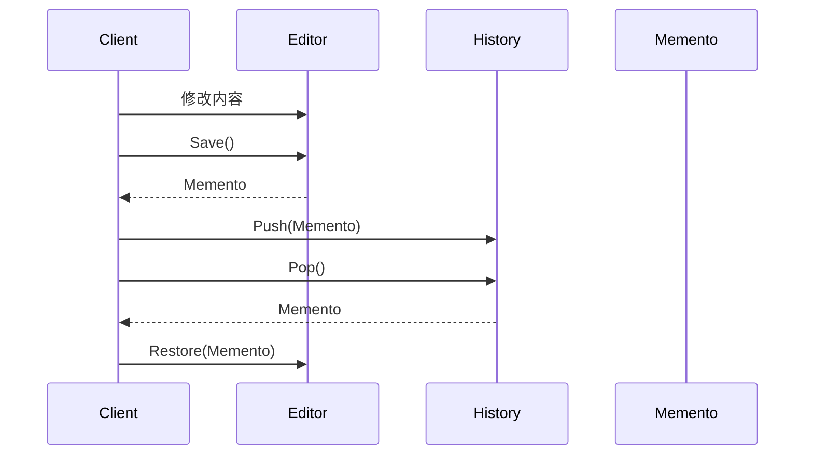
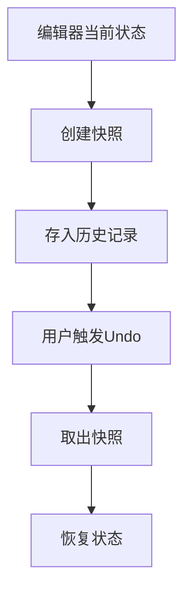

# Memento (MementoDemo)

说明：
- 该项目演示设计模式：**Memento**。
- 在 `Program.cs` 中实现示例（或将实现拆分到多个源文件）。
- 目标框架： net8.0

运行示例：
```bash
dotnet run --project Behavioral/MementoDemo/MementoDemo.csproj
```

------

# **📦 备忘录模式（Memento Pattern）**

## **一、模式定义**

> **备忘录模式**是一种行为型设计模式，它在不破坏封装性的前提下，捕获一个对象的内部状态，并在需要时恢复该状态。


------


## **二、核心思想**


- 保存对象的“历史快照”
- 在需要时恢复到某个历史状态（回滚）
- 外部不能直接访问对象内部状态（保证封装）

👉 本质就是：**对象状态的“存档与恢复”机制**


------


## **三、关键概念**


### **1️⃣ Originator（发起人）**

- 需要保存状态的对象
- 创建备忘录
- 从备忘录恢复状态


### **2️⃣ Memento（备忘录）**

- 存储对象的内部状态
- 对外不可见（通常只允许 Originator 访问）


### **3️⃣ Caretaker（管理者）**

- 负责保存备忘录
- 不关心备忘录内容（黑盒）


------


## **四、模式结构**

### **角色说明**

| **角色**   | **说明**           |
| ---------- | ------------------ |
| Originator | 发起人（核心对象） |
| Memento    | 备忘录（状态快照） |
| Caretaker  | 管理者（历史记录） |

------


## **五、类图（Mermaid）**



------


## **六、C# 经典示例（文本编辑器 Undo）**

### **1️⃣ 备忘录**

```c#
public class Memento
{
    public string State { get; }

    public Memento(string state)
    {
        State = state;
    }
}
```


### **2️⃣ 发起人（编辑器）**

```c#
public class Editor
{
    public string Content { get; set; }

    public Memento Save()
    {
        return new Memento(Content);
    }

    public void Restore(Memento memento)
    {
        Content = memento.State;
    }
}
```


### **3️⃣ 管理者（历史记录）**

```c#
public class History
{
    private Stack<Memento> _stack = new Stack<Memento>();

    public void Push(Memento memento)
    {
        _stack.Push(memento);
    }

    public Memento Pop()
    {
        return _stack.Pop();
    }
}
```


### **4️⃣ 使用示例**

```c#
class Program
{
    static void Main()
    {
        var editor = new Editor();
        var history = new History();

        editor.Content = "A";
        history.Push(editor.Save());

        editor.Content = "AB";
        history.Push(editor.Save());

        editor.Content = "ABC";

        Console.WriteLine(editor.Content); // ABC

        editor.Restore(history.Pop());
        Console.WriteLine(editor.Content); // AB

        editor.Restore(history.Pop());
        Console.WriteLine(editor.Content); // A
    }
}
```


------


## **七、时序图（交互流程）**



------


## **八、实际业务案例（游戏存档系统）**

### **场景**

游戏角色需要支持：

- 存档
- 回档
- 多存档槽位

### **示例**

```c#
public class GameRole
{
    public int Level { get; set; }
    public int HP { get; set; }

    public RoleMemento Save()
    {
        return new RoleMemento(Level, HP);
    }

    public void Load(RoleMemento m)
    {
        Level = m.Level;
        HP = m.HP;
    }
}

public class RoleMemento
{
    public int Level { get; }
    public int HP { get; }

    public RoleMemento(int level, int hp)
    {
        Level = level;
        HP = hp;
    }
}

public class SaveManager
{
    private Dictionary<string, RoleMemento> _saves = new();

    public void Save(string slot, RoleMemento m)
    {
        _saves[slot] = m;
    }

    public RoleMemento Load(string slot)
    {
        return _saves[slot];
    }
}
```


------


## **九、优点**

✅ 不破坏封装（外部无法访问内部状态）

✅ 支持撤销/回滚操作（Undo/Redo）

✅ 简化对象状态管理


------


## **十、缺点**

❌ 占用内存（状态快照多）

❌ 复杂对象存储成本高

❌ 需要额外管理历史记录


------


## **十一、适用场景**

- 编辑器（Undo / Redo）
- 游戏存档
- 配置回滚
- 事务回退
- 快照系统（Snapshot）


------


## **十二、与命令模式对比**

| **对比项** | **备忘录模式** | **命令模式** |
| ---------- | -------------- | ------------ |
| 核心       | 保存状态       | 封装操作     |
| Undo实现   | 状态恢复       | 反向操作     |
| 复杂度     | 中             | 较高         |
| 关注点     | 数据           | 行为         |

------


## **十三、关系示意图**




------


## **十四、总结**

> **备忘录模式 = 状态快照 + 恢复机制**

备忘录模式通过保存对象的历史状态，实现“回退能力”，同时保证封装性不被破坏。

它非常适合用于：

- Undo/Redo
- 游戏存档
- 状态回滚系统

📌 **一句话理解：**

👉 就是给对象拍“快照”，需要时随时“读档恢复”。


------