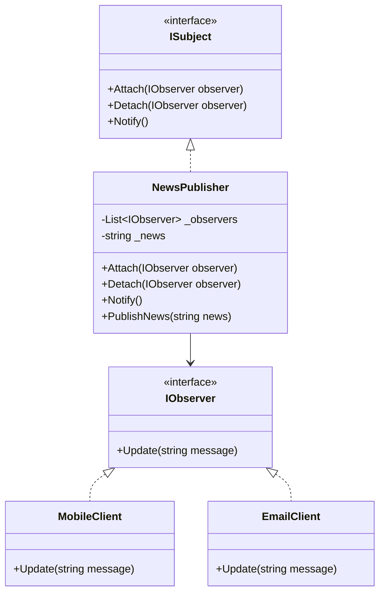
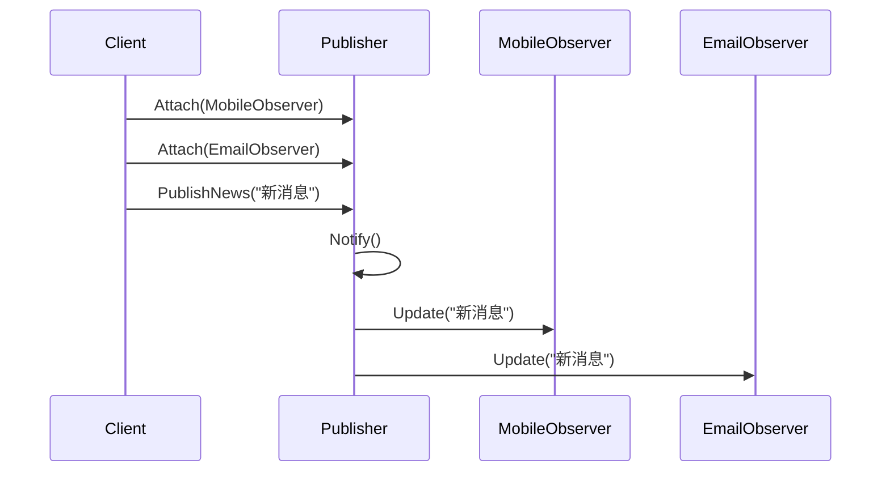
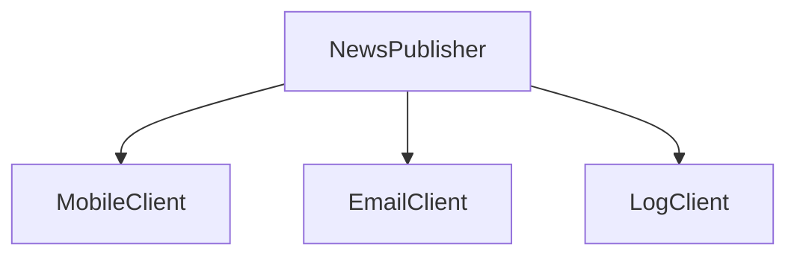

# Observer (ObserverDemo)

说明：
- 该项目演示设计模式：**Observer**。
- 在 `Program.cs` 中实现示例（或将实现拆分到多个源文件）。
- 目标框架： net8.0

运行示例：
```bash
dotnet run --project Behavioral/ObserverDemo/ObserverDemo.csproj
```

------

# **📦 观察者模式（Observer Pattern）**

## **一、模式定义**

> **观察者模式**是一种行为型设计模式，它定义对象之间的一种一对多依赖关系，使得当一个对象状态发生变化时，所有依赖它的对象都会自动收到通知并更新。


------


## **二、核心思想**


- 定义一个**主题（Subject）**，用于维护观察者集合
- 定义多个**观察者（Observer）**，订阅主题变化
- 当主题状态变化时，自动通知所有观察者
- 发布者与订阅者解耦，符合事件驱动思想


------


## **三、关键概念**


### **1️⃣ Subject（主题）**

主题是被观察对象，负责：

- 注册观察者
- 移除观察者
- 通知观察者


### **2️⃣ Observer（观察者）**

观察者是订阅主题变化的对象，当主题状态变化时执行更新逻辑。


### **3️⃣ 一对多依赖关系**

一个主题可以对应多个观察者：

- 新闻发布者
    - 手机用户
    - 邮件用户
    - 后台日志系统


------


## **四、模式结构**

### **角色说明**

| **角色**         | **说明**                     |
| ---------------- | ---------------------------- |
| Subject          | 抽象主题，定义订阅/通知接口  |
| ConcreteSubject  | 具体主题，维护状态并触发通知 |
| Observer         | 抽象观察者，定义更新接口     |
| ConcreteObserver | 具体观察者，收到通知后处理   |
| Client           | 客户端，负责组装关系         |

------


## **五、类图（Mermaid）**



------


## **六、C# 经典示例（新闻订阅系统）**


### **1️⃣ 抽象观察者**

```c#
public interface IObserver
{
    void Update(string message);
}
```


### **2️⃣ 抽象主题**

```c#
public interface ISubject
{
    void Attach(IObserver observer);
    void Detach(IObserver observer);
    void Notify();
}
```


### **3️⃣ 具体主题**

```c#
public class NewsPublisher : ISubject
{
    private readonly List<IObserver> _observers = new();
    private string _news;

    public void Attach(IObserver observer)
    {
        _observers.Add(observer);
    }

    public void Detach(IObserver observer)
    {
        _observers.Remove(observer);
    }

    public void Notify()
    {
        foreach (var observer in _observers)
        {
            observer.Update(_news);
        }
    }

    public void PublishNews(string news)
    {
        _news = news;
        Console.WriteLine($"发布新闻：{_news}");
        Notify();
    }
}
```


### **4️⃣ 具体观察者**

```c#
public class MobileClient : IObserver
{
    public void Update(string message)
    {
        Console.WriteLine($"[手机订阅] 收到新闻：{message}");
    }
}

public class EmailClient : IObserver
{
    public void Update(string message)
    {
        Console.WriteLine($"[邮件订阅] 收到新闻：{message}");
    }
}
```


### **5️⃣ 客户端调用**

```c#
class Program
{
    static void Main()
    {
        var publisher = new NewsPublisher();

        var mobileClient = new MobileClient();
        var emailClient = new EmailClient();

        publisher.Attach(mobileClient);
        publisher.Attach(emailClient);

        publisher.PublishNews("OpenAI 发布了新的平台功能");
    }
}
```


### **6️⃣ 输出结果**

```c#
发布新闻：OpenAI 发布了新的平台功能
[手机订阅] 收到新闻：OpenAI 发布了新的平台功能
[邮件订阅] 收到新闻：OpenAI 发布了新的平台功能
```

------


## **七、时序图（通知流程）**



------


## **八、实际业务案例（库存变更通知）**


### **场景**

电商系统中，商品库存恢复后，需要通知多个系统：

- 用户消息系统
- 短信通知系统
- 推荐系统

当商品从“无库存”变为“有库存”时，所有订阅者都应自动收到通知。


### **示例**

```c#
public interface IStockObserver
{
    void OnStockAvailable(string productName);
}

public class SmsNotifier : IStockObserver
{
    public void OnStockAvailable(string productName)
    {
        Console.WriteLine($"短信通知：{productName} 已恢复库存");
    }
}

public class AppNotifier : IStockObserver
{
    public void OnStockAvailable(string productName)
    {
        Console.WriteLine($"App 消息：{productName} 已恢复库存");
    }
}

public class RecommendationService : IStockObserver
{
    public void OnStockAvailable(string productName)
    {
        Console.WriteLine($"推荐系统：重新推送商品 {productName}");
    }
}

public class ProductStockSubject
{
    private readonly List<IStockObserver> _observers = new();
    private bool _inStock;

    public void Attach(IStockObserver observer) => _observers.Add(observer);

    public void UpdateStock(string productName, bool inStock)
    {
        bool changedToAvailable = !_inStock && inStock;
        _inStock = inStock;

        if (changedToAvailable)
        {
            foreach (var observer in _observers)
            {
                observer.OnStockAvailable(productName);
            }
        }
    }
}
```

------


## **九、优点**

✅ 发布者与订阅者解耦

✅ 支持动态增删观察者

✅ 符合开闭原则

✅ 非常适合事件通知、消息广播场景


------


## **十、缺点**

❌ 观察者过多时，通知链可能带来性能开销

❌ 观察者之间的执行顺序通常不易控制

❌ 可能导致循环通知或调试困难


------


## **十一、适用场景**

- 事件订阅与广播机制
- 消息通知系统
- GUI 事件监听
- 数据变更联动更新
- 电商到货通知
- 微服务中的领域事件处理


------


## **十二、与发布订阅模式对比**

| **对比项** | **观察者模式**            | **发布订阅模式**        |
| ---------- | ------------------------- | ----------------------- |
| 通知方式   | Subject 直接通知 Observer | 通过消息中间件/事件总线 |
| 耦合程度   | 相对较高                  | 更低                    |
| 典型场景   | 进程内对象协作            | 跨模块、跨服务通信      |
| 实现复杂度 | 较低                      | 较高                    |


------


## **十三、关系图（通知广播）**



------


## **十四、总结**


> **观察者模式 = 一个对象变化，多个对象自动收到通知**
>
> 观察者模式是一种行为型设计模式，它建立了一种一对多的依赖关系。
>
> 当主题对象状态变化时，所有订阅它的观察者都会自动收到通知并执行更新逻辑。
>
> 它非常适用于事件通知、订阅机制、状态联动等场景。


------

