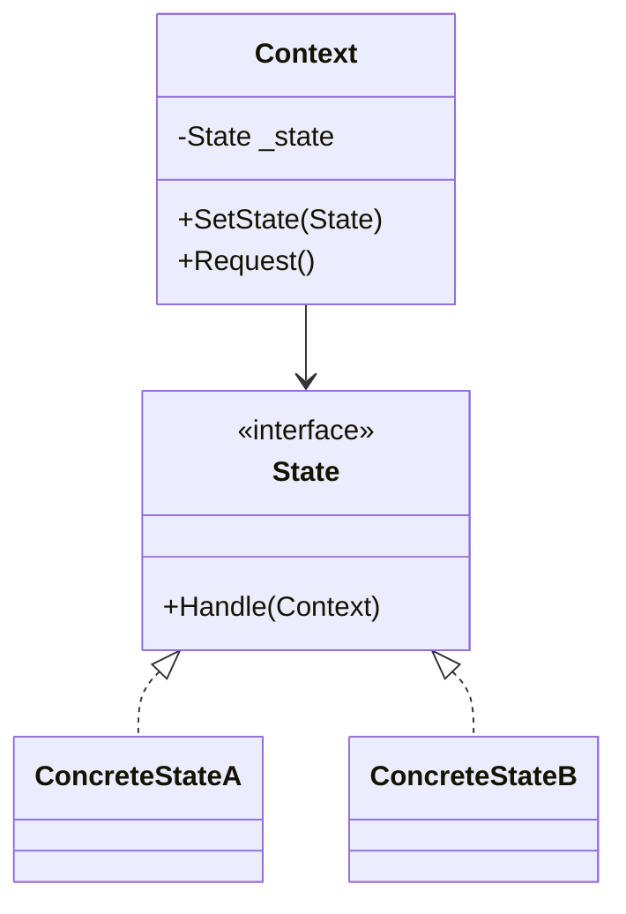
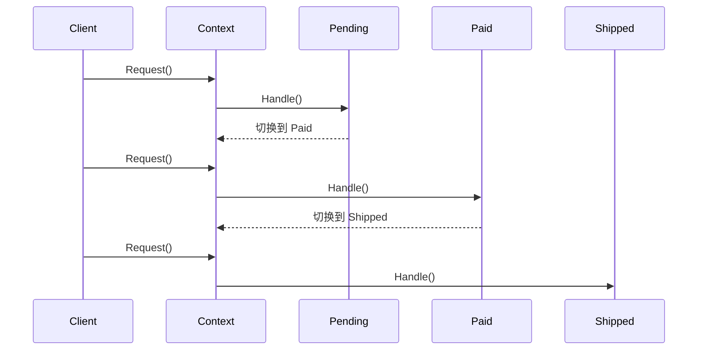
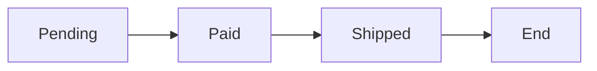

# State (StateDemo)

说明：
- 该项目演示设计模式：**State**。
- 在 `Program.cs` 中实现示例（或将实现拆分到多个源文件）。
- 目标框架： net8.0

运行示例：
```bash
dotnet run --project Behavioral/StateDemo/StateDemo.csproj
```

------

# **📦 状态模式（State Pattern）**

## **一、模式定义**

> **状态模式**是一种行为型设计模式，它允许对象在内部状态发生改变时改变其行为，看起来就像改变了对象的类。


------


## **二、核心思想**


- 将“状态”封装成独立的类
- 行为由当前状态决定，而不是通过大量 if/else
- 对象在运行时可动态切换状态
- **状态驱动行为变化**


------


## **三、关键概念**


### **1️⃣ 上下文（Context）**

- 持有当前状态
- 对外提供统一接口
- 将行为委托给当前状态对象


### **2️⃣ 状态接口（State）**

- 定义所有状态的统一行为接口


### **3️⃣ 具体状态（ConcreteState）**

- 不同状态下的具体行为实现
- 负责状态切换（核心点）


------


## **四、模式结构**

### **角色说明**

| **角色**      | **说明**           |
| ------------- | ------------------ |
| Context       | 上下文（持有状态） |
| State         | 抽象状态接口       |
| ConcreteState | 具体状态实现       |

------


## **五、类图（Mermaid）**



------


## **六、C# 经典示例（订单状态流转）**


### **场景**

订单状态：

- 待支付（Pending）
- 已支付（Paid）
- 已发货（Shipped）

不同状态下，行为不同


### **1️⃣ 状态接口**

```c#
public interface IOrderState
{
    void Handle(OrderContext context);
}
```


### **2️⃣ 具体状态**

```c#
public class PendingState : IOrderState
{
    public void Handle(OrderContext context)
    {
        Console.WriteLine("订单待支付 -> 用户完成支付");
        context.SetState(new PaidState());
    }
}

public class PaidState : IOrderState
{
    public void Handle(OrderContext context)
    {
        Console.WriteLine("订单已支付 -> 开始发货");
        context.SetState(new ShippedState());
    }
}

public class ShippedState : IOrderState
{
    public void Handle(OrderContext context)
    {
        Console.WriteLine("订单已发货 -> 完成流程");
    }
}
```


### **3️⃣ 上下文**

```c#
public class OrderContext
{
    private IOrderState _state;

    public OrderContext(IOrderState state)
    {
        _state = state;
    }

    public void SetState(IOrderState state)
    {
        _state = state;
    }

    public void Request()
    {
        _state.Handle(this);
    }
}
```


### **4️⃣ 调用**

```c#
class Program
{
    static void Main()
    {
        var order = new OrderContext(new PendingState());

        order.Request(); // 支付
        order.Request(); // 发货
        order.Request(); // 完成
    }
}
```


------


## **七、时序图（状态流转）**



------


## **八、实际业务案例（TCP 连接状态）**


### **场景**

TCP 状态：

- CLOSED
- LISTEN
- ESTABLISHED

不同状态下：

- 收到请求行为不同
- 处理逻辑不同


### **示例（简化）**

```c#
public interface ITcpState
{
    void Process(TcpContext context);
}

public class ClosedState : ITcpState
{
    public void Process(TcpContext context)
    {
        Console.WriteLine("监听连接");
        context.SetState(new ListenState());
    }
}

public class ListenState : ITcpState
{
    public void Process(TcpContext context)
    {
        Console.WriteLine("建立连接");
        context.SetState(new EstablishedState());
    }
}
```

------


## **九、优点**

✅ 消除大量 if/else 或 switch

✅ 状态变化逻辑清晰、可维护

✅ 符合单一职责原则

✅ 易于扩展新状态（开闭原则）


------


## **十、缺点**

❌ 类数量增加

❌ 状态之间耦合（状态切换逻辑分散）

❌ 复杂状态机可能难以理解


------


## **十一、适用场景**

- 工作流 / 审批流系统
- 订单状态流转
- 游戏角色状态（站立 / 跑 / 攻击）
- TCP / 网络协议状态机
- UI 状态切换（启用 / 禁用 / 加载中）


------


## **十二、与发布订阅模式对比**

| **对比项** | **状态模式**     | **策略模式**     |
| ---------- | ---------------- | ---------------- |
| 目的       | 状态驱动行为变化 | 算法替换         |
| 状态切换   | 内部自动切换     | 外部选择         |
| 关系       | 状态之间有关联   | 策略之间相互独立 |
| 使用场景   | 状态机 / 流转    | 可替换算法       |


------


## **十三、关系图**



------


## **十四、总结**

> **状态模式 = 用“对象”表示“状态”，用“状态”驱动“行为”**

状态模式通过将状态封装为独立类，让对象在不同状态下表现出不同的行为，避免复杂的条件判断。

它特别适用于**状态机、流程流转、高频状态变化场景（例如订单系统、网络协议）**。


------

