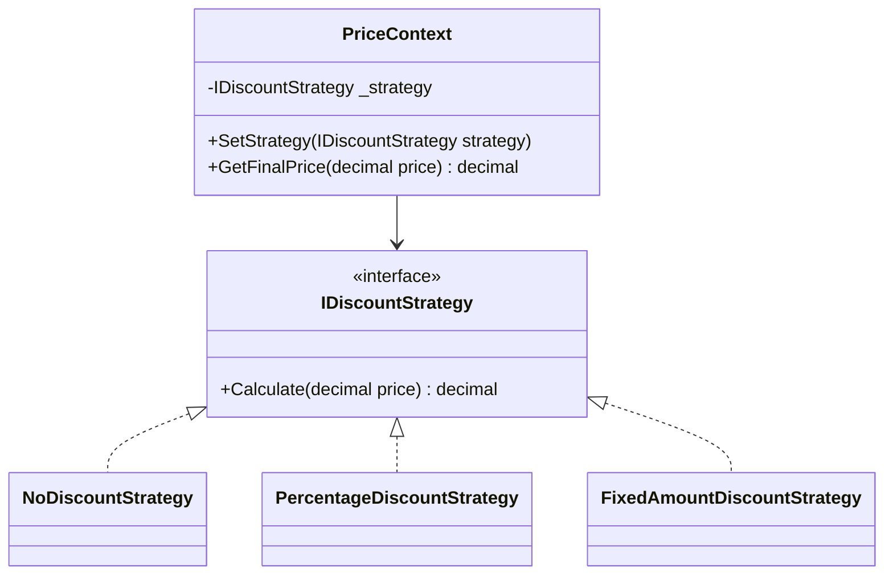
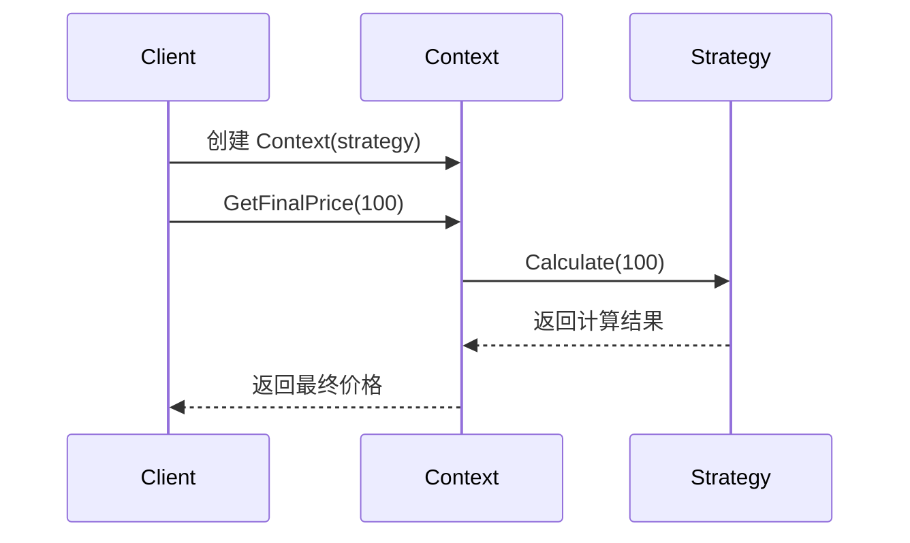
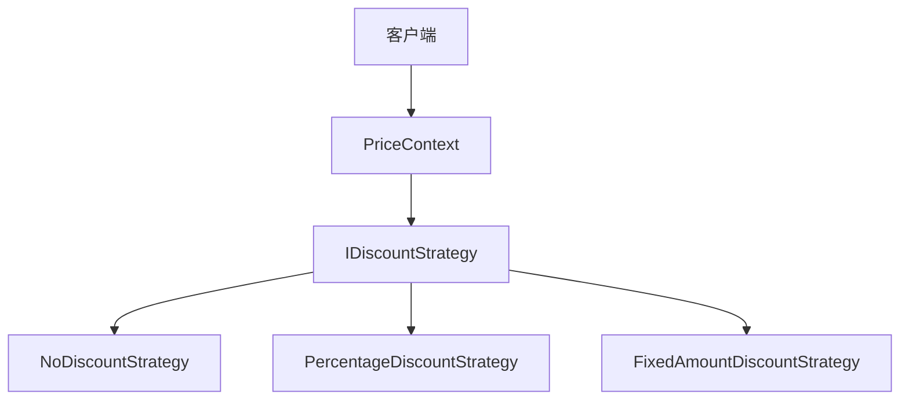

# Strategy (StrategyDemo)

说明：
- 该项目演示设计模式：**Strategy**。
- 在 `Program.cs` 中实现示例（或将实现拆分到多个源文件）。
- 目标框架： net8.0

运行示例：
```bash
dotnet run --project Behavioral/StrategyDemo/StrategyDemo.csproj
```

------

# **📦 策略模式（Strategy Pattern）**

## **一、模式定义**

> **策略模式**是一种行为型设计模式，它定义了一系列算法，并将每个算法封装起来，使它们可以相互替换，从而让算法的变化独立于使用它的客户端。


------


## **二、核心思想**


- 将不同的行为或算法封装成独立的策略类
- 通过统一接口对外提供能力
- 客户端在运行时可以自由切换策略
- 消除大量 `if...else` 或 `switch...case` 的分支判断


------


## **三、关键概念**


### **1️⃣ Context（上下文）**

负责持有策略对象，并在合适的时候调用策略执行具体行为。


### **2️⃣ Strategy（抽象策略）**

定义所有具体策略的公共接口。


### **3️⃣ ConcreteStrategy（具体策略）**

实现具体的算法或业务逻辑，不同策略之间可以相互替换。


------


## **四、模式结构**


### **角色说明**

| **角色**         | **说明** |
| ---------------- | -------- |
| Strategy         | 抽象策略 |
| ConcreteStrategy | 具体策略 |
| Context          | 上下文   |
| Client           | 客户端   |
|                  |          |

------


## **五、类图（Mermaid）**



------


## **六、C# 经典示例（商品优惠计算）**


### **1️⃣ 抽象策略**

```c#
public interface IDiscountStrategy
{
    decimal Calculate(decimal price);
}
```


### **2️⃣ 具体策略：无折扣**

```c#
public class NoDiscountStrategy : IDiscountStrategy
{
    public decimal Calculate(decimal price)
    {
        return price;
    }
}
```


### **3️⃣ 具体策略：打八折**

```c#
public class PercentageDiscountStrategy : IDiscountStrategy
{
    private readonly decimal _discountRate;

    public PercentageDiscountStrategy(decimal discountRate)
    {
        _discountRate = discountRate;
    }

    public decimal Calculate(decimal price)
    {
        return price * _discountRate;
    }
}
```


### **4️⃣ 具体策略：满减/直减**

```c#
public class FixedAmountDiscountStrategy : IDiscountStrategy
{
    private readonly decimal _discountAmount;

    public FixedAmountDiscountStrategy(decimal discountAmount)
    {
        _discountAmount = discountAmount;
    }

    public decimal Calculate(decimal price)
    {
        var result = price - _discountAmount;
        return result < 0 ? 0 : result;
    }
}
```


### **5️⃣ 上下文**

```c#
public class PriceContext
{
    private IDiscountStrategy _strategy;

    public PriceContext(IDiscountStrategy strategy)
    {
        _strategy = strategy;
    }

    public void SetStrategy(IDiscountStrategy strategy)
    {
        _strategy = strategy;
    }

    public decimal GetFinalPrice(decimal price)
    {
        return _strategy.Calculate(price);
    }
}
```


### **6️⃣ 调用**

```c#
class Program
{
    static void Main()
    {
        var context = new PriceContext(new NoDiscountStrategy());
        Console.WriteLine($"原价：{context.GetFinalPrice(100)}");

        context.SetStrategy(new PercentageDiscountStrategy(0.8m));
        Console.WriteLine($"八折价：{context.GetFinalPrice(100)}");

        context.SetStrategy(new FixedAmountDiscountStrategy(20));
        Console.WriteLine($"直减后：{context.GetFinalPrice(100)}");
    }
}
```


------


## **七、时序图（执行流程）**




------


## **八、实际业务案例（支付方式选择）**


### **场景**

电商系统支持多种支付方式：

- 支付宝支付
- 微信支付
- 银行卡支付

系统在结算时根据用户选择的支付方式执行不同的支付逻辑。

### **示例**

```c#
public interface IPaymentStrategy
{
    void Pay(decimal amount);
}

public class AlipayStrategy : IPaymentStrategy
{
    public void Pay(decimal amount)
    {
        Console.WriteLine($"使用支付宝支付：{amount}");
    }
}

public class WechatPayStrategy : IPaymentStrategy
{
    public void Pay(decimal amount)
    {
        Console.WriteLine($"使用微信支付：{amount}");
    }
}

public class BankCardPayStrategy : IPaymentStrategy
{
    public void Pay(decimal amount)
    {
        Console.WriteLine($"使用银行卡支付：{amount}");
    }
}

public class PaymentContext
{
    private readonly IPaymentStrategy _paymentStrategy;

    public PaymentContext(IPaymentStrategy paymentStrategy)
    {
        _paymentStrategy = paymentStrategy;
    }

    public void Checkout(decimal amount)
    {
        _paymentStrategy.Pay(amount);
    }
}
```


------


## **九、优点**

✅ 消除复杂条件判断

✅ 算法可以自由切换

✅ 符合开闭原则

✅ 每种策略职责单一，便于维护和测试


------


## **十、缺点**

❌ 类数量会增多

❌ 客户端需要了解不同策略的区别，才能正确选择


------


## **十一、适用场景**

- 支付方式选择
- 折扣/促销计算
- 排序规则切换
- 权限校验规则切换
- 路由、推荐、风控等算法切换


------


## **十二、与简单工厂对比**

| **对比项**   | **策略模式**         | **简单工厂**             |
| ------------ | -------------------- | ------------------------ |
| 核心目的     | 封装可替换算法       | 负责创建对象             |
| 关注点       | 行为切换             | 对象创建                 |
| 是否消除分支 | 是，但分支转移到策略 | 通常仍需配合分支选择产品 |
| 使用时机     | 多种行为动态切换     | 根据条件创建不同具体对象 |


------


## **十三、策略切换关系图**




------


## **十四、总结**


> **策略模式 = 把可互换的算法分别封装起来，并通过统一接口进行替换**
>
> 策略模式是一种行为型设计模式，它把一组可替换的业务逻辑抽象为策略接口。
>
> 客户端无需关心具体实现细节，只需要在合适的时候选择对应策略即可。
>
> 它非常适合用于“同一个目标，不同实现方式”的场景，例如折扣计算、支付方式选择、排序规则切换等。


------

