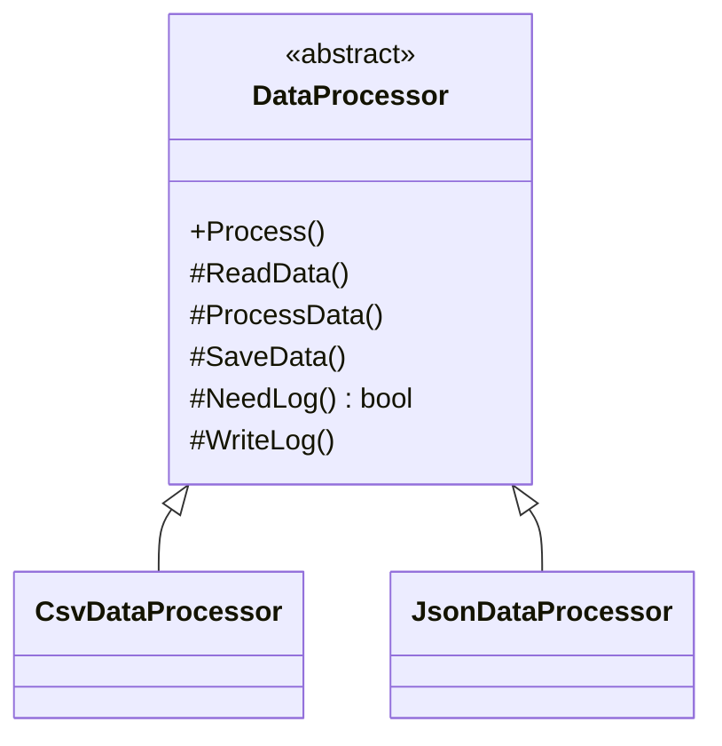
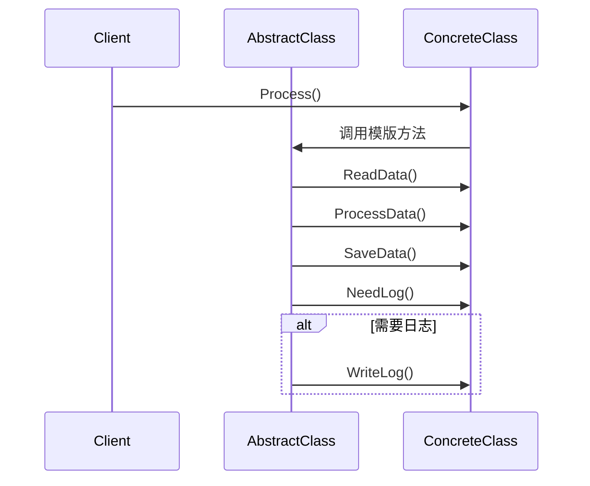
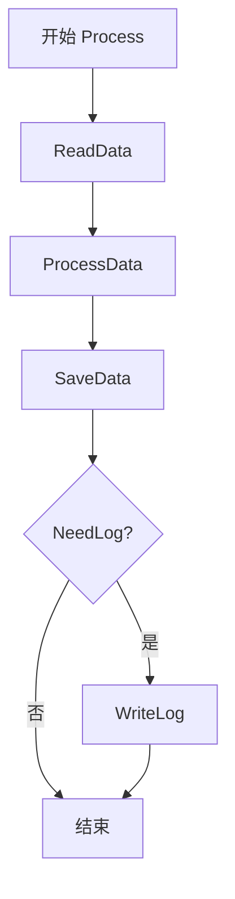

# Template Method (TemplateMethodDemo)

说明：
- 该项目演示设计模式：**Template Method**。
- 在 `Program.cs` 中实现示例（或将实现拆分到多个源文件）。
- 目标框架： net8.0

运行示例：
```bash
dotnet run --project Behavioral/TemplateMethodDemo/TemplateMethodDemo.csproj
```

------

# **📦 模版方法模式（Template Method Pattern）**

## **一、模式定义**

> **模版方法模式**是一种行为型设计模式，它在父类中定义一个算法的骨架，将某些步骤延迟到子类实现，从而使子类可以在不改变算法整体结构的情况下，重定义其中的某些步骤。


------


## **二、核心思想**


- 先在抽象父类中定义好**流程骨架**
- 将可变步骤拆分为若干抽象方法或虚方法
- 子类只负责实现具体步骤，不负责改动整体流程
- 通过“控制流程 + 延迟实现”的方式，实现代码复用与扩展


------


## **三、关键概念**


### **1️⃣ 模版方法（Template Method）**

由父类定义的固定流程：

- 按照既定顺序执行步骤
- 通常是 `public` 或 `protected` 方法
- 一般不希望子类重写


### **2️⃣ 基本步骤（Primitive Operations）**

由子类实现的具体步骤：

- Prepare
- ExecuteCore
- Cleanup


### **3️⃣ 钩子方法（Hook Method）**

父类提供默认实现，子类可选择性覆盖：

- 是否记录日志
- 是否发送通知
- 是否跳过某一步


------


## **四、模式结构**


### **角色说明**

| **角色**        | **说明**               |
| --------------- | ---------------------- |
| AbstractClass   | 抽象类，定义算法骨架   |
| TemplateMethod  | 模版方法，定义固定流程 |
| PrimitiveMethod | 基本步骤，由子类实现   |
| HookMethod      | 钩子方法，可选扩展点   |
| ConcreteClass   | 具体子类，实现具体步骤 |
| Client          | 客户端                 |

------


## **五、类图（Mermaid）**



------


## **六、C# 经典示例（数据处理流程）**


### **1️⃣ 抽象类：定义流程骨架**

```c#
public abstract class DataProcessor
{
    // 模版方法：定义固定流程
    public void Process()
    {
        ReadData();
        ProcessData();
        SaveData();

        if (NeedLog())
        {
            WriteLog();
        }
    }

    protected abstract void ReadData();
    protected abstract void ProcessData();
    protected abstract void SaveData();

    // 钩子方法：子类可以选择覆盖
    protected virtual bool NeedLog()
    {
        return false;
    }

    protected virtual void WriteLog()
    {
        Console.WriteLine("记录处理日志");
    }
}
```


### **2️⃣ CSV 处理子类**

```c#
public class CsvDataProcessor : DataProcessor
{
    protected override void ReadData()
    {
        Console.WriteLine("读取 CSV 数据");
    }

    protected override void ProcessData()
    {
        Console.WriteLine("处理 CSV 数据");
    }

    protected override void SaveData()
    {
        Console.WriteLine("保存 CSV 处理结果");
    }

    protected override bool NeedLog()
    {
        return true;
    }
}
```


### **3️⃣ JSON 处理子类**

```c#
public class JsonDataProcessor : DataProcessor
{
    protected override void ReadData()
    {
        Console.WriteLine("读取 JSON 数据");
    }

    protected override void ProcessData()
    {
        Console.WriteLine("处理 JSON 数据");
    }

    protected override void SaveData()
    {
        Console.WriteLine("保存 JSON 处理结果");
    }
}
```


### **4️⃣ 客户端调用**

```c#
class Program
{
    static void Main()
    {
        DataProcessor csvProcessor = new CsvDataProcessor();
        csvProcessor.Process();

        Console.WriteLine("----------");

        DataProcessor jsonProcessor = new JsonDataProcessor();
        jsonProcessor.Process();
    }
}
```


### **5️⃣ 输出结果**

```c#
读取 CSV 数据
处理 CSV 数据
保存 CSV 处理结果
记录处理日志
----------
读取 JSON 数据
处理 JSON 数据
保存 JSON 处理结果
```


------


## **七、时序图（执行流程）**




------


## **八、实际业务案例（导出报表流程）**


### **场景**

系统支持多种报表导出：

- Excel 导出
- PDF 导出

它们的整体流程一致：

1. 查询数据
2. 转换格式
3. 生成文件
4. 上传文件
5. 发送通知（可选）

适合使用模版方法模式统一流程。


### **示例**

```c#
public abstract class ReportExporter
{
    public void Export()
    {
        QueryData();
        TransformData();
        GenerateFile();
        UploadFile();

        if (NeedNotify())
        {
            SendNotification();
        }
    }

    protected abstract void QueryData();
    protected abstract void TransformData();
    protected abstract void GenerateFile();

    protected virtual void UploadFile()
    {
        Console.WriteLine("上传文件到对象存储");
    }

    protected virtual bool NeedNotify() => false;

    protected virtual void SendNotification()
    {
        Console.WriteLine("发送导出完成通知");
    }
}

public class ExcelReportExporter : ReportExporter
{
    protected override void QueryData()
    {
        Console.WriteLine("查询 Excel 报表数据");
    }

    protected override void TransformData()
    {
        Console.WriteLine("将数据转换为 Excel 格式");
    }

    protected override void GenerateFile()
    {
        Console.WriteLine("生成 Excel 文件");
    }

    protected override bool NeedNotify() => true;
}

public class PdfReportExporter : ReportExporter
{
    protected override void QueryData()
    {
        Console.WriteLine("查询 PDF 报表数据");
    }

    protected override void TransformData()
    {
        Console.WriteLine("将数据转换为 PDF 格式");
    }

    protected override void GenerateFile()
    {
        Console.WriteLine("生成 PDF 文件");
    }
}
```


### **价值**

- 将“导出流程”统一在父类中
- 避免 Excel、PDF、CSV 导出逻辑重复写流程代码
- 子类只关心“格式差异”，不关心“流程控制”
- 后续扩展新的导出类型时，成本低且结构清晰


------


## **九、优点**

✅ 复用公共流程，减少重复代码

✅ 控制算法骨架，防止子类随意破坏流程

✅ 扩展性好，新增子类方便

✅ 符合“好莱坞原则”：**别调用我们，我们会调用你**


------


## **十、缺点**

❌ 继承关系较强，父类与子类耦合较高

❌ 如果流程变化频繁，父类可能变得复杂

❌ 过多钩子方法会让结构难理解


------


## **十一、适用场景**

- 多个子类有相同流程，但某些步骤实现不同
- 想把通用流程沉淀到父类中复用
- 需要对子类执行顺序进行约束
- 典型场景包括：
    - 数据处理流程
    - 文件导入导出
    - 审批流程骨架
    - 爬虫抓取流程
    - 游戏回合流程


------


## **十二、与策略模式对比**

| **对比项** | **模版方法模式**    | **策略模式**     |
| ---------- | ------------------- | ---------------- |
| 复用方式   | 通过继承复用流程    | 通过组合替换算法 |
| 流程控制者 | 父类控制            | 客户端控制       |
| 可变部分   | 某些步骤延迟到子类  | 整个算法可替换   |
| 耦合方式   | 父子类耦合较强      | 组合耦合，更灵活 |
| 使用重点   | 固定骨架 + 局部差异 | 可切换的完整策略 |


------


## **十三、流程骨架示意图**




------


## **十四、总结**


> **模版方法模式 = 父类定义流程骨架，子类补充具体步骤**
>
> 模版方法模式是一种行为型设计模式，它将算法的整体执行顺序固化在父类中，把其中可变的步骤留给子类实现。
>
> 它适用于“流程稳定、步骤可变”的场景，例如报表导出、数据处理、文件解析等。
>
> 优点是流程统一、复用性强，缺点是继承耦合较强，不如组合方式灵活。


------


