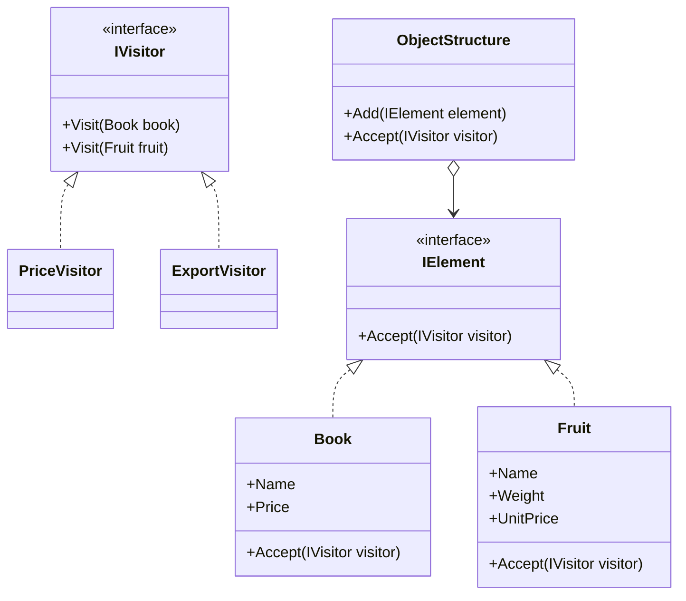
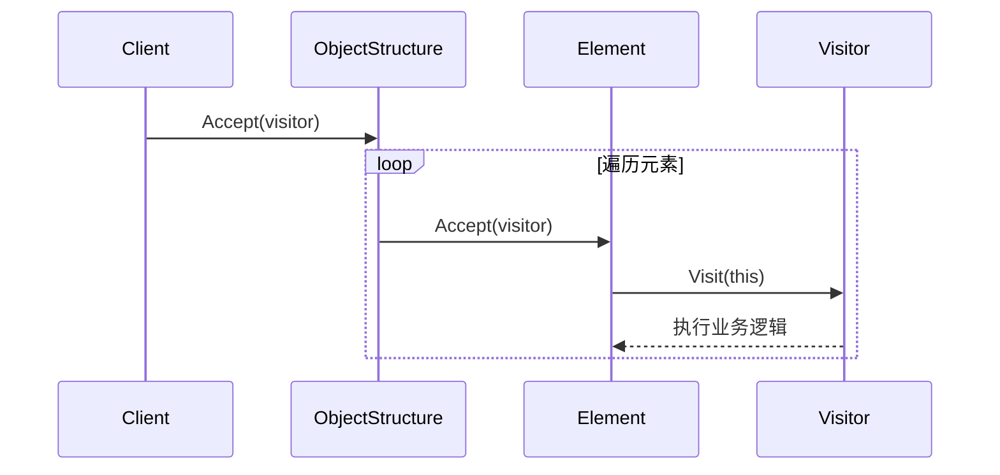
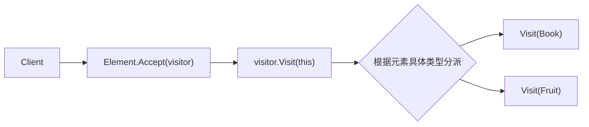

# Visitor (VisitorDemo)

说明：
- 该项目演示设计模式：**Visitor**。
- 在 `Program.cs` 中实现示例（或将实现拆分到多个源文件）。
- 目标框架： net8.0

运行示例：
```bash
dotnet run --project Behavioral/VisitorDemo/VisitorDemo.csproj
```

------

# **📦 访问者模式（Visitor Pattern）**

## **一、模式定义**

> **访问者模式**是一种行为型设计模式，它将“作用于对象结构中的操作”与“对象本身”分离，使你可以在不修改元素类的前提下，定义作用于这些元素的新操作。


------


## **二、核心思想**

- 数据结构相对稳定，操作逻辑经常变化
- 将“操作”抽离到 Visitor 中统一管理
- 元素对象通过 `Accept()` 将自己交给访问者处理
- 适合“对象结构稳定、操作可扩展”的场景


------


## **三、关键概念**

### **1️⃣ Element（元素）**

对象结构中的节点，定义 `Accept(IVisitor visitor)` 方法，用于接收访问者。

### **2️⃣ Visitor（访问者）**

封装对不同元素的处理逻辑。  
同一个访问者中，会为不同元素提供不同的 `Visit()` 重载方法。

### **3️⃣ ObjectStructure（对象结构）**

负责保存一组元素对象，供访问者统一遍历访问。

### **4️⃣ Double Dispatch（双重分派）**

访问者模式的核心机制：

- 第一次分派：调用元素的 `Accept(visitor)`
- 第二次分派：元素内部再调用 `visitor.Visit(this)`

最终根据：

- 当前访问者类型
- 当前元素具体类型

共同决定执行哪段逻辑。


------


## **四、模式结构**

### **角色说明**

| **角色**        | **说明**   |
| --------------- | ---------- |
| Visitor         | 抽象访问者 |
| ConcreteVisitor | 具体访问者 |
| Element         | 抽象元素   |
| ConcreteElement | 具体元素   |
| ObjectStructure | 对象结构   |
| Client          | 客户端     |

------


## **五、类图（Mermaid）**



------


## **六、C# 经典示例（商品计价与导出）**

### **1️⃣ 抽象访问者**

```c#
public interface IVisitor
{
    void Visit(Book book);
    void Visit(Fruit fruit);
}
```

### **2️⃣ 抽象元素**

```c#
public interface IElement
{
    void Accept(IVisitor visitor);
}
```

### **3️⃣ 具体元素**

```c#
public class Book : IElement
{
    public string Name { get; }
    public decimal Price { get; }

    public Book(string name, decimal price)
    {
        Name = name;
        Price = price;
    }

    public void Accept(IVisitor visitor)
    {
        visitor.Visit(this);
    }
}

public class Fruit : IElement
{
    public string Name { get; }
    public decimal Weight { get; }
    public decimal UnitPrice { get; }

    public Fruit(string name, decimal weight, decimal unitPrice)
    {
        Name = name;
        Weight = weight;
        UnitPrice = unitPrice;
    }

    public void Accept(IVisitor visitor)
    {
        visitor.Visit(this);
    }
}
```

### **4️⃣ 具体访问者：价格统计**

```c#
public class PriceVisitor : IVisitor
{
    public decimal TotalPrice { get; private set; }

    public void Visit(Book book)
    {
        TotalPrice += book.Price;
        Console.WriteLine($"图书：{book.Name}，价格：{book.Price}");
    }

    public void Visit(Fruit fruit)
    {
        var subtotal = fruit.Weight * fruit.UnitPrice;
        TotalPrice += subtotal;
        Console.WriteLine($"水果：{fruit.Name}，小计：{subtotal}");
    }
}
```

### **5️⃣ 具体访问者：导出报表**

```c#
public class ExportVisitor : IVisitor
{
    public void Visit(Book book)
    {
        Console.WriteLine($"导出图书：名称={book.Name}, 单价={book.Price}");
    }

    public void Visit(Fruit fruit)
    {
        Console.WriteLine($"导出水果：名称={fruit.Name}, 重量={fruit.Weight}, 单价={fruit.UnitPrice}");
    }
}
```

### **6️⃣ 对象结构**

```c#
public class ShoppingCart
{
    private readonly List<IElement> _items = new();

    public void Add(IElement element)
    {
        _items.Add(element);
    }

    public void Accept(IVisitor visitor)
    {
        foreach (var item in _items)
        {
            item.Accept(visitor);
        }
    }
}
```

### **7️⃣ 调用**

```c#
class Program
{
    static void Main()
    {
        var cart = new ShoppingCart();
        cart.Add(new Book("设计模式", 88));
        cart.Add(new Fruit("苹果", 3, 6));

        var priceVisitor = new PriceVisitor();
        cart.Accept(priceVisitor);
        Console.WriteLine($"总价：{priceVisitor.TotalPrice}");

        var exportVisitor = new ExportVisitor();
        cart.Accept(exportVisitor);
    }
}
```

------


## **七、时序图（访问流程）**



------


## **八、实际业务案例（报表审批单）**

### **场景**

在审批系统中，存在多种单据：

- 请假单 LeaveForm
- 报销单 ExpenseForm

系统需要支持多种处理动作：

- 审批校验
- 导出归档
- 风险审计

如果把这些逻辑都写进单据类中，会导致单据类职责过重、频繁修改。

### **示例**

```c#
public interface IFormVisitor
{
    void Visit(LeaveForm form);
    void Visit(ExpenseForm form);
}

public interface IFormElement
{
    void Accept(IFormVisitor visitor);
}

public class LeaveForm : IFormElement
{
    public int Days { get; set; }

    public void Accept(IFormVisitor visitor)
    {
        visitor.Visit(this);
    }
}

public class ExpenseForm : IFormElement
{
    public decimal Amount { get; set; }

    public void Accept(IFormVisitor visitor)
    {
        visitor.Visit(this);
    }
}

public class AuditVisitor : IFormVisitor
{
    public void Visit(LeaveForm form)
    {
        Console.WriteLine(form.Days > 3 ? "请假单进入复核" : "请假单通过");
    }

    public void Visit(ExpenseForm form)
    {
        Console.WriteLine(form.Amount > 5000 ? "报销单进入财务稽核" : "报销单通过");
    }
}
```

### **说明**

这里：

- **单据类型**属于稳定的对象结构
- **审批、导出、审计**属于经常变化的操作

因此使用访问者模式，可以在不改动单据类的情况下不断新增处理逻辑。


------


## **九、优点**

✅ 符合单一职责原则，元素类只关注自身数据结构

✅ 易于新增操作，只需增加新的 Visitor

✅ 适合复杂对象结构的统一处理

✅ 可以集中管理跨多种元素的业务逻辑


------


## **十、缺点**

❌ 新增具体元素困难，需要修改 Visitor 接口及所有具体访问者

❌ 模式理解门槛较高，双重分派不够直观

❌ 元素需要暴露足够信息给访问者，可能破坏封装


------


## **十一、适用场景**

- 对象结构相对稳定，但操作经常新增
- 需要对一组不同类型对象执行多种不同操作
- 报表导出、审批流校验、税费计算、统计分析
- 编译器语法树遍历
- 文档结构处理（段落、表格、图片）


------


## **十二、与组合模式对比**

| **对比项** | **访问者模式**         | **组合模式**         |
| ---------- | ---------------------- | -------------------- |
| 核心目标   | 给稳定对象结构新增操作 | 构建树形层次结构     |
| 关注点     | 操作扩展               | 结构组织             |
| 典型手段   | Visitor + Accept       | 统一节点接口         |
| 扩展难点   | 新增元素困难           | 复杂操作分散在节点中 |

------


## **十三、双重分派关系图**



------


## **十四、总结**

> **访问者模式 = 把“操作”从“对象结构”中拆出来**
>
> 访问者模式适用于对象结构比较稳定，但业务操作经常变化的场景。
>
> 它通过 `Accept + Visit` 的双重分派机制，让我们可以在不修改元素类的前提下新增处理逻辑。
>
> 它的优点是便于扩展新操作、集中管理逻辑；缺点是新增元素代价较高，因此更适合“元素稳定、操作多变”的系统。


------

