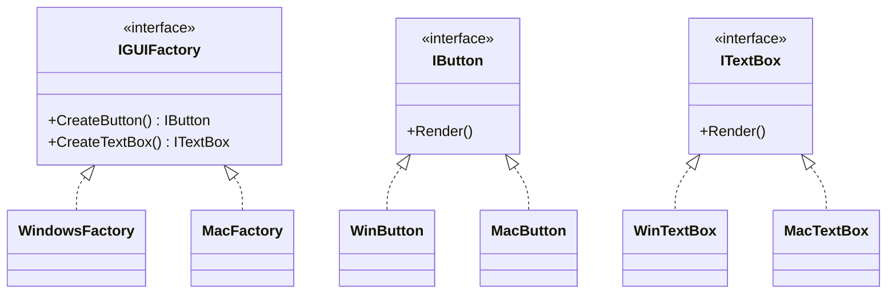
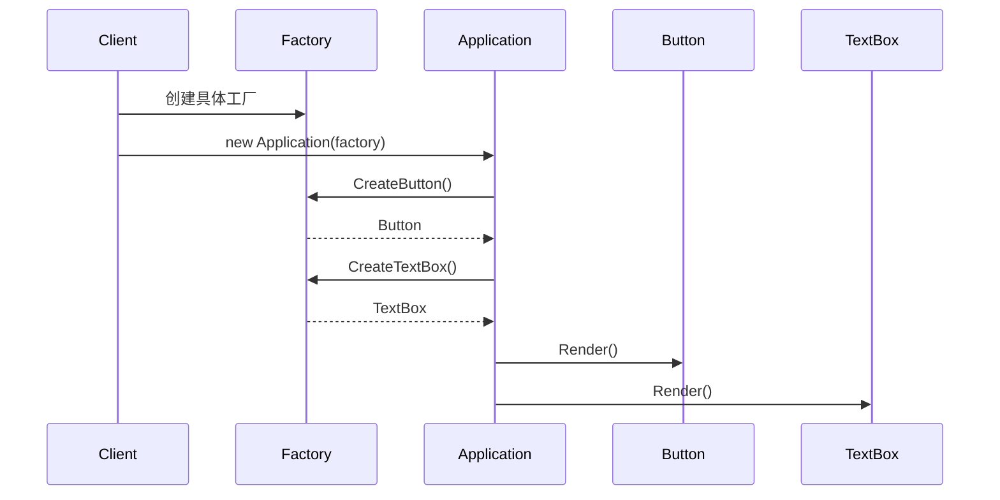
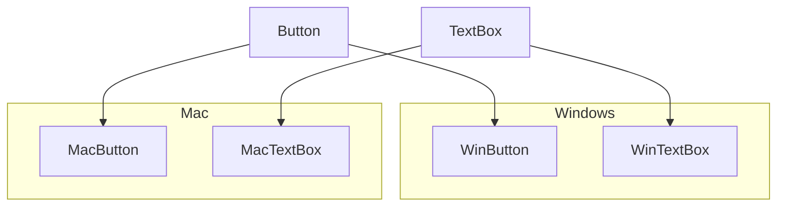

# Abstract Factory (AbstractFactoryDemo)

说明：
- 该项目演示设计模式：**Abstract Factory**。
- 在 `Program.cs` 中实现示例（或将实现拆分到多个源文件）。
- 目标框架： net8.0

运行示例：
```bash
dotnet run --project Creational/AbstractFactoryDemo/AbstractFactoryDemo.csproj
```

------

# **📦 抽象工厂模式（Abstract Factory Pattern）**

## **一、模式定义**

> **抽象工厂模式**是一种创建型设计模式，它提供一个接口，用于创建一组相关或依赖的对象，而无需指定它们的具体类。


------


## **二、核心思想**


- 创建的不是单个对象，而是**一组相关对象（产品族）**
- 客户端只依赖抽象接口，不依赖具体实现
- 可以整体切换产品族


------


## **三、关键概念**


### **1️⃣ 产品等级结构（Product Hierarchy）**


同一类型产品的不同实现：

- Button
    - WinButton
    - MacButton
- TextBox
    - WinTextBox
    - MacTextBox


### **2️⃣ 产品族（Product Family）**


同一风格/平台的一组产品：

- Windows 产品族
    - WinButton
    - WinTextBox
- Mac 产品族
    - MacButton
    - MacTextBox


------


## **四、模式结构**


### **角色说明**

| **角色**        | **说明** |
| --------------- | -------- |
| AbstractFactory | 抽象工厂 |
| ConcreteFactory | 具体工厂 |
| AbstractProduct | 抽象产品 |
| ConcreteProduct | 具体产品 |
| Client          | 客户端   |
|                 |          |

------


## **五、类图（Mermaid）**



------


## **六、C# 经典示例（跨平台 UI）**


### **1️⃣ 抽象产品**

```c#
public interface IButton
{
    void Render();
}

public interface ITextBox
{
    void Render();
}
```


### **2️⃣ Windows 产品族**

```c#
public class WinButton : IButton
{
    public void Render()
    {
        Console.WriteLine("Windows 按钮");
    }
}

public class WinTextBox : ITextBox
{
    public void Render()
    {
        Console.WriteLine("Windows 文本框");
    }
}
```


### **3️⃣ Mac 产品族**

```c#
public class MacButton : IButton
{
    public void Render()
    {
        Console.WriteLine("Mac 按钮");
    }
}

public class MacTextBox : ITextBox
{
    public void Render()
    {
        Console.WriteLine("Mac 文本框");
    }
}
```


### **4️⃣ 抽象工厂**

```c#
public interface IGUIFactory
{
    IButton CreateButton();
    ITextBox CreateTextBox();
}
```


### **5️⃣ 具体工厂**

```c#
public class WindowsFactory : IGUIFactory
{
    public IButton CreateButton() => new WinButton();
    public ITextBox CreateTextBox() => new WinTextBox();
}

public class MacFactory : IGUIFactory
{
    public IButton CreateButton() => new MacButton();
    public ITextBox CreateTextBox() => new MacTextBox();
}
```


### **6️⃣ 客户端**

```c#
public class Application
{
    private readonly IButton _button;
    private readonly ITextBox _textBox;

    public Application(IGUIFactory factory)
    {
        _button = factory.CreateButton();
        _textBox = factory.CreateTextBox();
    }

    public void RenderUI()
    {
        _button.Render();
        _textBox.Render();
    }
}
```


### **7️⃣ 调用**

```c#
class Program
{
    static void Main()
    {
        IGUIFactory factory = new WindowsFactory();
        var app = new Application(factory);
        app.RenderUI();
    }
}
```


------


## **七、时序图（创建流程）**




------


## **八、实际业务案例（数据库）**


### **场景**

支持多数据库：

- SQL Server
- MySQL

每种数据库提供：

- Connection
- Command

### **示例**

```c#
public interface IDbConnection
{
    void Connect();
}

public interface IDbCommand
{
    void Execute();
}

public class SqlConnection : IDbConnection
{
    public void Connect() => Console.WriteLine("SQL Server 连接");
}

public class SqlCommand : IDbCommand
{
    public void Execute() => Console.WriteLine("SQL 执行");
}

public interface IDatabaseFactory
{
    IDbConnection CreateConnection();
    IDbCommand CreateCommand();
}
```


------


## **九、优点**

✅ 保证产品族一致性

✅ 解耦客户端与具体实现

✅ 易于切换整套实现

✅ 符合开闭原则


------


## **十、缺点**

❌ 类数量多，结构复杂

❌ 新增产品等级结构困难（需要修改所有工厂）


------


## **十一、适用场景**

- 多平台 UI（Windows / Mac）
- 多数据库支持
- 多云厂商（阿里云 / AWS / 腾讯云）
- 多主题系统
- 游戏阵营系统


------


## **十二、与工厂方法对比**

| **对比项** | **工厂方法** | **抽象工厂** |
| ---------- | ------------ | ------------ |
| 创建对象   | 单个产品     | 一组产品     |
| 复杂度     | 低           | 高           |
| 使用场景   | 单类扩展     | 产品族       |


------


## **十三、产品族关系图**




------


## **十四、总结**


> **抽象工厂模式 = 创建“一整套相关对象”的工厂**
>
> 抽象工厂模式是一种创建型设计模式，它用于创建一组相关对象，而不需要指定具体类。
>
> 它适用于多个产品族切换的场景，例如跨平台 UI 或多数据库支持。
>
> 优点是解耦和保证一致性，缺点是扩展新产品结构困难。


------

