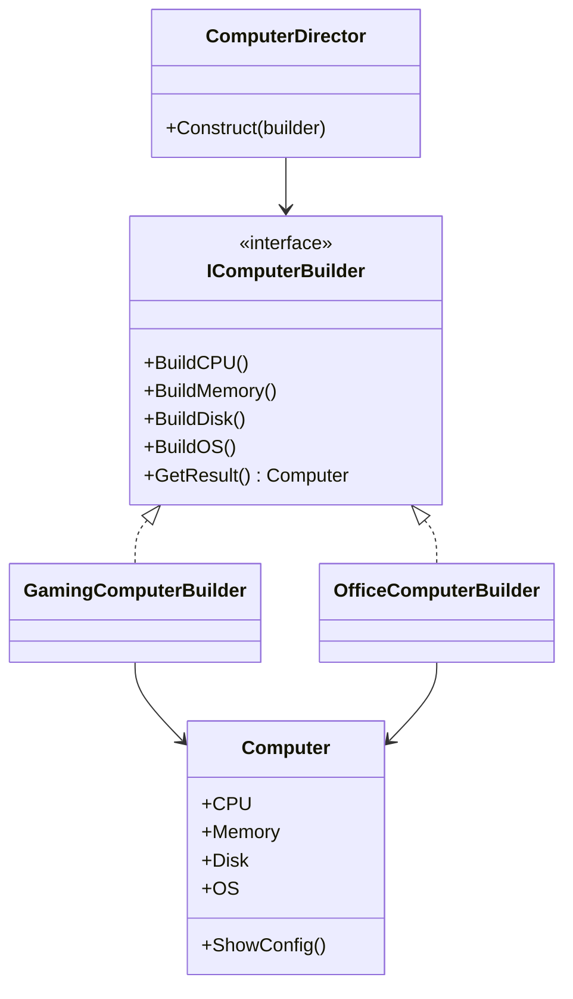
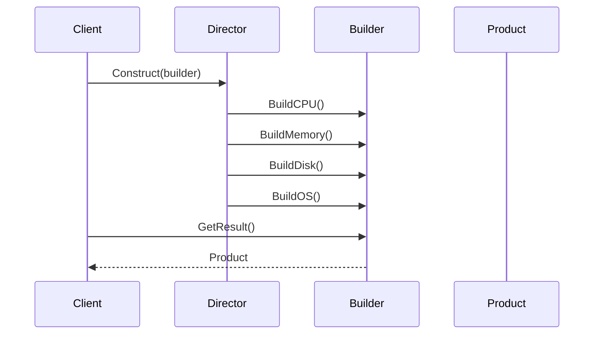
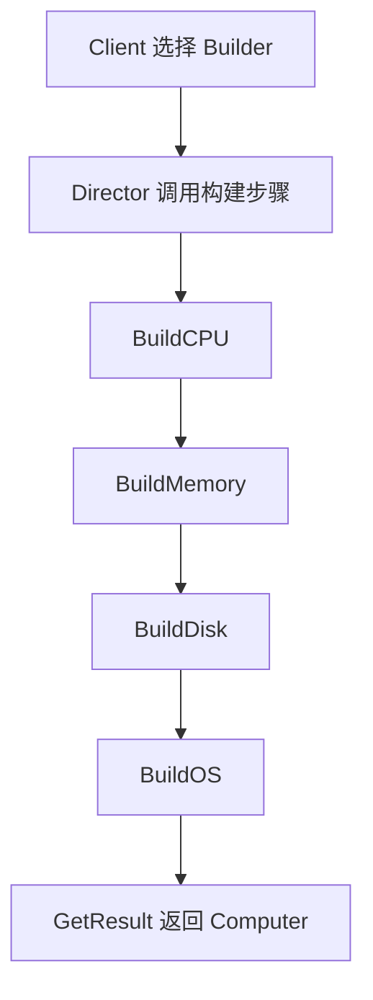

# Builder (BuilderDemo)

说明：
- 该项目演示设计模式：**Builder**。
- 在 `Program.cs` 中实现示例（或将实现拆分到多个源文件）。
- 目标框架： net8.0

运行示例：
```bash
dotnet run --project Creational/BuilderDemo/BuilderDemo.csproj
```

------

# **📦 Builder 模式（Builder Pattern）**

## **一、模式定义**

> **Builder 模式**（建造者模式）是一种创建型设计模式，它将一个复杂对象的构建过程与其表示分离，使得同样的构建过程可以创建不同的表示。


------


## **二、核心思想**


- 关注的不是“一次性创建对象”，而是**按步骤构建复杂对象**
- 将复杂对象的构建过程拆分为多个独立步骤
- 客户端无需知道内部组装细节，只需要指定构建方式
- 相同构建流程可以生成不同结果


------


## **三、关键概念**


### **1️⃣ Product（产品）**


最终要构建的复杂对象，例如：

- Computer
- House
- Report
- Meal


### **2️⃣ Builder（抽象建造者）**


定义构建各个部件的步骤，例如：

- BuildCPU()
- BuildMemory()
- BuildDisk()
- BuildOS()


### **3️⃣ ConcreteBuilder（具体建造者）**


实现具体构建步骤，负责真正组装产品：

- GamingComputerBuilder
- OfficeComputerBuilder


### **4️⃣ Director（指挥者）**


负责控制构建顺序，定义“如何一步一步构建对象”。


------


## **四、模式结构**


### **角色说明**

| **角色**        | **说明**   |
| --------------- | ---------- |
| Product         | 最终产品   |
| Builder         | 抽象建造者 |
| ConcreteBuilder | 具体建造者 |
| Director        | 指挥者     |
| Client          | 客户端     |

------


## **五、类图（Mermaid）**



------


## **六、C# 经典示例（组装电脑）**


### **1️⃣ 产品类**

```c#
public class Computer
{
    public string CPU { get; set; }
    public string Memory { get; set; }
    public string Disk { get; set; }
    public string OS { get; set; }

    public void ShowConfig()
    {
        Console.WriteLine($"CPU: {CPU}");
        Console.WriteLine($"Memory: {Memory}");
        Console.WriteLine($"Disk: {Disk}");
        Console.WriteLine($"OS: {OS}");
    }
}
```


### **2️⃣ 抽象建造者**

```c#
public interface IComputerBuilder
{
    void BuildCPU();
    void BuildMemory();
    void BuildDisk();
    void BuildOS();
    Computer GetResult();
}
```


### **3️⃣ 游戏电脑建造者**

```c#
public class GamingComputerBuilder : IComputerBuilder
{
    private readonly Computer _computer = new Computer();

    public void BuildCPU()
    {
        _computer.CPU = "Intel i9";
    }

    public void BuildMemory()
    {
        _computer.Memory = "32GB DDR5";
    }

    public void BuildDisk()
    {
        _computer.Disk = "1TB NVMe SSD";
    }

    public void BuildOS()
    {
        _computer.OS = "Windows 11";
    }

    public Computer GetResult()
    {
        return _computer;
    }
}
```


### **4️⃣ 办公电脑建造者**

```c#
public class OfficeComputerBuilder : IComputerBuilder
{
    private readonly Computer _computer = new Computer();

    public void BuildCPU()
    {
        _computer.CPU = "Intel i5";
    }

    public void BuildMemory()
    {
        _computer.Memory = "16GB DDR4";
    }

    public void BuildDisk()
    {
        _computer.Disk = "512GB SSD";
    }

    public void BuildOS()
    {
        _computer.OS = "Windows 11 Pro";
    }

    public Computer GetResult()
    {
        return _computer;
    }
}
```


### **5️⃣ 指挥者**

```c#
public class ComputerDirector
{
    public void Construct(IComputerBuilder builder)
    {
        builder.BuildCPU();
        builder.BuildMemory();
        builder.BuildDisk();
        builder.BuildOS();
    }
}
```


### **6️⃣ 客户端调用**

```c#
class Program
{
    static void Main()
    {
        var director = new ComputerDirector();

        IComputerBuilder builder = new GamingComputerBuilder();
        director.Construct(builder);

        Computer computer = builder.GetResult();
        computer.ShowConfig();
    }
}
```

------


## **七、时序图（创建流程）**




------


## **八、实际业务案例（报表生成）**


### **场景**

系统需要导出不同格式的报表：

- Excel 报表
- PDF 报表
- HTML 报表

每种报表都需要按步骤构建：

- 设置标题
- 填充表头
- 填充数据
- 输出文件

### **示例**

```c#
public class Report
{
    public string Title { get; set; }
    public string Header { get; set; }
    public string Body { get; set; }
}

public interface IReportBuilder
{
    void BuildTitle();
    void BuildHeader();
    void BuildBody();
    Report GetResult();
}

public class PdfReportBuilder : IReportBuilder
{
    private readonly Report _report = new Report();

    public void BuildTitle() => _report.Title = "PDF 报表标题";
    public void BuildHeader() => _report.Header = "PDF 表头";
    public void BuildBody() => _report.Body = "PDF 数据内容";
    public Report GetResult() => _report;
}
```


------


## **九、优点**

✅ 将复杂对象的构建过程拆分，职责清晰

✅ 客户端不需要了解产品内部组装细节

✅ 相同构建过程可以创建不同产品

✅ 更适合创建参数多、步骤多的复杂对象

✅ 符合单一职责原则和开闭原则


------


## **十、缺点**

❌ 类数量增加，系统结构更复杂

❌ 如果产品差异很大，Builder 接口可能会变得臃肿

❌ 对简单对象来说会显得设计过重


------


## **十一、适用场景**

- 创建复杂对象，且构建步骤固定但配置不同
- 对象存在大量可选参数
- 需要生成不同表示形式的对象
- 希望将对象构建过程与使用过程解耦
- 链式配置对象（如 Fluent Builder）


------


## **十二、与工厂模式对比**

| **对比项** | **工厂模式**   | **Builder 模式**   |
| ---------- | -------------- | ------------------ |
| 关注点     | 直接创建对象   | 分步骤构建复杂对象 |
| 创建方式   | 一次性返回     | 逐步组装           |
| 适用对象   | 简单或单一对象 | 复杂对象           |
| 重点       | 创建结果       | 创建过程           |


------


## **十三、构建流程图**



------


## **十四、链式 Builder（常见变体）**


在实际开发中，Builder 模式经常会写成链式调用形式：

```c#
public class ComputerBuilder
{
    private readonly Computer _computer = new Computer();

    public ComputerBuilder SetCPU(string cpu)
    {
        _computer.CPU = cpu;
        return this;
    }

    public ComputerBuilder SetMemory(string memory)
    {
        _computer.Memory = memory;
        return this;
    }

    public ComputerBuilder SetDisk(string disk)
    {
        _computer.Disk = disk;
        return this;
    }

    public ComputerBuilder SetOS(string os)
    {
        _computer.OS = os;
        return this;
    }

    public Computer Build()
    {
        return _computer;
    }
}
```

### **调用方式**

```c#
var computer = new ComputerBuilder()
    .SetCPU("AMD Ryzen 7")
    .SetMemory("32GB")
    .SetDisk("2TB SSD")
    .SetOS("Windows 11")
    .Build();
```


------


## **十五、总结**


> **Builder 模式 = 按步骤组装复杂对象**
>
> Builder 模式适用于对象创建过程复杂、参数多、组装顺序明确的场景。
>
> 它把“对象怎么建”与“对象是什么”分离开来，让代码更清晰、更易扩展。
>
> 在实际项目中，Builder 模式常用于复杂 DTO、配置对象、报表生成、SQL 构造器、HTTP 请求构造器等场景。


------