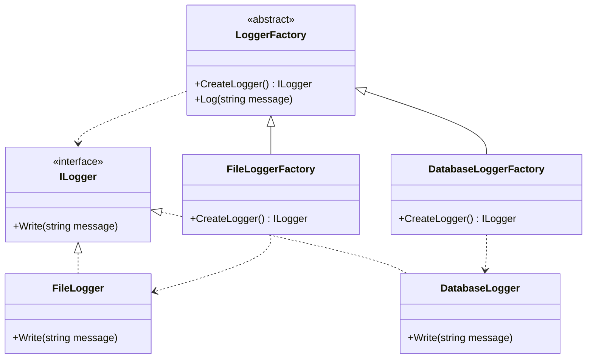
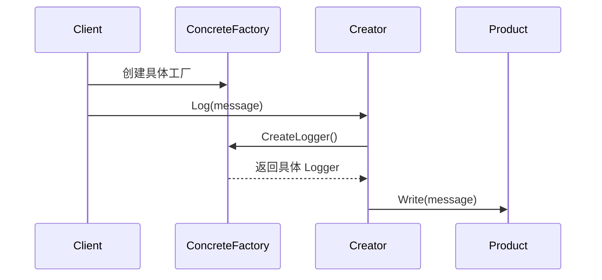
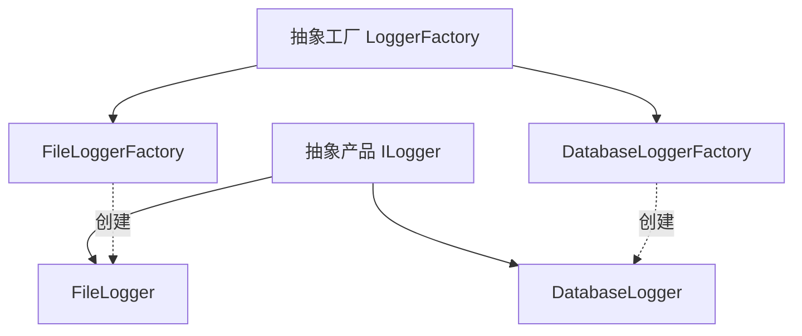

# Factory Method (FactoryMethodDemo)

说明：
- 该项目演示设计模式：**Factory Method**。
- 在 `Program.cs` 中实现示例（或将实现拆分到多个源文件）。
- 目标框架： net8.0

运行示例：
```bash
dotnet run --project Creational/FactoryMethodDemo/FactoryMethodDemo.csproj
```

------

# **🏭 工厂方法模式（Factory Method Pattern）**

## **一、模式定义**

> **工厂方法模式**是一种创建型设计模式，它定义一个创建对象的接口，但将具体实例化延迟到子类中完成。
>
> 也就是说：**父类负责约定创建规则，子类负责决定到底创建哪个具体对象。**


------


## **二、核心思想**

- 将“对象创建”这件事单独封装起来
- 客户端依赖抽象产品，而不是具体产品
- 通过子类重写工厂方法，决定返回哪一种具体对象
- 达到**创建与使用分离**的目的


------


## **三、关键概念**


### **1️⃣ 产品（Product）**

工厂方法所创建的对象抽象。

例如：

- Logger
    - FileLogger
    - DatabaseLogger


### **2️⃣ 创建者（Creator）**

声明工厂方法的抽象类或接口。

例如：

- LoggerFactory
    - FileLoggerFactory
    - DatabaseLoggerFactory


### **3️⃣ 工厂方法（Factory Method）**

由抽象创建者声明，具体创建者实现。

客户端通过工厂方法拿到对象，而不直接 `new` 具体类。


------


## **四、模式结构**


### **角色说明**

| **角色**        | **说明**   |
| --------------- | ---------- |
| Product         | 抽象产品   |
| ConcreteProduct | 具体产品   |
| Creator         | 抽象创建者 |
| ConcreteCreator | 具体创建者 |
| Client          | 客户端     |

------


## 五、类图（Mermaid）



------


## **六、C# 经典示例（日志系统）**


### **1️⃣ 抽象产品**

```c#
public interface ILogger
{
    void Write(string message);
}
```


### **2️⃣ 具体产品**

```c#
public class FileLogger : ILogger
{
    public void Write(string message)
    {
        Console.WriteLine($"写入文件日志：{message}");
    }
}

public class DatabaseLogger : ILogger
{
    public void Write(string message)
    {
        Console.WriteLine($"写入数据库日志：{message}");
    }
}
```


### **3️⃣ 抽象创建者**

```c#
public abstract class LoggerFactory
{
    public abstract ILogger CreateLogger();

    public void Log(string message)
    {
        var logger = CreateLogger();
        logger.Write(message);
    }
}
```


### **4️⃣ 具体创建者**

```c#
public class FileLoggerFactory : LoggerFactory
{
    public override ILogger CreateLogger()
    {
        return new FileLogger();
    }
}

public class DatabaseLoggerFactory : LoggerFactory
{
    public override ILogger CreateLogger()
    {
        return new DatabaseLogger();
    }
}
```


### **5️⃣ 客户端调用**

```c#
class Program
{
    static void Main()
    {
        LoggerFactory factory = new FileLoggerFactory();
        factory.Log("用户登录成功");

        factory = new DatabaseLoggerFactory();
        factory.Log("订单创建成功");
    }
}
```


------


## **七、时序图（创建流程）**




------


## **八、实际业务案例（支付系统）**


### **场景**

系统支持多种支付方式：

- 支付宝支付
- 微信支付
- 银联支付

每种支付方式都有统一接口：

- Pay()

通过不同工厂创建不同支付对象。


### **示例**

```c#
public interface IPayment
{
    void Pay(decimal amount);
}

public class Alipay : IPayment
{
    public void Pay(decimal amount)
    {
        Console.WriteLine($"支付宝支付：{amount}");
    }
}

public class WechatPay : IPayment
{
    public void Pay(decimal amount)
    {
        Console.WriteLine($"微信支付：{amount}");
    }
}

public abstract class PaymentFactory
{
    public abstract IPayment CreatePayment();
}

public class AlipayFactory : PaymentFactory
{
    public override IPayment CreatePayment() => new Alipay();
}

public class WechatPayFactory : PaymentFactory
{
    public override IPayment CreatePayment() => new WechatPay();
}
```


------


## **九、优点**

✅ 符合开闭原则，新增产品时通常只需新增具体产品和对应工厂

✅ 解耦对象创建与对象使用

✅ 客户端面向抽象编程，扩展性好

✅ 便于在不同场景下切换具体实现


------


## **十、缺点**

❌ 每增加一种产品，通常都要增加一个具体工厂类

❌ 类数量会增多，系统结构会更复杂

❌ 适合单一产品层级扩展，不适合同时扩展多个产品族


------


## **十一、适用场景**

- 日志记录系统（文件日志、数据库日志、消息日志）
- 支付系统（支付宝、微信、银联）
- 导出系统（PDF、Excel、Word）
- 消息发送系统（邮件、短信、站内信）
- 存储系统（本地存储、云存储、对象存储）


------


## **十二、与简单工厂对比**

| **对比项**       | **简单工厂**       | **工厂方法**     |
| ---------------- | ------------------ | ---------------- |
| 工厂结构         | 一个工厂类         | 多个具体工厂类   |
| 扩展方式         | 修改工厂逻辑       | 新增工厂子类     |
| 是否符合开闭原则 | 一般较弱           | 更好             |
| 使用场景         | 产品较少、逻辑简单 | 需要持续扩展产品 |


------


## **十三、与抽象工厂对比**

| **对比项** | **工厂方法**     | **抽象工厂**     |
| ---------- | ---------------- | ---------------- |
| 创建对象   | 单个产品         | 一组相关产品     |
| 关注点     | 某一类产品的扩展 | 整个产品族的切换 |
| 复杂度     | 中等             | 较高             |
| 使用场景   | 单产品层级扩展   | 多产品族协同创建 |


------


## **十四、结构关系图**



------


## **十五、总结**


> **工厂方法模式 = 把对象创建延迟到子类中完成**
>
> 它通过定义统一的工厂接口，让不同子类决定实例化哪一个具体产品。
>
> 这种模式特别适合“同一类对象存在多种实现，并且未来还会持续扩展”的场景。
>
> 相比简单工厂，它更符合开闭原则；相比抽象工厂，它更专注于**单一产品层级**的创建。


------


