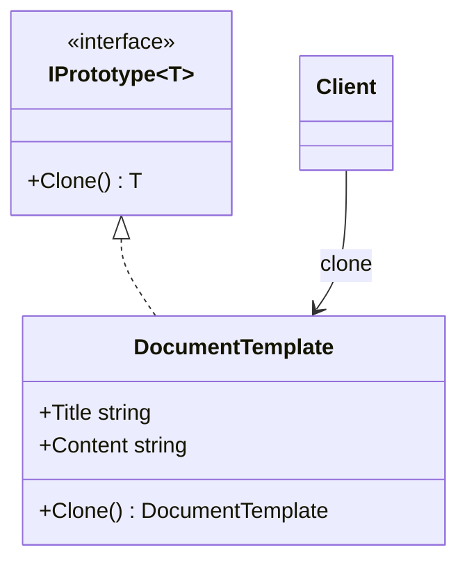
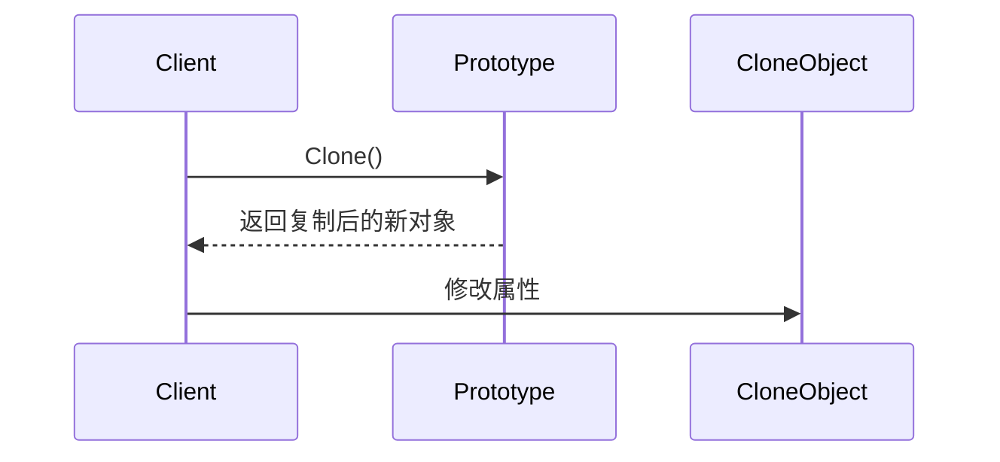
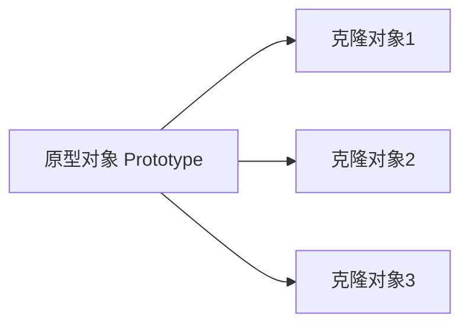

# Prototype (PrototypeDemo)

说明：
- 该项目演示设计模式：**Prototype**。
- 在 `Program.cs` 中实现示例（或将实现拆分到多个源文件）。
- 目标框架： net8.0

运行示例：
```bash
dotnet run --project Creational/PrototypeDemo/PrototypeDemo.csproj
```

------

# **📦 原型模式（Prototype Pattern）**

## **一、模式定义**

> **原型模式**是一种创建型设计模式，它通过复制现有对象来创建新对象，而不是通过 `new` 直接实例化。


------


## **二、核心思想**


- 创建对象时，不直接依赖构造函数
- 通过**克隆已有对象**生成新对象
- 当对象创建成本较高或初始化过程复杂时，可以显著提升性能
- 可以避免重复执行复杂的初始化逻辑


------


## **三、关键概念**


### **1️⃣ Prototype（抽象原型）**

定义克隆接口，约定对象必须支持复制能力：

- Clone()


### **2️⃣ ConcretePrototype（具体原型）**

实现具体的克隆逻辑：

- DocumentTemplate
- Person
- CrawlTaskConfig


### **3️⃣ Client（客户端）**

客户端不关心对象如何创建，只关心从原型复制得到新对象。


------


## **四、模式结构**


### **角色说明**

| **角色**          | **说明** |
| ----------------- | -------- |
| Prototype         | 抽象原型 |
| ConcretePrototype | 具体原型 |
| Client            | 客户端   |
|                   |          |

------


## **五、类图（Mermaid）**



------


## **六、C# 经典示例（文档模板复制）**


### **1️⃣ 抽象原型**

```c#
public interface IPrototype<T>
{
    T Clone();
}
```


### **2️⃣ 具体原型**

```c#
public class DocumentTemplate : IPrototype<DocumentTemplate>
{
    public string Title { get; set; }
    public string Content { get; set; }

    public DocumentTemplate(string title, string content)
    {
        Title = title;
        Content = content;
    }

    public DocumentTemplate Clone()
    {
        return new DocumentTemplate(Title, Content);
    }
}
```


### **3️⃣ 客户端调用**

```c#
class Program
{
    static void Main()
    {
        var template = new DocumentTemplate("周报模板", "1. 本周工作\n2. 下周计划");

        var copy1 = template.Clone();
        copy1.Title = "张三周报";

        var copy2 = template.Clone();
        copy2.Title = "李四周报";

        Console.WriteLine(template.Title);
        Console.WriteLine(copy1.Title);
        Console.WriteLine(copy2.Title);
    }
}
```


------


## **七、浅拷贝与深拷贝**


### **1️⃣ 浅拷贝（Shallow Copy）**

只复制当前对象本身，引用类型字段仍然指向同一块内存。

```c#
public class Address
{
    public string City { get; set; }
}

public class Person
{
    public string Name { get; set; }
    public Address Address { get; set; }

    public Person ShallowClone()
    {
        return (Person)this.MemberwiseClone();
    }
}
```

**特点：**

- 值类型会被复制
- 引用类型不会复制对象本身，只复制引用地址


### **2️⃣ 深拷贝（Deep Copy）**

不仅复制对象本身，还复制对象内部引用的所有子对象。

```c#
public class Address
{
    public string City { get; set; }
}

public class Person
{
    public string Name { get; set; }
    public Address Address { get; set; }

    public Person DeepClone()
    {
        return new Person
        {
            Name = this.Name,
            Address = new Address
            {
                City = this.Address.City
            }
        };
    }
}
```

**特点：**

- 新旧对象完全独立
- 修改克隆对象不会影响原对象


------


## **八、时序图（创建流程）**




------


## **九、实际业务案例（高频配置对象复制）**


### **场景**

在高频采集、任务调度、规则引擎等系统中，经常需要根据一个“默认配置对象”快速生成大量实例。

例如：

- 采集任务默认重试次数、超时时间、请求头
- 每次创建新任务时，只修改少量字段
- 如果每次都重新初始化完整对象，成本较高


### **示例**

```c#
public class CrawlTaskConfig
{
    public string SourceName { get; set; }
    public int Timeout { get; set; }
    public int RetryCount { get; set; }
    public Dictionary<string, string> Headers { get; set; }

    public CrawlTaskConfig Clone()
    {
        return new CrawlTaskConfig
        {
            SourceName = this.SourceName,
            Timeout = this.Timeout,
            RetryCount = this.RetryCount,
            Headers = new Dictionary<string, string>(this.Headers)
        };
    }
}
```


### **调用方式**

```c#
var defaultConfig = new CrawlTaskConfig
{
    SourceName = "Default",
    Timeout = 5000,
    RetryCount = 3,
    Headers = new Dictionary<string, string>
    {
        ["User-Agent"] = "CollectorBot"
    }
};

var taskA = defaultConfig.Clone();
taskA.SourceName = "站点A";

var taskB = defaultConfig.Clone();
taskB.SourceName = "站点B";
taskB.Timeout = 8000;
```


### **业务价值**

- 减少重复初始化成本
- 保持配置模板统一
- 提升高频创建对象时的性能
- 便于通过模板快速派生不同实例


------


## **十、优点**

✅ 可以提升复杂对象创建效率

✅ 避免重复初始化逻辑

✅ 客户端无需依赖具体类的构造过程

✅ 适合高频创建、结构相近的对象


------


## **十一、缺点**

❌ 需要为每个类实现克隆逻辑

❌ 遇到复杂引用对象时，深拷贝实现较麻烦

❌ 如果对象包含循环引用，处理会更复杂


------


## **十二、适用场景**

- 对象创建成本高，初始化过程复杂
- 系统中需要大量相似对象
- 希望通过模板快速生成实例
- 需要动态复制运行时对象状态
- 高性能场景下减少频繁 `new` 带来的初始化成本


------


## **十三、与工厂方法对比**

| **对比项** | **工厂方法**     | **原型模式**         |
| ---------- | ---------------- | -------------------- |
| 创建方式   | 通过工厂创建     | 通过复制现有对象创建 |
| 关注点     | 隐藏创建过程     | 复用已有对象状态     |
| 适用场景   | 创建逻辑多变     | 对象复制、高频创建   |
| 性能表现   | 取决于构造复杂度 | 对复杂对象更有优势   |


------


## **十四、原型复制关系图**



------


## **十五、总结**


> **原型模式 = 通过复制已有对象来创建新对象**
>
> 原型模式是一种创建型设计模式，它将“创建对象”转换为“复制对象”。
>
> 它特别适合对象初始化成本高、系统中需要频繁创建相似对象的场景。
>
> 在实际业务中，原型模式常用于模板对象复制、配置派生、缓存对象复制、游戏角色生成等场景。


------