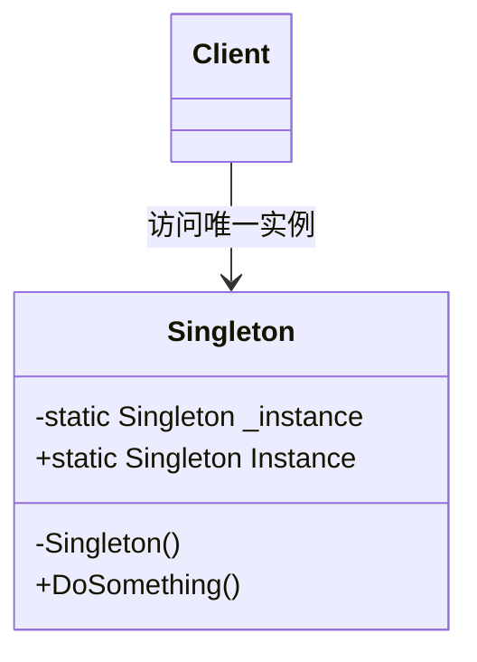
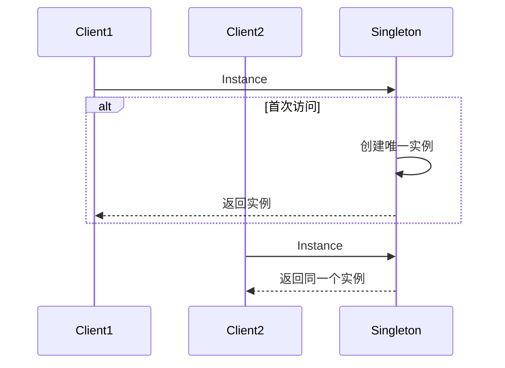
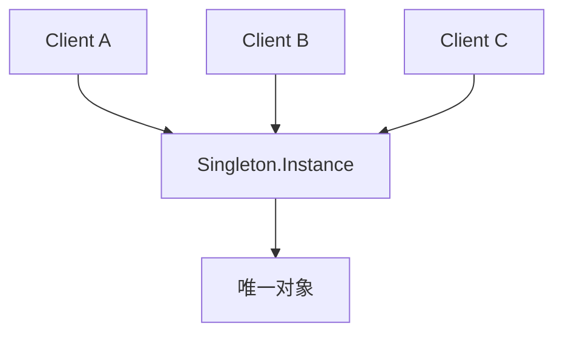

# Singleton (SingletonDemo)

说明：
- 该项目演示设计模式：**Singleton**。
- 在 `Program.cs` 中实现示例（或将实现拆分到多个源文件）。
- 目标框架： net8.0

运行示例：
```bash
dotnet run --project Creational/SingletonDemo/SingletonDemo.csproj
```

------

# **📦 单例模式（Singleton Pattern）**

## **一、模式定义**

> **单例模式**是一种创建型设计模式，它保证一个类只有一个实例，并提供一个全局访问点来获取该实例。


------


## **二、核心思想**


- 一个类在系统运行期间只能存在**一个实例**
- 由类自身负责创建并管理这个唯一实例
- 对外统一提供访问入口，而不是让外部随意 `new`


------


## **三、关键概念**


### **1️⃣ 唯一实例（Single Instance）**


系统中同一个类只允许存在一个对象，例如：

- 配置管理器
- 日志管理器
- 缓存中心
- 线程池


### **2️⃣ 全局访问点（Global Access Point）**


外部通过统一入口获取实例，例如：

- `Singleton.Instance`
- `ConfigManager.Instance`
- `Logger.Instance`


------


## **四、模式结构**


### **角色说明**

| **角色**  | **说明** |
| --------- | -------- |
| Singleton | 单例类   |
| Client    | 客户端   |
|           |          |

------


## **五、类图（Mermaid）**



------


## **六、C# 经典示例（线程安全单例）**


### **1️⃣ 单例类**

```c#
public sealed class Singleton
{
    private static readonly Lazy<Singleton> _instance =
        new Lazy<Singleton>(() => new Singleton());

    public static Singleton Instance => _instance.Value;

    private Singleton()
    {
    }

    public void DoSomething()
    {
        Console.WriteLine("执行单例对象的方法");
    }
}
```


### **2️⃣ 调用**

```c#
class Program
{
    static void Main()
    {
        var s1 = Singleton.Instance;
        var s2 = Singleton.Instance;

        Console.WriteLine(ReferenceEquals(s1, s2)); // True
        s1.DoSomething();
    }
}
```


### **3️⃣ 输出说明**

```c#
True
执行单例对象的方法
```


------


## **七、时序图（获取实例流程）**




------


## **八、实际业务案例（配置中心）**


### **场景**

系统启动后，全局只需要一份配置数据，例如：

- 数据库连接字符串
- Redis 配置
- 接口地址
- 功能开关

如果允许重复创建配置对象：

- 会造成资源浪费
- 容易出现配置不一致
- 管理入口分散

因此适合使用单例模式统一管理配置。

### **示例**

```c#
public sealed class AppConfig
{
    private static readonly Lazy<AppConfig> _instance =
        new Lazy<AppConfig>(() => new AppConfig());

    public static AppConfig Instance => _instance.Value;

    public string ConnectionString { get; private set; }
    public string RedisServer { get; private set; }

    private AppConfig()
    {
        ConnectionString = "Server=.;Database=Demo;Trusted_Connection=True;";
        RedisServer = "127.0.0.1:6379";
    }
}
```


### **调用示例**

```c#
class Program
{
    static void Main()
    {
        Console.WriteLine(AppConfig.Instance.ConnectionString);
        Console.WriteLine(AppConfig.Instance.RedisServer);
    }
}
```


------


## **九、优点**

✅ 保证全局唯一实例

✅ 提供统一访问入口

✅ 节省系统资源

✅ 避免重复初始化重要对象


------


## **十、缺点**

❌ 单例类职责可能过重

❌ 对单元测试不友好

❌ 可能隐藏全局状态依赖

❌ 并发环境下实现不当会有线程安全问题


------


## **十一、适用场景**

- 配置中心
- 日志组件
- 缓存管理器
- 线程池
- 数据库连接池管理器
- 应用级全局上下文


------


## **十二、与静态类对比**

| **对比项**         | **静态类** | **单例模式**   |
| ------------------ | ---------- | -------------- |
| 是否可实例化       | 否         | 是，但只能一个 |
| 是否支持接口       | 否         | 支持           |
| 是否可继承抽象设计 | 差         | 更灵活         |
| 生命周期控制       | 较死板     | 更可控         |
| 是否适合依赖注入   | 不适合     | 相对更适合     |


------


## **十三、结构关系图**




------


## **十四、总结**


> **单例模式 = 保证一个类只有一个对象，并提供全局访问入口**
>
> 单例模式是一种创建型设计模式，它适合那些在系统中只需要存在一个实例的对象。
>
> 它常用于配置中心、日志组件、缓存管理器等场景。
>
> 优点是节省资源、统一管理，缺点是容易引入全局状态与测试困难。


------

