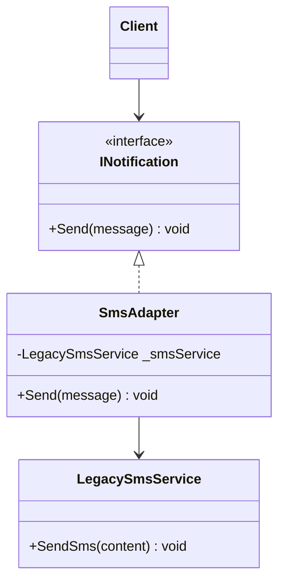
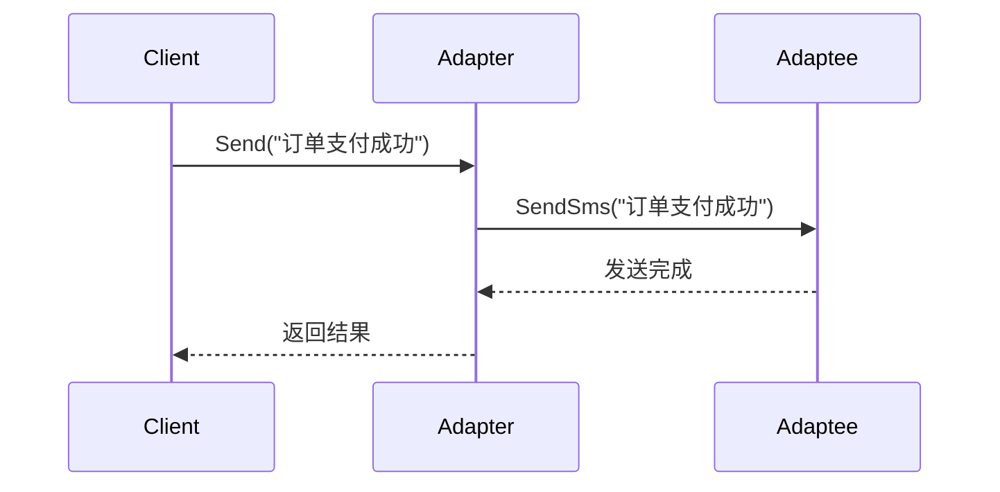

# Adapter (AdapterDemo)

说明：
- 该项目演示设计模式：**Adapter**。
- 在 `Program.cs` 中实现示例（或将实现拆分到多个源文件）。
- 目标框架： net8.0

运行示例：
```bash
dotnet run --project Structural/AdapterDemo/AdapterDemo.csproj
```

------

# **📦 适配器模式（Adapter Pattern）**

## **一、模式定义**

> **适配器模式**是一种结构型设计模式，它将一个类的接口转换成客户端期望的另一个接口，使原本由于接口不兼容而不能一起工作的类可以协同工作。


------


## **二、核心思想**


- 适配器的本质是**“转换接口”**
- 让旧系统、第三方库、异构接口能够被当前系统复用
- 客户端只面向目标接口，无需关心被适配者的具体细节
- 常用于“新旧系统兼容”“接口统一封装”


------


## **三、关键概念**


### **1️⃣ Target（目标接口）**

客户端真正希望调用的接口：

- `INotification`
    - `Send(message)`


### **2️⃣ Adaptee（被适配者）**

已经存在但接口不兼容的类：

- `LegacySmsService`
    - `SendSms(content)`


### **3️⃣ Adapter（适配器）**

负责把旧接口转换成目标接口：

- `SmsAdapter`
    - 内部调用 `LegacySmsService.SendSms()`


------


## **四、模式结构**


### **角色说明**

| **角色** | **说明** |
| -------- | -------- |
| Target   | 目标接口 |
| Client   | 客户端   |
| Adaptee  | 被适配者 |
| Adapter  | 适配器   |

------


## **五、类图（Mermaid）**



------


## **六、C# 经典示例（旧短信接口适配）**


### **1️⃣ 目标接口**

```c#
public interface INotification
{
    void Send(string message);
}
```


### **2️⃣ 被适配者（旧系统接口）**

```c#
public class LegacySmsService
{
    public void SendSms(string content)
    {
        Console.WriteLine($"旧短信接口发送：{content}");
    }
}
```


### **3️⃣ 适配器**

```c#
public class SmsAdapter : INotification
{
    private readonly LegacySmsService _smsService;

    public SmsAdapter(LegacySmsService smsService)
    {
        _smsService = smsService;
    }

    public void Send(string message)
    {
        _smsService.SendSms(message);
    }
}
```


### **4️⃣ 客户端**

```c#
public class MessageClient
{
    private readonly INotification _notification;

    public MessageClient(INotification notification)
    {
        _notification = notification;
    }

    public void Notify(string message)
    {
        _notification.Send(message);
    }
}
```


### **5️⃣ 调用**

```c#
class Program
{
    static void Main()
    {
        var legacySmsService = new LegacySmsService();
        INotification notification = new SmsAdapter(legacySmsService);

        var client = new MessageClient(notification);
        client.Notify("订单支付成功");
    }
}
```


------


## **七、时序图（调用流程）**




------


## **八、实际业务案例（支付接口兼容）**


### **场景**

系统中统一支付接口定义为：

- `IPayment.Pay(amount)`

但第三方支付渠道接口各不相同：

- 微信支付：`WeChatPay.Submit(decimal money)`
- 支付宝支付：`AliPay.PayRequest(decimal amount)`

此时可以使用适配器模式，把不同第三方支付接口统一转换成系统内部标准接口。

### **示例**

```c#
public interface IPayment
{
    void Pay(decimal amount);
}

public class WeChatPay
{
    public void Submit(decimal money)
    {
        Console.WriteLine($"微信支付金额：{money}");
    }
}

public class WeChatPayAdapter : IPayment
{
    private readonly WeChatPay _weChatPay;

    public WeChatPayAdapter(WeChatPay weChatPay)
    {
        _weChatPay = weChatPay;
    }

    public void Pay(decimal amount)
    {
        _weChatPay.Submit(amount);
    }
}
```


------


## **九、优点**

✅ 提高旧代码复用性

✅ 解耦客户端与具体实现

✅ 屏蔽接口差异，统一调用方式

✅ 符合开闭原则


------


## **十、缺点**

❌ 增加系统中的类和层次

❌ 过多适配器会让结构变复杂

❌ 只能解决接口不兼容问题，不能解决业务逻辑不一致问题


------


## **十一、适用场景**

- 新系统兼容旧系统接口
- 第三方 SDK 接入封装
- 多支付渠道统一接入
- 多消息渠道统一发送
- 不同数据源格式转换


------


## **十二、与装饰器模式对比**

| **对比项**     | **适配器模式** | **装饰器模式** |
| -------------- | -------------- | -------------- |
| 目的           | 转换接口       | 增强功能       |
| 是否改变原接口 | 是             | 否             |
| 关注点         | 兼容性         | 扩展性         |
| 典型用途       | 旧系统接入     | 动态加功能     |


------


## **十三、适配关系图**


------


## **十四、总结**


> **适配器模式 = 在“客户端需求接口”和“已有接口”之间增加一层转换器**
>
> 适配器模式是一种结构型设计模式，核心作用是让接口不兼容的类可以一起工作。
>
> 它特别适合旧系统改造、第三方接口接入、统一服务调用入口等场景。
>
> 优点是复用旧代码、统一接口，缺点是会引入额外的适配层。


------