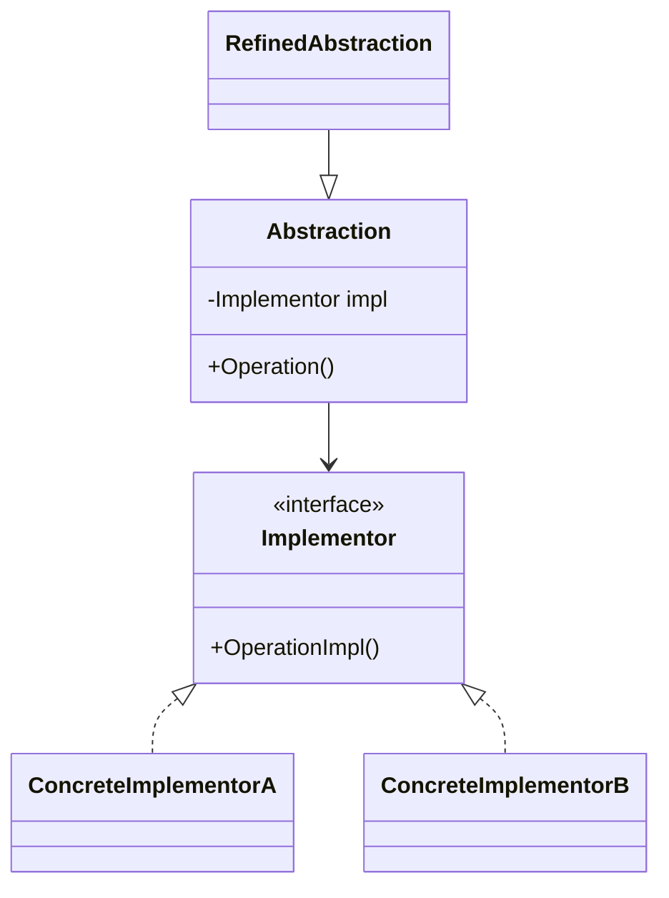
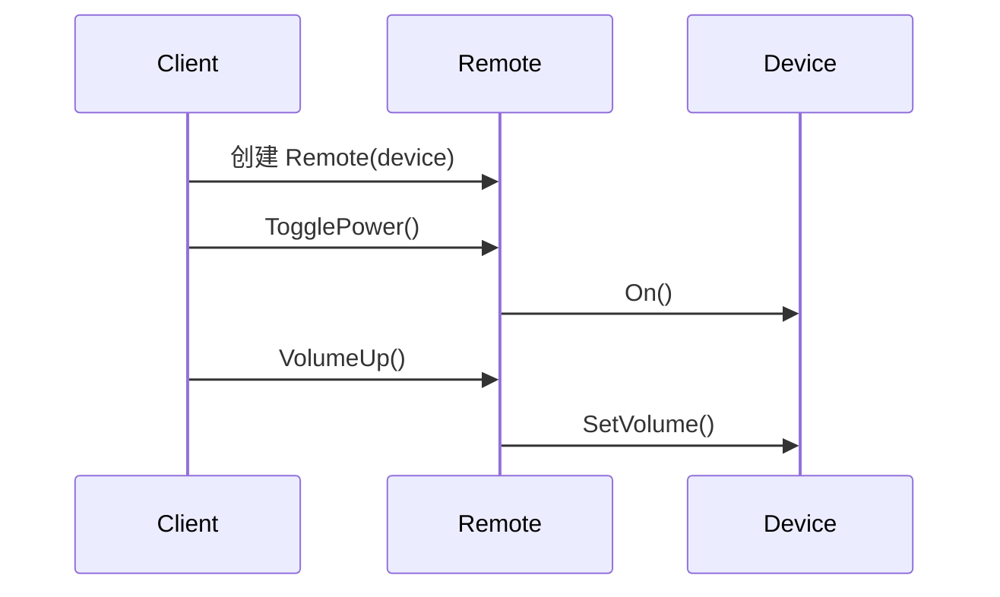
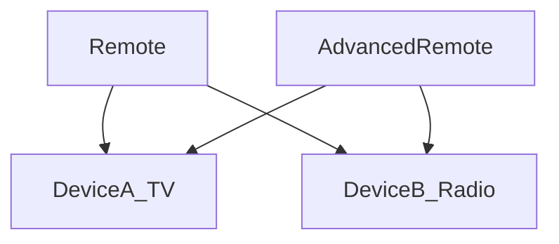

# Bridge (BridgeDemo)

说明：
- 该项目演示设计模式：**Bridge**。
- 在 `Program.cs` 中实现示例（或将实现拆分到多个源文件）。
- 目标框架： net8.0

运行示例：
```bash
dotnet run --project Structural/BridgeDemo/BridgeDemo.csproj
```

------

# **📦 桥接模式（Bridge Pattern）**

## **一、模式定义**

> **桥接模式**是一种结构型设计模式，它将抽象部分与实现部分分离，使它们可以独立变化。


------


## **二、核心思想**

- 将“抽象”和“实现”解耦
- 通过组合（而非继承）建立关系
- 避免类爆炸（多维度变化）


------


## **三、关键概念**

### **1️⃣ 抽象（Abstraction）**

对外提供统一接口

### **2️⃣ 扩展抽象（Refined Abstraction）**

对抽象进行扩展

### **3️⃣ 实现接口（Implementor）**

定义实现部分的接口

### **4️⃣ 具体实现（Concrete Implementor）**

实现具体功能


------


## **四、模式结构**

| **角色**            | **说明**   |
| ------------------- | ---------- |
| Abstraction         | 抽象类     |
| RefinedAbstraction  | 扩展抽象   |
| Implementor         | 实现接口   |
| ConcreteImplementor | 具体实现类 |


------


## **五、类图（Mermaid）**




------


## **六、C# 经典示例（设备遥控器）**

### **场景**

不同设备（TV、Radio） + 不同遥控器（普通 / 高级）

👉 两个维度：

- 设备类型
- 控制方式

如果用继承会爆炸：

- TVRemote、TVAdvancedRemote、RadioRemote…

👉 用桥接解耦！

### 1️⃣ 实现接口(设备)

```c#
public interface IDevice
{
    void On();
    void Off();
    void SetVolume(int percent);
}
```

### **2️⃣ 具体实现**

```c#
public class TV : IDevice
{
    public void On() => Console.WriteLine("TV 开机");
    public void Off() => Console.WriteLine("TV 关机");
    public void SetVolume(int percent) => Console.WriteLine($"TV 音量: {percent}");
}

public class Radio : IDevice
{
    public void On() => Console.WriteLine("Radio 开机");
    public void Off() => Console.WriteLine("Radio 关机");
    public void SetVolume(int percent) => Console.WriteLine($"Radio 音量: {percent}");
}
```

### **3️⃣ 抽象**(遥控器)

```c#
public abstract class RemoteControl
{
    protected IDevice _device;

    protected RemoteControl(IDevice device)
    {
        _device = device;
    }

    public virtual void TogglePower()
    {
        _device.On();
    }

    public void VolumeUp()
    {
        _device.SetVolume(10);
    }
}
```

### **4️⃣ 扩展抽象**

```c#
public class AdvancedRemote : RemoteControl
{
    public AdvancedRemote(IDevice device) : base(device) { }

    public void Mute()
    {
        _device.SetVolume(0);
    }
}
```

### **5️⃣ 调用**

```c#
class Program
{
    static void Main()
    {
        IDevice tv = new TV();
        var remote = new AdvancedRemote(tv);

        remote.TogglePower();
        remote.VolumeUp();
        remote.Mute();
    }
}
```


------


## **七、时序图（调用流程）**




------


## **八、实际业务案例（支付系统）**

### **场景**

支付方式 × 支付渠道

- 支付方式：
    - 微信支付
    - 支付宝支付
- 支付渠道：
    - PC
    - 手机

👉 两个维度组合

### **示例**

```c#
// 实现层
public interface IPayChannel
{
    void Pay(string type);
}

public class PcPay : IPayChannel
{
    public void Pay(string type)
    {
        Console.WriteLine($"{type} 在 PC 支付");
    }
}

public class MobilePay : IPayChannel
{
    public void Pay(string type)
    {
        Console.WriteLine($"{type} 在 手机 支付");
    }
}

// 抽象层
public abstract class Pay
{
    protected IPayChannel channel;

    protected Pay(IPayChannel channel)
    {
        this.channel = channel;
    }

    public abstract void DoPay();
}

// 扩展抽象
public class WechatPay : Pay
{
    public WechatPay(IPayChannel channel) : base(channel) { }

    public override void DoPay()
    {
        channel.Pay("微信支付");
    }
}

public class AliPay : Pay
{
    public AliPay(IPayChannel channel) : base(channel) { }

    public override void DoPay()
    {
        channel.Pay("支付宝支付");
    }
}
```


------


## **九、优点**

✅ 分离抽象与实现

✅ 支持多维度变化

✅ 避免类爆炸

✅ 提高扩展性

✅ 符合开闭原则


------


## **十、缺点**

❌ 增加系统复杂度

❌ 理解成本较高


------


## **十一、适用场景**

- 多维度变化系统（设备 × 控制方式）
- 跨平台 UI（窗口 × 操作系统）
- 支付系统（支付方式 × 渠道）
- 驱动程序（设备 × 驱动）
- 图形系统（形状 × 渲染方式）


------


## **十二、与继承对比**

| **对比项** | **继承方案** | **桥接模式** |
| ---------- | ------------ | ------------ |
| 扩展方式   | 类爆炸       | 组合解耦     |
| 灵活性     | 低           | 高           |
| 复杂度     | 简单         | 中等         |


------


## **十三、结构关系图**




------


## **十四、总结**

> **桥接模式 = 将“抽象”和“实现”拆开，通过组合连接**
>
> 当系统存在多个变化维度时，桥接模式可以避免类爆炸问题。
>
> 它通过“组合”替代“继承”，使系统更加灵活、可扩展。
>
> 适用于“多个变化维度”的复杂系统设计。
