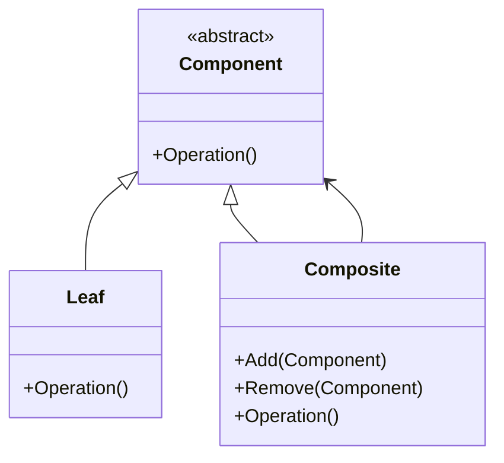
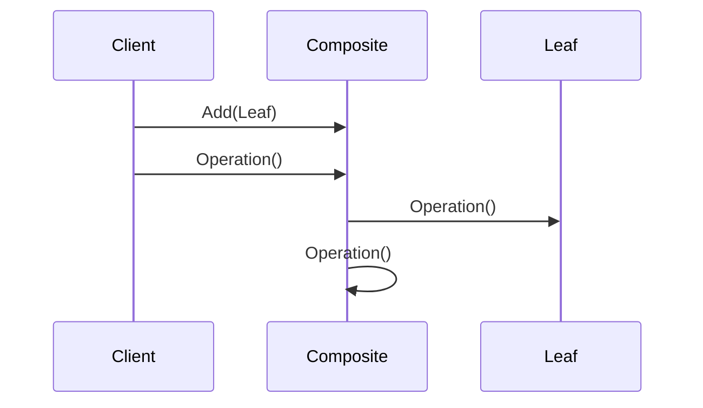
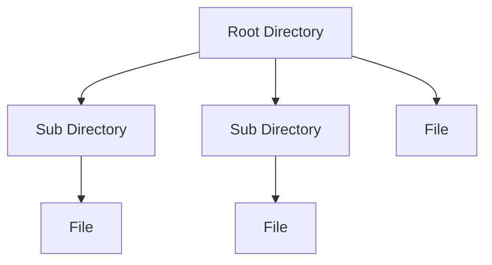

# Composite (CompositeDemo)

说明：
- 该项目演示设计模式：**Composite**。
- 在 `Program.cs` 中实现示例（或将实现拆分到多个源文件）。
- 目标框架： net8.0

运行示例：
```bash
dotnet run --project Structural/CompositeDemo/CompositeDemo.csproj
```

------

# 📦 组合模式（Composite Pattern）

## **一、模式定义**

> **组合模式**是一种结构型设计模式，它将对象组合成树形结构以表示“部分-整体”的层次结构，使客户端可以统一对待单个对象和组合对象。


------


## **二、核心思想**

- 将对象组织成**树形结构**
- 叶子节点（Leaf）和容器节点（Composite）**统一接口**
- 客户端无需区分是单个对象还是组合对象


------


## **三、关键概念**

### **1️⃣ 组件（Component）**

定义统一接口：

- 文件
- 文件夹

### **2️⃣ 叶子节点（Leaf）**

最小单位：

- 文件（不能再包含子对象）

### **3️⃣ 组合节点（Composite）**

可以包含子元素：

- 文件夹（可以包含文件或子文件夹）


------


## **四、模式结构**

| **角色**  | **说明**         |
| --------- | ---------------- |
| Component | 抽象组件         |
| Leaf      | 叶子节点         |
| Composite | 组合节点（容器） |
| Client    | 客户端           |


------


## **五、类图（Mermaid）**



------


## **六、C# 经典示例（文件系统）**

### **1️⃣ 抽象组件**

```c#
public abstract class FileSystemItem
{
    public string Name { get; set; }

    protected FileSystemItem(string name)
    {
        Name = name;
    }

    public abstract void Display(int depth);
}
```

### **2️⃣ 叶子节点（文件）**

```c#
public class FileItem : FileSystemItem
{
    public FileItem(string name) : base(name) { }

    public override void Display(int depth)
    {
        Console.WriteLine(new string('-', depth) + Name);
    }
}
```

### **3️⃣ 组合节点（文件夹）**

```c#
public class DirectoryItem : FileSystemItem
{
    private readonly List<FileSystemItem> _children = new();

    public DirectoryItem(string name) : base(name) { }

    public void Add(FileSystemItem item)
    {
        _children.Add(item);
    }

    public void Remove(FileSystemItem item)
    {
        _children.Remove(item);
    }

    public override void Display(int depth)
    {
        Console.WriteLine(new string('-', depth) + Name);

        foreach (var child in _children)
        {
            child.Display(depth + 2);
        }
    }
}
```

### **4️⃣ 调用**

```c#
class Program
{
    static void Main()
    {
        var root = new DirectoryItem("Root");

        var file1 = new FileItem("File1.txt");
        var file2 = new FileItem("File2.txt");

        var subDir = new DirectoryItem("SubDir");
        subDir.Add(new FileItem("File3.txt"));

        root.Add(file1);
        root.Add(file2);
        root.Add(subDir);

        root.Display(1);
    }
}
```


------


## **七、时序图（调用流程）**



------


## **八、实际业务案例（组织架构）**

### **场景**

公司组织结构：

- 公司
    - 部门A
        - 员工1
        - 员工2
    - 部门B
        - 员工3

### **实现思路**

- 抽象：OrganizationComponent
- 叶子：Employee
- 组合：Department

### **示例**

```c#
// 抽象组件
public abstract class OrganizationComponent
{
    public string Name { get; set; }

    protected OrganizationComponent(string name)
    {
        Name = name;
    }

    public virtual void Add(OrganizationComponent component)
    {
        throw new NotImplementedException();
    }

    public virtual void Remove(OrganizationComponent component)
    {
        throw new NotImplementedException();
    }

    public abstract void Display(int depth);
}

//叶子节点（员工）
public class Employee : OrganizationComponent
{
    public string Position { get; set; }

    public Employee(string name, string position) : base(name)
    {
        Position = position;
    }

    public override void Display(int depth)
    {
        Console.WriteLine(new string('-', depth) + $"员工：{Name}（{Position}）");
    }
}

//组合节点（部门）
public class Department : OrganizationComponent
{
    private readonly List<OrganizationComponent> _children = new();

    public Department(string name) : base(name)
    {
    }

    public override void Add(OrganizationComponent component)
    {
        _children.Add(component);
    }

    public override void Remove(OrganizationComponent component)
    {
        _children.Remove(component);
    }

    public override void Display(int depth)
    {
        Console.WriteLine(new string('-', depth) + $"部门：{Name}");

        foreach (var child in _children)
        {
            child.Display(depth + 2);
        }
    }
}

//客户端调用
class Program
{
    static void Main()
    {
        var company = new Department("总公司");

        var deptA = new Department("研发部");
        deptA.Add(new Employee("张三", "后端开发工程师"));
        deptA.Add(new Employee("李四", "前端开发工程师"));

        var deptB = new Department("市场部");
        deptB.Add(new Employee("王五", "市场专员"));

        company.Add(deptA);
        company.Add(deptB);

        company.Display(1);
    }
}
```


------


## **九、优点**

✅ 统一处理单个对象和组合对象

✅ 简化客户端代码

✅ 易于扩展（新增节点类型）

✅ 符合开闭原则


------


## **十、缺点**

❌ 设计较抽象，理解成本较高

❌ 不易限制组合中的元素类型

❌ 调试复杂（树结构）


------


## **十一、适用场景**

- 文件系统（文件 / 文件夹）
- UI 组件树
- 组织架构
- 菜单系统
- 商品分类树
- XML / JSON 结构解析


------


## **十二、与装饰器模式对比**

| **对比项** | **组合模式**      | **装饰器模式** |
| ---------- | ----------------- | -------------- |
| 目的       | 表示整体-部分关系 | 动态增强功能   |
| 结构       | 树形结构          | 链式结构       |
| 使用场景   | 层级结构          | 功能扩展       |


------


## **十三、结构关系图**




------


## **十四、总结**

> **组合模式 = 树结构 + 统一操作**
>
> 它让客户端无需区分单个对象和组合对象，统一进行处理。
>
> 适用于具有明显层级结构的系统，如文件系统、组织架构等。
>
> 核心价值在于：**结构统一 + 操作一致**。
