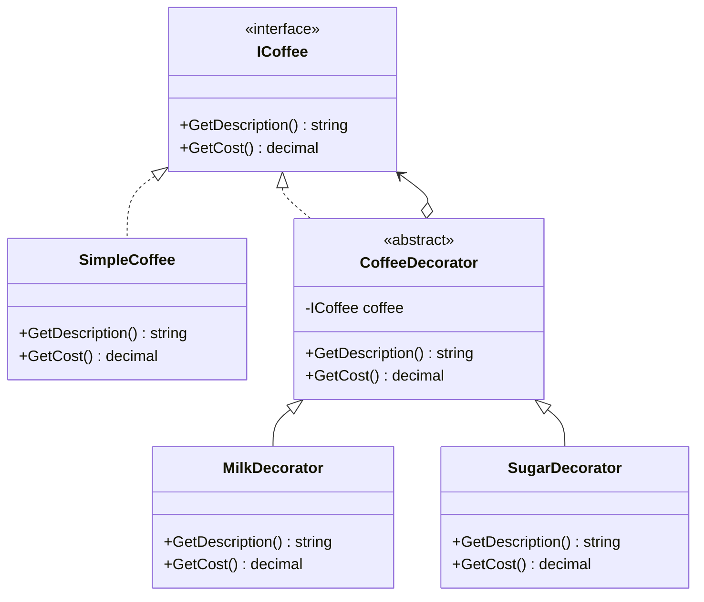
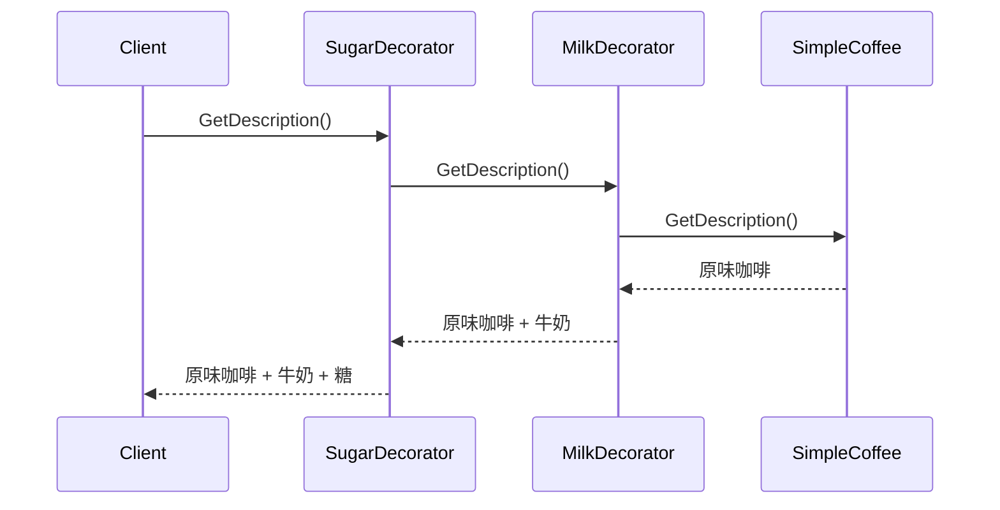
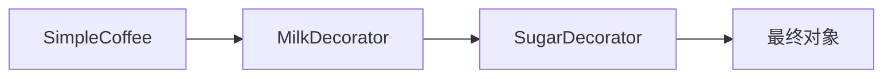

# Decorator (DecoratorDemo)

说明：
- 该项目演示设计模式：**Decorator**。
- 在 `Program.cs` 中实现示例（或将实现拆分到多个源文件）。
- 目标框架： net8.0

运行示例：
```bash
dotnet run --project Structural/DecoratorDemo/DecoratorDemo.csproj
```

------

# **📦 装饰模式（Decorator Pattern）**

## **一、模式定义**

> **装饰模式**是一种结构型设计模式，它允许在**不修改原有类代码**的情况下，动态地给对象添加额外职责。


------


## **二、核心思想**


- 通过“包装”的方式增强对象功能
- 装饰对象与被装饰对象实现同一个抽象接口
- 功能可以按需叠加、自由组合
- 相比继承，装饰模式更加灵活


------


## **三、关键概念**


### **1️⃣ Component（抽象构件）**

定义对象的公共接口：

- Coffee
- Stream
- Notifier


### **2️⃣ ConcreteComponent（具体构件）**

被装饰的原始对象：

- SimpleCoffee
- FileStream
- EmailNotifier


### **3️⃣ Decorator（抽象装饰者）**

持有一个 Component 引用，并实现相同接口：

- CoffeeDecorator
- StreamDecorator
- NotifierDecorator


### **4️⃣ ConcreteDecorator（具体装饰者）**

给对象增加附加职责：

- MilkDecorator
- SugarDecorator
- LoggingStreamDecorator
- SmsDecorator


------


## **四、模式结构**


### **角色说明**

| **角色**          | **说明**   |
| ----------------- | ---------- |
| Component         | 抽象构件   |
| ConcreteComponent | 具体构件   |
| Decorator         | 抽象装饰者 |
| ConcreteDecorator | 具体装饰者 |
| Client            | 客户端     |

------


## **五、类图（Mermaid）**



------


## **六、C# 经典示例（咖啡加料）**


### **1️⃣ 抽象构件**

```c#
public interface ICoffee
{
    string GetDescription();
    decimal GetCost();
}
```


### **2️⃣ 具体构件**

```c#
public class SimpleCoffee : ICoffee
{
    public string GetDescription()
    {
        return "原味咖啡";
    }

    public decimal GetCost()
    {
        return 10m;
    }
}
```


### **3️⃣ 抽象装饰者**

```c#
public abstract class CoffeeDecorator : ICoffee
{
    protected readonly ICoffee _coffee;

    protected CoffeeDecorator(ICoffee coffee)
    {
        _coffee = coffee;
    }

    public virtual string GetDescription()
    {
        return _coffee.GetDescription();
    }

    public virtual decimal GetCost()
    {
        return _coffee.GetCost();
    }
}
```


### **4️⃣ 具体装饰者：牛奶**

```c#
public class MilkDecorator : CoffeeDecorator
{
    public MilkDecorator(ICoffee coffee) : base(coffee)
    {
    }

    public override string GetDescription()
    {
        return _coffee.GetDescription() + " + 牛奶";
    }

    public override decimal GetCost()
    {
        return _coffee.GetCost() + 2m;
    }
}
```


### **5️⃣ 具体装饰者：糖**

```c#
public class SugarDecorator : CoffeeDecorator
{
    public SugarDecorator(ICoffee coffee) : base(coffee)
    {
    }

    public override string GetDescription()
    {
        return _coffee.GetDescription() + " + 糖";
    }

    public override decimal GetCost()
    {
        return _coffee.GetCost() + 1m;
    }
}
```


### **6️⃣ 客户端调用**

```c#
class Program
{
    static void Main()
    {
        ICoffee coffee = new SimpleCoffee();
        Console.WriteLine($"{coffee.GetDescription()}，价格：{coffee.GetCost()}");

        coffee = new MilkDecorator(coffee);
        coffee = new SugarDecorator(coffee);

        Console.WriteLine($"{coffee.GetDescription()}，价格：{coffee.GetCost()}");
    }
}
```


### **7️⃣ 输出结果**

```c#
原味咖啡，价格：10
原味咖啡 + 牛奶 + 糖，价格：13
```


------


## **七、时序图（装饰调用流程）**




------


## **八、实际业务案例（消息通知增强）**


### **场景**

系统中存在基础通知能力：

- 邮件通知

随着业务发展，需要按需叠加：

- 短信通知
- 企业微信通知
- 日志记录
- 性能统计

如果直接使用继承，可能会出现：

- EmailNotifierWithSms
- EmailNotifierWithLog
- EmailNotifierWithSmsAndWeChat
- EmailNotifierWithSmsAndLogAndMetrics

组合会迅速膨胀。

装饰模式可以让这些增强能力自由叠加。


### **示例**

```c#
public interface INotifier
{
    void Send(string message);
}

public class EmailNotifier : INotifier
{
    public void Send(string message)
    {
        Console.WriteLine($"发送邮件通知：{message}");
    }
}

public abstract class NotifierDecorator : INotifier
{
    protected readonly INotifier _notifier;

    protected NotifierDecorator(INotifier notifier)
    {
        _notifier = notifier;
    }

    public virtual void Send(string message)
    {
        _notifier.Send(message);
    }
}

public class SmsDecorator : NotifierDecorator
{
    public SmsDecorator(INotifier notifier) : base(notifier)
    {
    }

    public override void Send(string message)
    {
        base.Send(message);
        Console.WriteLine($"发送短信通知：{message}");
    }
}

public class WeChatDecorator : NotifierDecorator
{
    public WeChatDecorator(INotifier notifier) : base(notifier)
    {
    }

    public override void Send(string message)
    {
        base.Send(message);
        Console.WriteLine($"发送企业微信通知：{message}");
    }
}

public class LogDecorator : NotifierDecorator
{
    public LogDecorator(INotifier notifier) : base(notifier)
    {
    }

    public override void Send(string message)
    {
        Console.WriteLine($"[Log] 开始发送通知：{message}");
        base.Send(message);
        Console.WriteLine("[Log] 通知发送完成");
    }
}
```


### **业务调用**

```c#
class Program
{
    static void Main()
    {
        INotifier notifier = new EmailNotifier();
        notifier = new SmsDecorator(notifier);
        notifier = new WeChatDecorator(notifier);
        notifier = new LogDecorator(notifier);

        notifier.Send("订单支付成功");
    }
}
```


### **执行结果**

```c#
[Log] 开始发送通知：订单支付成功
发送邮件通知：订单支付成功
发送短信通知：订单支付成功
发送企业微信通知：订单支付成功
[Log] 通知发送完成
```


### **这个案例的价值**

- 每种增强职责都可以独立开发与测试
- 可以根据业务场景灵活组合通知链路
- 非常适合高频采集、消息推送、审计日志、监控埋点等需要“层层增强”的系统


------


## **九、优点**

✅ 动态扩展对象功能

✅ 避免子类爆炸

✅ 比继承更灵活

✅ 支持职责自由组合

✅ 符合开闭原则


------


## **十、缺点**

❌ 会产生较多小类

❌ 多层装饰后，排查问题相对复杂

❌ 对象包装层次多时，调试成本会上升


------


## **十一、适用场景**

- 给对象动态增加功能
- 不希望通过继承扩展导致类爆炸
- 需要多个功能自由组合
- I/O 流增强（缓冲、压缩、加密）
- 通知系统增强（短信、日志、监控）
- Web 请求处理中间件链路


------


## **十二、与继承对比**

| **对比项**   | **继承扩展** | **装饰模式**   |
| ------------ | ------------ | -------------- |
| 功能扩展方式 | 编译期固定   | 运行期动态组合 |
| 灵活性       | 低           | 高             |
| 类数量控制   | 容易膨胀     | 更易拆分职责   |
| 耦合度       | 高           | 低             |
| 适合场景     | 关系稳定     | 功能可选叠加   |


------


## **十三、装饰关系图**



------


## **十四、开发中的常见识别信号**


当你在代码里看到以下迹象时，往往可以考虑装饰模式：

- 某个对象需要“可选功能”反复叠加
- 功能组合越来越多，继承已经难以维护
- 多个增强功能彼此独立，但都要围绕同一个核心对象展开
- 希望在不改原类的前提下增强能力

例如：

- 给采集任务增加缓存、限流、重试、日志
- 给数据库调用增加审计、监控、事务
- 给 API 客户端增加签名、鉴权、熔断、埋点


------


## **十五、总结**


> **装饰模式 = 在不改变原对象的前提下，给对象一层一层“包功能”**
>
> 它通过让装饰者与原对象实现同一抽象接口，把功能增强变成一种可组合的包装关系。
>
> 相比继承，装饰模式更加灵活，特别适合“可选能力叠加”的业务场景。
>
> 在实际开发中，像通知增强、流处理、日志埋点、权限控制、监控统计等，都非常适合使用装饰模式。


------

