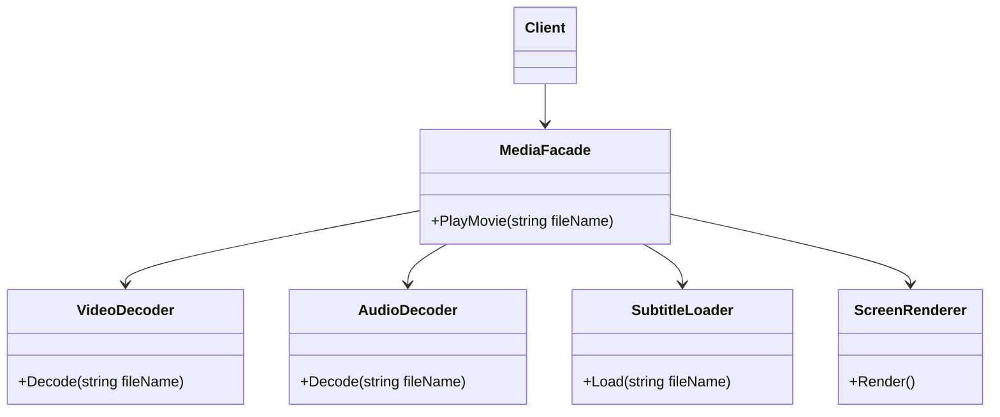
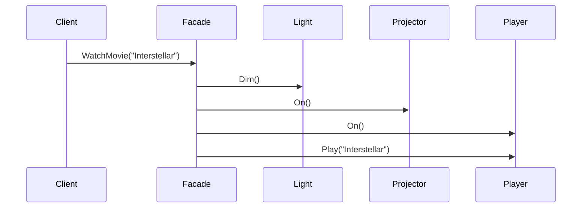
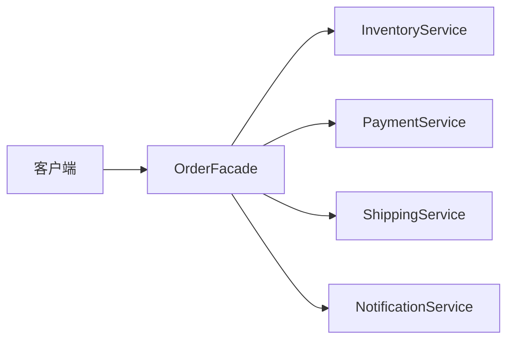

# Facade (FacadeDemo)

说明：
- 该项目演示设计模式：**Facade**。
- 在 `Program.cs` 中实现示例（或将实现拆分到多个源文件）。
- 目标框架： net8.0

运行示例：
```bash
dotnet run --project Structural/FacadeDemo/FacadeDemo.csproj
```

------

# **📦 外观模式（Facade Pattern）**

## **一、模式定义**

> **外观模式**是一种结构型设计模式，它为子系统中的一组复杂接口提供一个统一的高层接口，使得子系统更容易使用。


------


## **二、核心思想**


- 将复杂的子系统调用过程**封装到一个门面对象中**
- 客户端不需要直接了解子系统的内部细节
- 通过一个统一入口，降低系统使用复杂度


------


## **三、关键概念**


### **1️⃣ Facade（外观类）**

对外提供统一入口，负责协调多个子系统对象的调用。


### **2️⃣ Subsystem（子系统）**

真正完成业务逻辑的模块，外观只是对它们进行组合与封装：

- VideoDecoder
- AudioDecoder
- SubtitleLoader
- ScreenRenderer


### **3️⃣ Client（客户端）**

客户端只依赖 Facade，而不直接依赖多个复杂子系统。


------


## **四、模式结构**


### **角色说明**

| **角色**  | **说明**                 |
| --------- | ------------------------ |
| Facade    | 外观类，对外提供统一接口 |
| Subsystem | 子系统，完成具体功能     |
| Client    | 客户端，通过外观使用系统 |
|           |                          |

------


## **五、类图（Mermaid）**



------


## **六、C# 经典示例（家庭影院系统）**


### **1️⃣ 子系统：灯光**

```c#
public class LightSystem
{
    public void Dim()
    {
        Console.WriteLine("灯光调暗");
    }
}
```


### **2️⃣ 子系统：投影仪**

```c#
public class Projector
{
    public void On()
    {
        Console.WriteLine("投影仪开启");
    }
}
```


### **3️⃣ 子系统：播放器**

```c#
public class Player
{
    public void On()
    {
        Console.WriteLine("播放器开启");
    }

    public void Play(string movie)
    {
        Console.WriteLine($"开始播放：{movie}");
    }
}
```


### **4️⃣ 外观类**

```c#
public class HomeTheaterFacade
{
    private readonly LightSystem _light;
    private readonly Projector _projector;
    private readonly Player _player;

    public HomeTheaterFacade(LightSystem light, Projector projector, Player player)
    {
        _light = light;
        _projector = projector;
        _player = player;
    }

    public void WatchMovie(string movie)
    {
        _light.Dim();
        _projector.On();
        _player.On();
        _player.Play(movie);
    }
}
```


### **5️⃣ 客户端调用**

```c#
class Program
{
    static void Main()
    {
        var facade = new HomeTheaterFacade(
            new LightSystem(),
            new Projector(),
            new Player());

        facade.WatchMovie("Interstellar");
    }
}
```


------


## **七、时序图（调用流程）**




------


## **八、实际业务案例（订单提交流程封装）**


### **场景**

电商系统中，提交订单往往涉及多个子系统：

- 库存校验
- 支付处理
- 物流创建
- 消息通知

如果客户端直接调用这些服务，会导致调用流程复杂、耦合度高。

### **示例**

```c#
public class InventoryService
{
    public bool CheckStock(string sku, int quantity)
    {
        Console.WriteLine("校验库存");
        return true;
    }
}

public class PaymentService
{
    public bool Pay(decimal amount)
    {
        Console.WriteLine("执行支付");
        return true;
    }
}

public class ShippingService
{
    public void CreateShipment(string orderId)
    {
        Console.WriteLine("创建物流单");
    }
}

public class NotificationService
{
    public void Send(string message)
    {
        Console.WriteLine($"发送通知：{message}");
    }
}

public class OrderFacade
{
    private readonly InventoryService _inventory = new InventoryService();
    private readonly PaymentService _payment = new PaymentService();
    private readonly ShippingService _shipping = new ShippingService();
    private readonly NotificationService _notification = new NotificationService();

    public void SubmitOrder(string orderId, string sku, int quantity, decimal amount)
    {
        if (!_inventory.CheckStock(sku, quantity))
        {
            Console.WriteLine("库存不足");
            return;
        }

        if (!_payment.Pay(amount))
        {
            Console.WriteLine("支付失败");
            return;
        }

        _shipping.CreateShipment(orderId);
        _notification.Send($"订单 {orderId} 已提交成功");
    }
}
```


### **客户端调用**

```c#
class Program
{
    static void Main()
    {
        var orderFacade = new OrderFacade();
        orderFacade.SubmitOrder("ORD1001", "SKU-01", 2, 199.00m);
    }
}
```


------


## **九、优点**

✅ 简化客户端调用逻辑

✅ 降低客户端与子系统之间的耦合

✅ 提供统一入口，便于维护

✅ 有助于对子系统进行分层封装


------


## **十、缺点**

❌ 外观类可能变得过于庞大，形成“上帝类”

❌ 不一定能完全屏蔽子系统复杂性

❌ 新需求过多时，Facade 可能频繁修改


------


## **十一、适用场景**

- 老系统封装统一入口
- 多个子系统组合完成一个业务流程
- 降低复杂系统的使用门槛
- 分层架构中的服务聚合层
- SDK / 中台接口封装


------


## **十二、与适配器模式对比**

| **对比项**   | **外观模式**               | **适配器模式**         |
| ------------ | -------------------------- | ---------------------- |
| 目的         | 简化多个子系统的使用       | 转换接口以兼容不同对象 |
| 关注点       | 提供统一入口               | 解决接口不匹配         |
| 使用方式     | 面向整体流程封装           | 面向单个对象或接口转换 |
| 是否改变接口 | 不强调改变原接口，重在封装 | 通常会转换为目标接口   |


------


## **十三、业务流程关系图**




------


## **十四、总结**


> **外观模式 = 为复杂子系统提供一个统一、简洁的入口**
>
> 外观模式是一种结构型设计模式，它通过一个高层接口封装多个子系统的复杂调用。
>
> 它适用于流程复杂、子系统较多、希望对外简化调用方式的场景。
>
> 优点是简化使用、降低耦合，缺点是外观类可能膨胀。


------