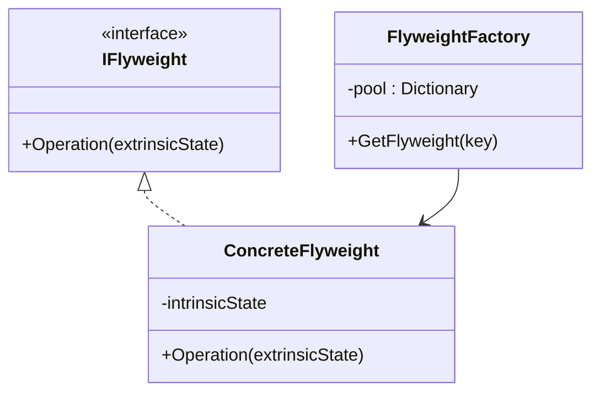
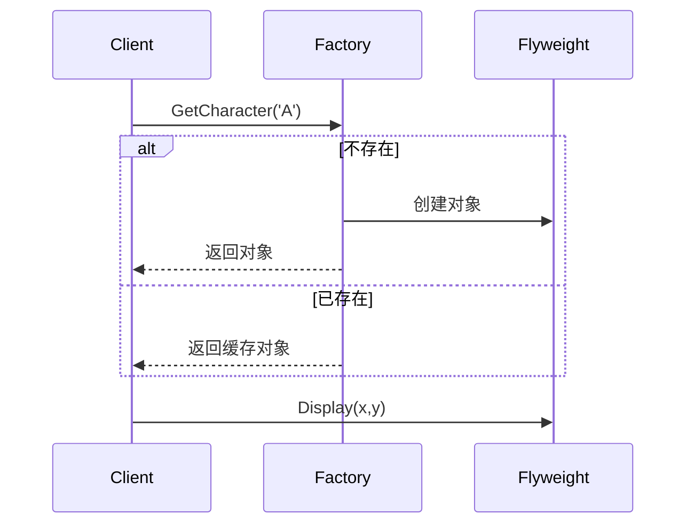
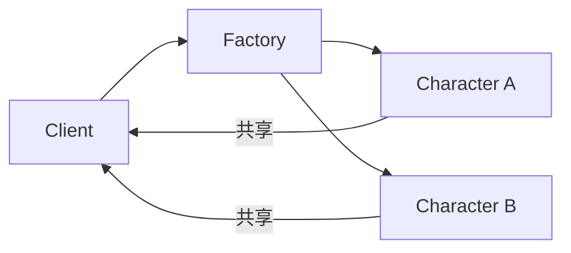

# Flyweight (FlyweightDemo)

说明：
- 该项目演示设计模式：**Flyweight**。
- 在 `Program.cs` 中实现示例（或将实现拆分到多个源文件）。
- 目标框架： net8.0

运行示例：
```bash
dotnet run --project Structural/FlyweightDemo/FlyweightDemo.csproj
```

------

# **📦 享元模式（Flyweight Pattern）**

## **一、模式定义**

> **享元模式**是一种结构型设计模式，它通过共享大量细粒度对象，来减少内存使用，提高系统性能。


------

## **二、核心思想**

- 将对象拆分为：内部状态（可共享）和外部状态（不可共享）
- 通过共享内部状态，避免重复创建对象
- 使用工厂统一管理对象池


------

## **三、关键概念**

### **1️⃣ 内部状态（Intrinsic State）**

- 可共享
- 不随环境变化
- 存储在享元对象内部

👉 示例：

- 字符本身（A、B、C）
- 颜色类型（红、蓝）


### **2️⃣ 外部状态（Extrinsic State）**

- 不可共享
- 由客户端传入


👉 示例：

- 字符位置（x, y）
- 字体大小

### **3️⃣ 享元工厂（Flyweight Factory）**

- 负责创建和缓存对象
- 保证相同对象只创建一次


------

## **四、模式结构**

### **角色说明**

| **角色**          | **说明** |
| ----------------- | -------- |
| Flyweight         | 抽象享元 |
| ConcreteFlyweight | 具体享元 |
| FlyweightFactory  | 享元工厂 |
| Client            | 客户端   |


------

## **五、类图（Mermaid）**



------

## **六、C# 经典示例（字符渲染）**

### 1️⃣ 抽象享元

```c#
public interface ICharacter
{
    void Display(int x, int y);
}
```

### 2️⃣ 具体享元（内部状态）

```c#
public class Character : ICharacter
{
    private char _symbol; // 内部状态

    public Character(char symbol)
    {
        _symbol = symbol;
    }

    public void Display(int x, int y)
    {
        Console.WriteLine($"字符 {_symbol} 显示在位置 ({x},{y})");
    }
}
```

### 3️⃣ 享元工厂

```c#
public class CharacterFactory
{
    private readonly Dictionary<char, ICharacter> _pool = new();

    public ICharacter GetCharacter(char key)
    {
        if (!_pool.ContainsKey(key))
        {
            _pool[key] = new Character(key);
        }
        return _pool[key];
    }
}
```

### 4️⃣ 客户端

```c#
class Program
{
    static void Main()
    {
        var factory = new CharacterFactory();

        var str = "ABABA";

        int x = 0;

        foreach (var c in str)
        {
            var character = factory.GetCharacter(c);
            character.Display(x++, 0);
        }
    }
}
```


------

## **七、时序图（调用流程）**




------

## **八、实际业务案例（高频系统优化）**

### 场景：日志系统 / 监控系统

在高频日志采集中：

- 日志级别（INFO / ERROR）重复出现
- 模块名称重复出现
- 字符串大量重复

👉 使用享元模式优化：

### **示例**

```c#
public class LogType
{
    public string Type { get; }

    public LogType(string type)
    {
        Type = type;
    }
}

public class LogFactory
{
    private readonly Dictionary<string, LogType> _cache = new();

    public LogType GetLogType(string type)
    {
        if (!_cache.ContainsKey(type))
        {
            _cache[type] = new LogType(type);
        }
        return _cache[type];
    }
}
```

### **使用方式**

```c#
var factory = new LogFactory();

var log1 = factory.GetLogType("INFO");
var log2 = factory.GetLogType("INFO");

Console.WriteLine(object.ReferenceEquals(log1, log2)); // true
```


------

## **九、优点**

✅ 大幅减少内存占用

✅ 提高系统性能（减少 GC 压力）

✅ 适用于高频对象场景

✅ 对象复用，提升效率


------

## **十、缺点**

❌ 增加系统复杂度

❌ 外部状态管理困难

❌ 线程安全需额外处理


------

## **十一、适用场景**

- 字符渲染系统（编辑器）
- 棋牌游戏（棋子复用）
- UI 组件池
- 日志系统（高频）
- 数据缓存系统
- 大量重复对象场景


------

## 十二、与单例模式对比

| **对比项** | **单例模式** | **享元模式** |
| ---------- | ------------ | ------------ |
| 对象数量   | 1个          | 多个共享对象 |
| 目的       | 控制实例数量 | 减少内存     |
| 关注点     | 全局唯一     | 对象复用     |


------

## 十三、对象共享结构图




------

## 十四、总结

> 享元模式 = “共享对象，降低内存”

享元模式通过将对象拆分为内部状态和外部状态，实现对象复用，适用于**大量重复对象的高频场景**。

它的核心价值在于：

- 减少内存
- 提升性能
- 降低对象创建成本

但同时需要权衡：

- 状态拆分复杂度
- 线程安全问题

------