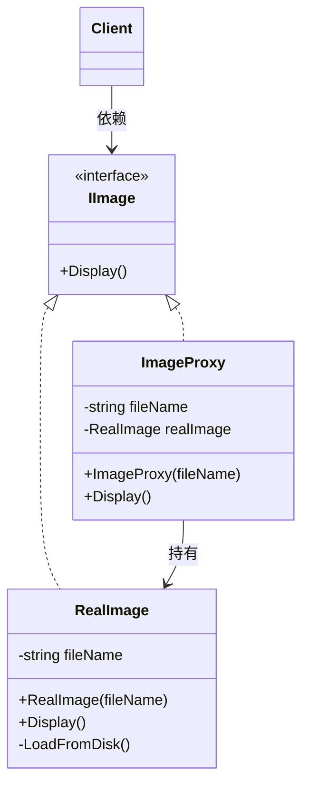
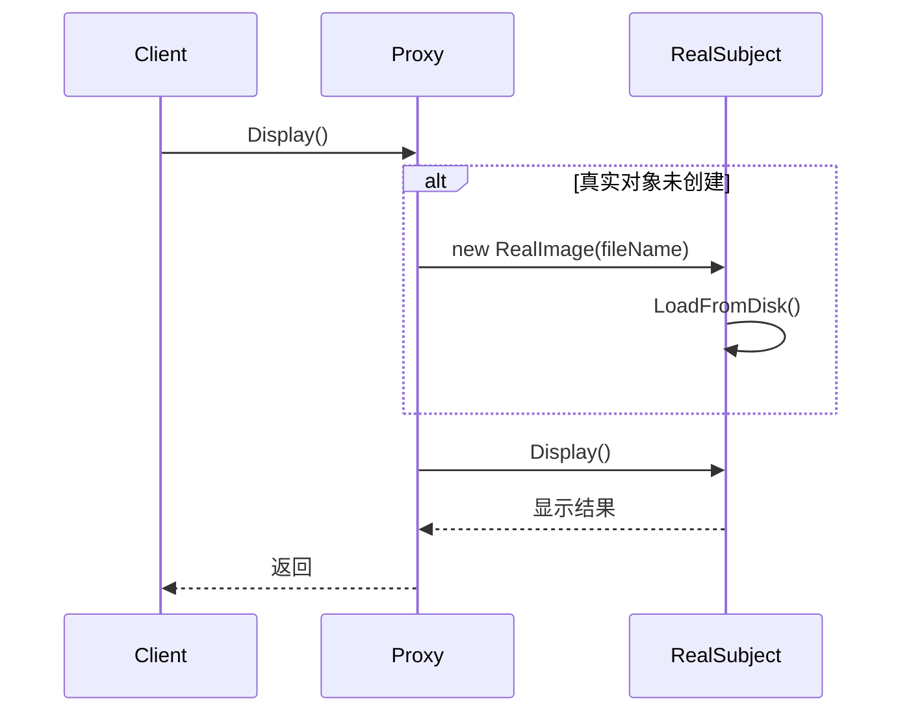
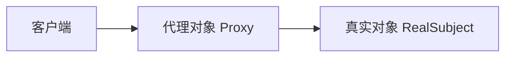

# Proxy (ProxyDemo)

说明：
- 该项目演示设计模式：**Proxy**。
- 在 `Program.cs` 中实现示例（或将实现拆分到多个源文件）。
- 目标框架： net8.0

运行示例：
```bash
dotnet run --project Structural/ProxyDemo/ProxyDemo.csproj
```

------

# **📦 代理模式（Proxy Pattern）**

## **一、模式定义**

> **代理模式**是一种结构型设计模式，它为某个对象提供一个替身或占位符，并由代理对象控制对原对象的访问。


------


## **二、核心思想**


- 客户端不直接访问真实对象，而是先访问**代理对象**
- 代理对象与真实对象实现相同接口，对外表现一致
- 代理可以在调用真实对象前后附加额外逻辑
- 常用于**权限控制、延迟加载、远程调用、缓存、日志监控**等场景


------


## **三、关键概念**


### **1️⃣ Subject（抽象主题）**

定义客户端与真实对象、代理对象统一遵循的接口：

- IImage
- IService
- IRepository


### **2️⃣ RealSubject（真实主题）**

真正执行业务逻辑的对象：

- RealImage
- UserService
- ProductRepository


### **3️⃣ Proxy（代理）**

持有真实对象的引用，并在访问真实对象时增加控制逻辑：

- ImageProxy
- ServiceProxy
- CacheProxy


------


## **四、模式结构**


### **角色说明**

| **角色**    | **说明** |
| ----------- | -------- |
| Subject     | 抽象主题 |
| RealSubject | 真实主题 |
| Proxy       | 代理对象 |
| Client      | 客户端   |
|             |          |

------


## **五、类图（Mermaid）**



------


## **六、C# 经典示例（图片延迟加载）**


### **1️⃣ 抽象主题**

```c#
public interface IImage
{
    void Display();
}
```


### **2️⃣ 真实主题**

```c#
public class RealImage : IImage
{
    private readonly string _fileName;

    public RealImage(string fileName)
    {
        _fileName = fileName;
        LoadFromDisk();
    }

    private void LoadFromDisk()
    {
        Console.WriteLine($"加载图片文件：{_fileName}");
    }

    public void Display()
    {
        Console.WriteLine($"显示图片：{_fileName}");
    }
}
```


### **3️⃣ 代理对象**

```c#
public class ImageProxy : IImage
{
    private readonly string _fileName;
    private RealImage? _realImage;

    public ImageProxy(string fileName)
    {
        _fileName = fileName;
    }

    public void Display()
    {
        if (_realImage == null)
        {
            _realImage = new RealImage(_fileName);
        }

        _realImage.Display();
    }
}
```


### **4️⃣ 客户端调用**

```c#
class Program
{
    static void Main()
    {
        IImage image = new ImageProxy("product_detail.png");

        Console.WriteLine("第一次调用：");
        image.Display();

        Console.WriteLine();
        Console.WriteLine("第二次调用：");
        image.Display();
    }
}
```


### **5️⃣ 输出结果**

```c#
第一次调用：
加载图片文件：product_detail.png
显示图片：product_detail.png

第二次调用：
显示图片：product_detail.png
```


### **6️⃣ 说明**

- 客户端始终操作的是 `IImage`
- 第一次访问时，代理对象才创建真实对象
- 第二次访问时，直接复用已创建的真实对象
- 这就是典型的**虚拟代理（Virtual Proxy）**


------


## **七、时序图（访问流程）**




------


## **八、实际业务案例（接口权限代理）**


### **场景**

系统中有一个订单删除服务：

- 管理员可以删除订单
- 普通用户不能删除订单

为了避免客户端直接调用真实服务，可以增加一个**权限代理**：

- 调用前先检查身份
- 有权限再放行
- 无权限直接拦截


### **示例**

```c#
public interface IOrderService
{
    void DeleteOrder(int orderId);
}

public class OrderService : IOrderService
{
    public void DeleteOrder(int orderId)
    {
        Console.WriteLine($"订单 {orderId} 已删除");
    }
}

public class OrderServiceProxy : IOrderService
{
    private readonly OrderService _orderService = new OrderService();
    private readonly string _role;

    public OrderServiceProxy(string role)
    {
        _role = role;
    }

    public void DeleteOrder(int orderId)
    {
        if (_role != "Admin")
        {
            Console.WriteLine("无权限删除订单");
            return;
        }

        Console.WriteLine("权限校验通过");
        _orderService.DeleteOrder(orderId);
    }
}
```


### **调用**

```c#
class Program
{
    static void Main()
    {
        IOrderService service1 = new OrderServiceProxy("User");
        service1.DeleteOrder(1001);

        Console.WriteLine();

        IOrderService service2 = new OrderServiceProxy("Admin");
        service2.DeleteOrder(1002);
    }
}
```


### **输出结果**

```c#
无权限删除订单

权限校验通过
订单 1002 已删除
```


### **业务价值**

- 把权限校验从核心业务中分离出来
- 客户端无需知道复杂的鉴权细节
- 可以在不修改原业务类的情况下扩展访问控制逻辑


------


## **九、代理模式常见类型**


### **1️⃣ 虚拟代理（Virtual Proxy）**

用于延迟创建开销很大的对象。

例如：

- 大图片加载
- 大文件读取
- 视频资源初始化


### **2️⃣ 保护代理（Protection Proxy）**

用于控制访问权限。

例如：

- 权限校验
- 角色控制
- 接口访问拦截


### **3️⃣ 远程代理（Remote Proxy）**

为远程对象提供本地代表。

例如：

- RPC 调用
- WCF / gRPC 客户端封装
- 微服务远程调用网关


### **4️⃣ 缓存代理（Cache Proxy）**

在调用真实对象前后加入缓存逻辑。

例如：

- 商品详情缓存
- 配置中心读取缓存
- 热点数据缓存


### **5️⃣ 日志代理（Logging Proxy）**

用于统计和审计。

例如：

- 调用日志
- 性能监控
- 链路追踪


------


## **十、优点**

✅ 控制对象访问

✅ 可在不修改真实对象的前提下增强功能

✅ 符合开闭原则

✅ 可实现延迟加载，优化性能

✅ 可用于权限、缓存、日志、远程调用等通用场景


------


## **十一、缺点**

❌ 增加系统层次，代码更复杂

❌ 代理类过多时，维护成本上升

❌ 某些场景下会增加一次间接调用开销


------


## **十二、适用场景**

- 需要对访问进行控制时
- 需要延迟初始化重量级对象时
- 需要给原有对象增加日志、缓存、权限功能时
- 需要封装远程调用细节时
- 需要统一做接口拦截和治理时


------


## **十三、与装饰器模式对比**

| **对比项** | **代理模式**                 | **装饰器模式**                     |
| ---------- | ---------------------------- | ---------------------------------- |
| 目的       | 控制访问                     | 动态增强功能                       |
| 关注点     | 权限、缓存、延迟加载、远程   | 功能叠加、职责扩展                 |
| 对客户端   | 常常隐藏真实对象             | 通常强调在原功能上继续增强         |
| 结构形式   | 和真实对象实现相同接口       | 和被装饰对象实现相同接口           |
| 常见场景   | 权限代理、远程代理、虚拟代理 | IO 流增强、UI 功能扩展、业务包装器 |


------


## **十四、结构关系图**



------


## **十五、总结**


> **代理模式 = 用一个代理对象代替客户端直接访问真实对象**
>
> 代理模式是一种结构型设计模式，它通过引入代理对象，在访问真实对象之前或之后附加控制逻辑。
>
> 它特别适合权限控制、延迟加载、缓存、日志、远程调用等场景。
>
> 其本质是：**不改变原对象对外接口，却在访问链路上增加一层可控能力。**


------